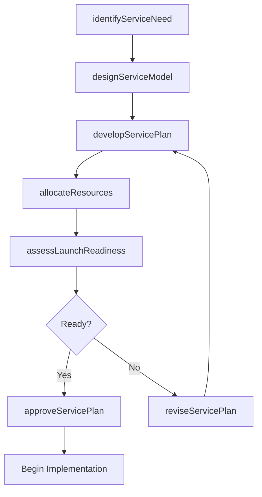
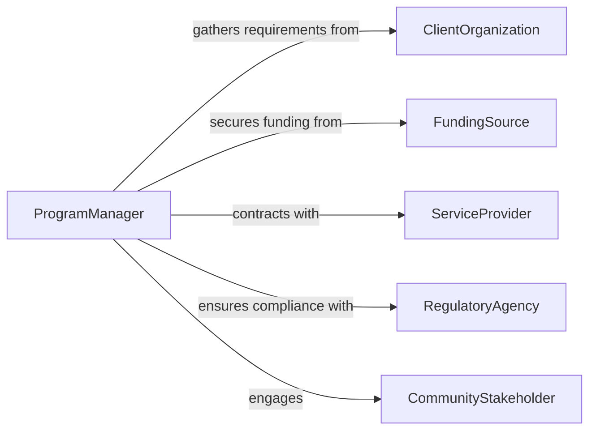

# Develop Plans Programs Services

> Business-as-Code definition for developing plans for programs or services. Models the planning lifecycle from opportunity identification through service design, resource planning, and launch readiness.

## Overview

Developing plans for programs or services involves identifying needs, designing service delivery models, planning resource allocation, and preparing implementation timelines. This definition exposes actions for each phase of service and program planning, events for workflow automation, and searches for retrieving plans, service designs, and readiness assessments.

## Actors

| Actor | Description |
|-------|-------------|
| ClientOrganization | The entity requesting or benefiting from the program or service |
| FundingSource | Provides financial resources for program development |
| ServiceProvider | External partners who deliver components of the program |
| RegulatoryAgency | Sets compliance standards for program and service delivery |
| CommunityStakeholder | Individuals or groups affected by the program or service |

## Roles

| Role | Description |
|------|-------------|
| ProgramManager | Oversees end-to-end planning and coordinates delivery teams |
| ServiceDesigner | Architects the service delivery model and user experience |
| ResourcePlanner | Allocates personnel, budget, and materials to the plan |
| QualityAssuranceLead | Ensures plans meet standards and regulatory requirements |
| ImplementationLead | Manages the transition from planning to execution |

## Entities

| Entity | Description |
|--------|-------------|
| ServicePlan | A detailed document defining scope, delivery model, and timeline |
| ProgramDesign | The structural framework describing how a program will operate |
| ResourceAllocation | The assignment of budget, staff, and materials to plan activities |
| ReadinessAssessment | An evaluation of preparedness for program or service launch |
| DeliveryModel | The approach for how services will be provided to recipients |
| ImplementationTimeline | A schedule of key activities and milestones leading to launch |

## Actions

| Action | Description |
|--------|-------------|
| identifyServiceNeed | Assess gaps and opportunities that warrant a new program or service |
| designServiceModel | Architect the delivery approach, channels, and touchpoints |
| developServicePlan | Create a comprehensive plan with scope, timeline, and resources |
| allocateResources | Assign budget, personnel, and materials to plan activities |
| assessLaunchReadiness | Evaluate preparedness across all plan dimensions |
| approveServicePlan | Formally approve the plan for implementation |
| reviseServicePlan | Update the plan based on feedback or changing requirements |

## Events

| Event | Description |
|-------|-------------|
| serviceNeedIdentified | A gap or opportunity has been documented |
| serviceModelDesigned | The delivery model has been architected |
| servicePlanDeveloped | The comprehensive plan has been created |
| resourcesAllocated | Budget and personnel have been assigned to the plan |
| launchReadinessAssessed | The readiness evaluation has been completed |
| servicePlanApproved | The plan has been formally approved |
| servicePlanRevised | The plan has been updated with new information |

## Searches

| Search | Description |
|--------|-------------|
| findServicePlans | List plans by status, program area, or owner |
| getDeliveryModels | Retrieve delivery model templates by type or domain |
| getReadinessAssessments | Find readiness evaluations by plan or status |
| findResourceAllocations | Search resource assignments by plan or budget category |

## Workflow



## Actor Relationships



## Usage

### Calling Actions

```typescript
import { developPlansProgramsServices } from '@headlessly/develop-plans-programs-services'

const planning = developPlansProgramsServices()

// Identify a service need
const need = await planning.identifyServiceNeed({
  area: 'Mental Health Support',
  targetPopulation: 'employees',
  gapAnalysis: 'Current EAP utilization at 12%, industry benchmark 25%'
})

// Design the service model
const model = await planning.designServiceModel({
  needId: need.id,
  channels: ['in-person', 'telehealth', 'digital-self-service'],
  deliveryPartners: ['licensed-counselors', 'peer-support-network']
})

// Develop the full service plan
await planning.developServicePlan({
  modelId: model.id,
  scope: 'enterprise-wide',
  launchDate: '2026-07-01',
  budget: 750000
})
```

### Event-Driven Automation

```typescript
// Notify stakeholders when plan is approved
planning.servicePlanApproved(async ({ planId, programArea }) => {
  await notify({
    to: 'implementation-team',
    message: `Service plan approved for ${programArea}. Ready for launch.`
  })
})

// Auto-schedule readiness check before launch
planning.resourcesAllocated(async ({ planId, launchDate }) => {
  const readinessDate = subtractDays(launchDate, 30)
  await scheduleTask({
    type: 'readiness-assessment',
    planId,
    dueDate: readinessDate
  })
})
```
