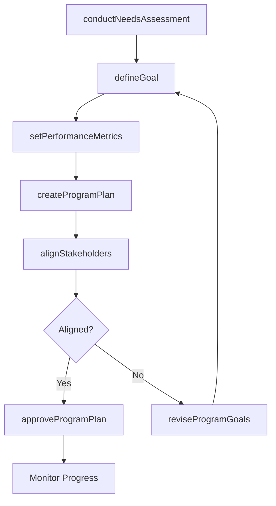
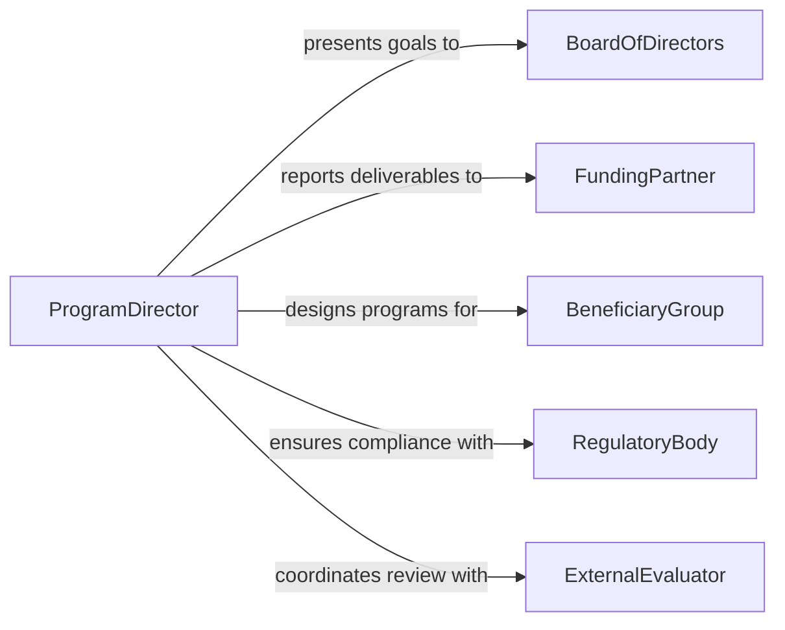

# Develop Program Goals Plans

> Business-as-Code definition for developing program goals and plans. Models the lifecycle from needs assessment through goal setting, planning, and stakeholder alignment.

## Overview

Developing program goals and plans involves assessing organizational needs, defining measurable objectives, creating implementation roadmaps, and aligning stakeholders on expected outcomes. This definition exposes actions for each phase of the goal-setting and planning process, events for tracking progress, and searches for retrieving goals, plans, and alignment records.

## Actors

| Actor | Description |
|-------|-------------|
| BoardOfDirectors | Provides strategic direction and approves high-level program goals |
| FundingPartner | Supplies financial resources and sets deliverable expectations |
| BeneficiaryGroup | The target population or audience the program is designed to serve |
| RegulatoryBody | Sets compliance requirements that influence program design |
| ExternalEvaluator | Provides independent assessment of program goals and outcomes |

## Roles

| Role | Description |
|------|-------------|
| ProgramDirector | Leads goal formulation and oversees plan development |
| ProgramPlanner | Develops detailed implementation roadmaps and timelines |
| StakeholderLiaison | Coordinates input and alignment across stakeholder groups |
| PerformanceAnalyst | Defines metrics, baselines, and targets for goal measurement |

## Entities

| Entity | Description |
|--------|-------------|
| ProgramGoal | A measurable objective the program intends to achieve |
| ProgramPlan | A structured roadmap with milestones, timelines, and resource assignments |
| NeedsAssessment | An analysis of gaps and opportunities that inform program goals |
| Milestone | A key checkpoint within the program plan |
| PerformanceMetric | A quantifiable indicator used to track goal achievement |
| StakeholderAlignment | A record of stakeholder agreement on goals and priorities |

## Actions

| Action | Description |
|--------|-------------|
| conductNeedsAssessment | Analyze gaps and opportunities to inform program goals |
| defineGoal | Create a measurable program goal with targets and timelines |
| createProgramPlan | Develop a detailed implementation roadmap with milestones |
| setPerformanceMetrics | Establish quantifiable indicators for tracking progress |
| alignStakeholders | Facilitate agreement among stakeholders on goals and priorities |
| approveProgramPlan | Formally approve the plan for implementation |
| reviseProgramGoals | Update goals based on changing conditions or feedback |

## Events

| Event | Description |
|-------|-------------|
| needsAssessmentCompleted | The needs analysis has been finalized |
| goalDefined | A new program goal has been created |
| programPlanCreated | The implementation roadmap has been developed |
| performanceMetricsSet | Key performance indicators have been established |
| stakeholdersAligned | All stakeholders have agreed on goals and priorities |
| programPlanApproved | The program plan has been formally approved |
| programGoalsRevised | Program goals have been updated |

## Searches

| Search | Description |
|--------|-------------|
| findProgramGoals | List program goals by status, program, or priority |
| getProgramPlans | Retrieve plans by program, status, or date range |
| getNeedsAssessments | Find needs assessments by program or completion date |
| getPerformanceMetrics | Search performance metrics by goal or program |

## Workflow



## Actor Relationships



## Usage

### Calling Actions

```typescript
import { developProgramGoalsPlans } from '@headlessly/develop-program-goals-plans'

const programs = developProgramGoalsPlans()

// Conduct a needs assessment
const assessment = await programs.conductNeedsAssessment({
  programArea: 'Youth Workforce Development',
  methods: ['survey', 'focus-group', 'data-analysis'],
  population: 'ages-16-24'
})

// Define a program goal
const goal = await programs.defineGoal({
  assessmentId: assessment.id,
  title: 'Increase youth employment rate by 20%',
  targetDate: '2027-06-30',
  baseline: 0.45,
  target: 0.65
})

// Create the program plan
await programs.createProgramPlan({
  goalId: goal.id,
  milestones: [
    { name: 'Curriculum Development', dueDate: '2026-09-01' },
    { name: 'Pilot Launch', dueDate: '2027-01-15' },
    { name: 'Full Rollout', dueDate: '2027-06-01' }
  ]
})
```

### Event-Driven Automation

```typescript
// Notify stakeholders when goals are defined
programs.goalDefined(async ({ goalId, title, programArea }) => {
  await notify({
    to: 'program-stakeholders',
    message: `New program goal defined: ${title}`
  })
})

// Trigger evaluation when plan is approved
programs.programPlanApproved(async ({ planId, goalId }) => {
  await scheduleReview({
    planId,
    reviewType: 'quarterly',
    startDate: new Date()
  })
})
```
