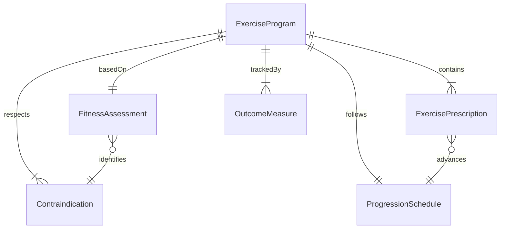
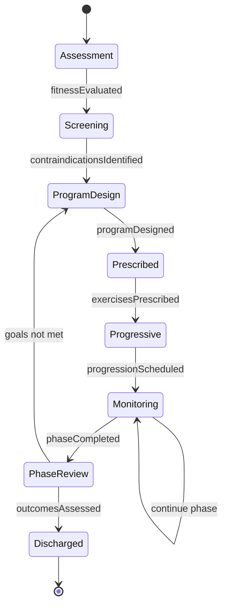
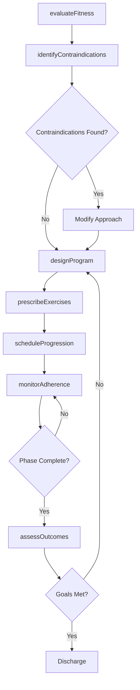
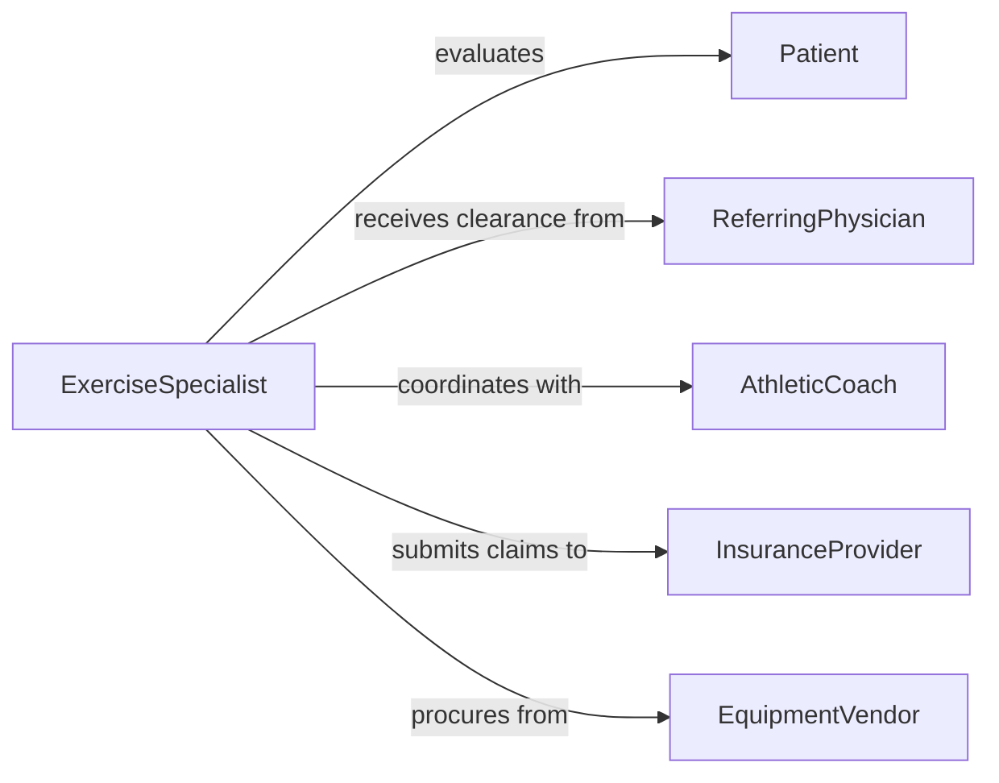

# Develop Exercise Conditioning Programs

> Business-as-Code definition for developing individualized exercise and conditioning programs tailored to patient rehabilitation or client fitness goals.

## Overview

Developing exercise or conditioning programs involves designing structured physical activity regimens based on clinical assessments, fitness evaluations, and individual goals. Programs address rehabilitation from injury, management of chronic conditions, athletic performance enhancement, or general wellness. Practitioners select exercises, determine intensity progressions, and establish monitoring protocols to ensure safe and effective outcomes.

## Actors

| Actor | Description |
|-------|-------------|
| Patient | The individual for whom the exercise program is designed |
| ReferringPhysician | Provides medical clearance and clinical context for exercise prescription |
| AthleticCoach | Supplies sport-specific performance requirements and schedules |
| InsuranceProvider | Authorizes coverage for rehabilitative exercise programs |
| EquipmentVendor | Supplies specialized exercise equipment or adaptive devices |

## Roles

| Role | Description |
|------|-------------|
| ExerciseSpecialist | Designs the conditioning program based on evaluation findings |
| PhysicalTherapist | Prescribes therapeutic exercises for rehabilitation cases |
| StrengthCoach | Develops performance-focused conditioning protocols |
| ProgressMonitor | Tracks adherence and functional improvements over time |

## Entities

| Entity | Description |
|--------|-------------|
| ExerciseProgram | A structured regimen of physical activities with progression plan |
| FitnessAssessment | Baseline evaluation of strength, endurance, flexibility, and balance |
| ExercisePrescription | Specific exercise parameters including sets, reps, intensity, and frequency |
| ProgressionSchedule | Planned increases in exercise difficulty over defined intervals |
| Contraindication | Medical condition or limitation restricting certain exercises |
| OutcomeMeasure | Metric used to evaluate program effectiveness |

## Actions

| Action | Description |
|--------|-------------|
| evaluateFitness | Conduct baseline physical assessment and functional testing |
| identifyContraindications | Review medical history for exercise restrictions |
| designProgram | Create the structured exercise regimen with progression milestones |
| prescribeExercises | Define specific exercises with parameters for each phase |
| scheduleProgression | Plan intensity and volume increases across program phases |
| monitorAdherence | Track client participation and exercise completion |
| assessOutcomes | Evaluate functional improvements against baseline measures |

## Events

| Event | Description |
|-------|-------------|
| fitnessEvaluated | Baseline physical assessment has been completed |
| contraindicationsIdentified | Exercise restrictions have been documented |
| programDesigned | The conditioning program has been created |
| exercisesPrescribed | Specific exercise parameters have been defined |
| progressionScheduled | Intensity increases have been planned across phases |
| phaseCompleted | The client has finished a program phase |
| outcomesAssessed | Functional improvements have been measured |

## Searches

| Search | Description |
|--------|-------------|
| findProgramsByPatient | Retrieve exercise programs for a specific patient or client |
| getExerciseLibrary | Browse available exercises filtered by body region or goal |
| getProgressionHistory | View progression data for a program over time |
| findProgramsByCondition | List exercise programs associated with a specific diagnosis |

## Entity Relationships



## State Diagram



## Workflow



## Actor Relationships



## Usage

### Calling Actions

```typescript
import { developExerciseConditioningPrograms } from '@headlessly/develop-exercise-conditioning-programs'

const programs = developExerciseConditioningPrograms()

// Evaluate baseline fitness
const assessment = await programs.evaluateFitness({
  patientId: 'pat-7721',
  tests: ['gripStrength', 'sitToStand', 'sixMinuteWalk', 'shoulderROM'],
  date: '2026-02-05'
})

// Design a post-surgical rehabilitation program
const program = await programs.designProgram({
  patientId: 'pat-7721',
  diagnosis: 'S83.511A',
  goal: 'Return to recreational sports',
  phases: [
    { name: 'Protection', weeks: [1, 4], focus: 'rangeOfMotion' },
    { name: 'Strengthening', weeks: [5, 10], focus: 'progressiveResistance' },
    { name: 'Return to Activity', weeks: [11, 16], focus: 'sportSpecific' }
  ]
})

// Prescribe exercises for phase 1
await programs.prescribeExercises({
  programId: program.id,
  phase: 'Protection',
  exercises: [
    { name: 'Quad Sets', sets: 3, reps: 15, frequency: 'daily' },
    { name: 'Heel Slides', sets: 3, reps: 10, frequency: 'daily' },
    { name: 'Straight Leg Raises', sets: 3, reps: 10, frequency: 'daily' }
  ]
})
```

### Event-Driven Automation

```typescript
// Progress to next phase when milestones are met
programs.phaseCompleted(async ({ programId, phase, outcomes }) => {
  await notify({
    to: 'exercise-specialist',
    message: `Phase "${phase}" completed for program ${programId}. Ready for progression.`
  })
})

// Alert clinician on adherence drop
programs.outcomesAssessed(async ({ programId, patientId, metrics }) => {
  if (metrics.adherenceRate < 0.6) {
    await escalate({
      to: 'care-team',
      programId,
      reason: 'Adherence below 60% - consider program modification'
    })
  }
})
```
