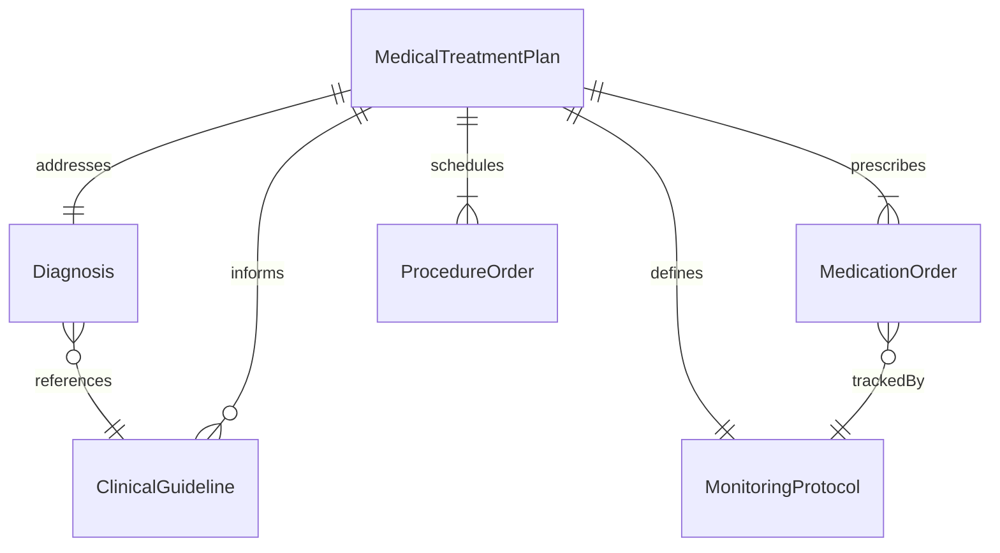
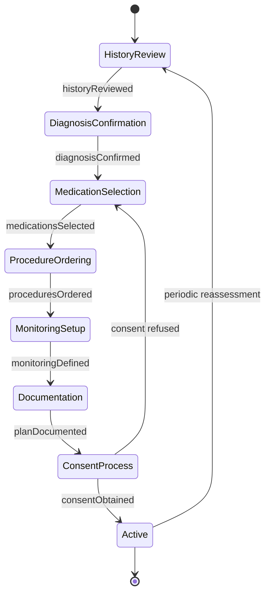
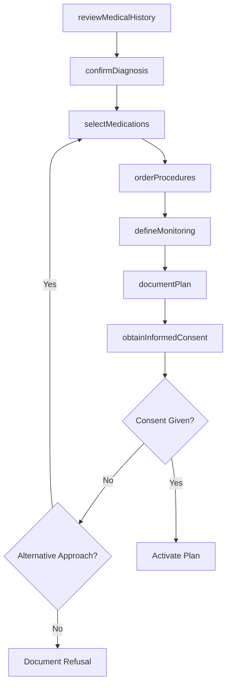
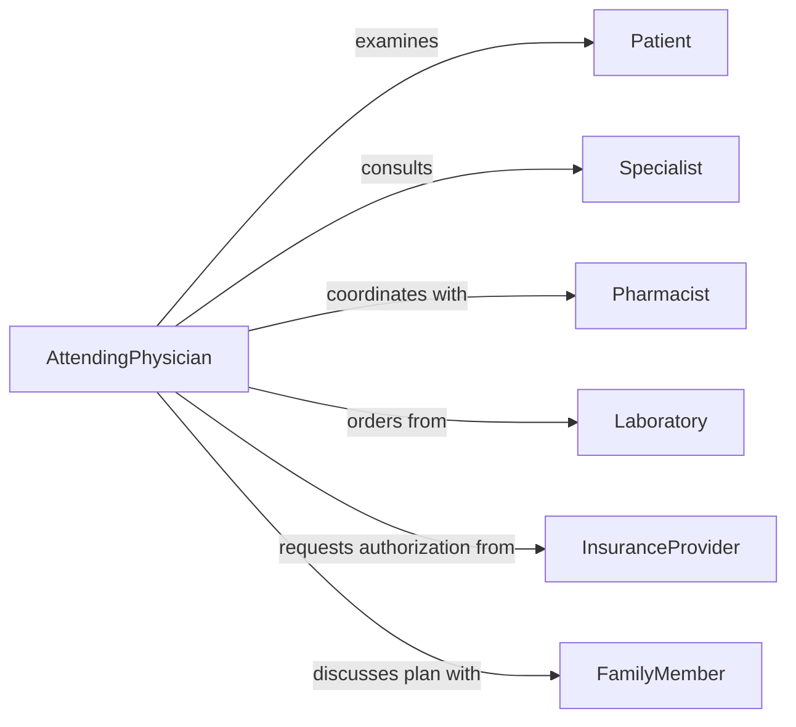

# Develop Medical Treatment Plans

> Business-as-Code definition for developing medical treatment plans that prescribe evidence-based clinical interventions for diagnosed conditions.

## Overview

Developing medical treatment plans involves formulating clinical care protocols based on patient diagnosis, medical history, laboratory findings, and current evidence-based guidelines. Physicians and advanced practitioners determine medication regimens, procedural interventions, monitoring schedules, and referral pathways. The resulting plan serves as the authoritative clinical document guiding all aspects of the patient's medical care.

## Actors

| Actor | Description |
|-------|-------------|
| Patient | The individual whose medical condition requires a treatment plan |
| FamilyMember | Supports informed consent decisions and treatment adherence |
| Specialist | Provides sub-specialty consultation for complex conditions |
| Pharmacist | Reviews medication selections for safety and interactions |
| Laboratory | Delivers diagnostic and monitoring test results |
| InsuranceProvider | Authorizes procedures and medication coverage |

## Roles

| Role | Description |
|------|-------------|
| AttendingPhysician | Develops and authorizes the medical treatment plan |
| ClinicalPharmacist | Reviews pharmacotherapy selections and dosing protocols |
| NursePractitioner | Assists in plan development and manages ongoing care |
| MedicalRecordsCoder | Ensures treatment plan documentation meets coding standards |

## Entities

| Entity | Description |
|--------|-------------|
| MedicalTreatmentPlan | The comprehensive clinical care protocol for a patient |
| Diagnosis | The confirmed medical condition being treated |
| MedicationOrder | A prescribed drug with dosage, route, and frequency |
| ProcedureOrder | A scheduled medical procedure or intervention |
| MonitoringProtocol | The schedule and parameters for tracking treatment response |
| ClinicalGuideline | Published evidence-based care standard informing treatment decisions |

## Actions

| Action | Description |
|--------|-------------|
| reviewMedicalHistory | Analyze patient history, comorbidities, and prior treatments |
| confirmDiagnosis | Validate the clinical diagnosis using available evidence |
| selectMedications | Choose pharmacotherapy based on guidelines and patient factors |
| orderProcedures | Schedule necessary medical procedures or interventions |
| defineMonitoring | Establish lab work, imaging, and follow-up schedules |
| documentPlan | Formalize the treatment plan in the medical record |
| obtainInformedConsent | Secure patient understanding and agreement to the plan |

## Events

| Event | Description |
|-------|-------------|
| historyReviewed | Patient medical history has been analyzed |
| diagnosisConfirmed | The clinical diagnosis has been validated |
| medicationsSelected | Pharmacotherapy choices have been finalized |
| proceduresOrdered | Medical procedures have been scheduled |
| monitoringDefined | Follow-up and lab schedules have been established |
| planDocumented | The treatment plan has been recorded in the medical chart |
| consentObtained | The patient has provided informed consent |

## Searches

| Search | Description |
|--------|-------------|
| findPlansByDiagnosis | Retrieve treatment plans associated with a specific diagnosis code |
| getMedicationHistory | List all medications prescribed to a patient across plans |
| getPendingOrders | Retrieve procedures and labs that have been ordered but not completed |
| findGuidelineUpdates | Check for updated clinical guidelines relevant to a treatment plan |

## Entity Relationships



## State Diagram



## Workflow



## Actor Relationships



## Usage

### Calling Actions

```typescript
import { developMedicalTreatmentPlans } from '@headlessly/develop-medical-treatment-plans'

const plans = developMedicalTreatmentPlans()

// Review history and confirm diagnosis
const history = await plans.reviewMedicalHistory({
  patientId: 'pat-1193',
  includeAllergies: true,
  includePriorTreatments: true
})

const diagnosis = await plans.confirmDiagnosis({
  patientId: 'pat-1193',
  icdCode: 'E11.65',
  supportingEvidence: ['hba1c-8.2', 'fastingGlucose-185', 'retinalExam-positive']
})

// Select medications and define monitoring
await plans.selectMedications({
  patientId: 'pat-1193',
  medications: [
    { drug: 'metformin', dose: '1000mg', route: 'oral', frequency: 'BID' },
    { drug: 'empagliflozin', dose: '10mg', route: 'oral', frequency: 'daily' }
  ],
  guideline: 'ADA-Standards-2026'
})

await plans.defineMonitoring({
  patientId: 'pat-1193',
  schedule: [
    { test: 'HbA1c', interval: 'every3months' },
    { test: 'renalPanel', interval: 'every6months' },
    { test: 'retinalExam', interval: 'annually' }
  ]
})
```

### Event-Driven Automation

```typescript
// Alert pharmacy when medications are selected
plans.medicationsSelected(async ({ patientId, medications }) => {
  await notify({
    to: 'pharmacy',
    message: `New medication orders for patient ${patientId}: ${medications.map(m => m.drug).join(', ')}`
  })
})

// Schedule monitoring appointments after plan documentation
plans.planDocumented(async ({ patientId, monitoringSchedule }) => {
  for (const item of monitoringSchedule) {
    await scheduleAppointment({
      patientId,
      type: item.test,
      date: calculateNextDate(item.interval)
    })
  }
})
```
