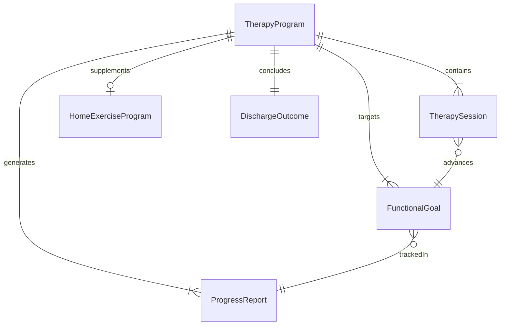
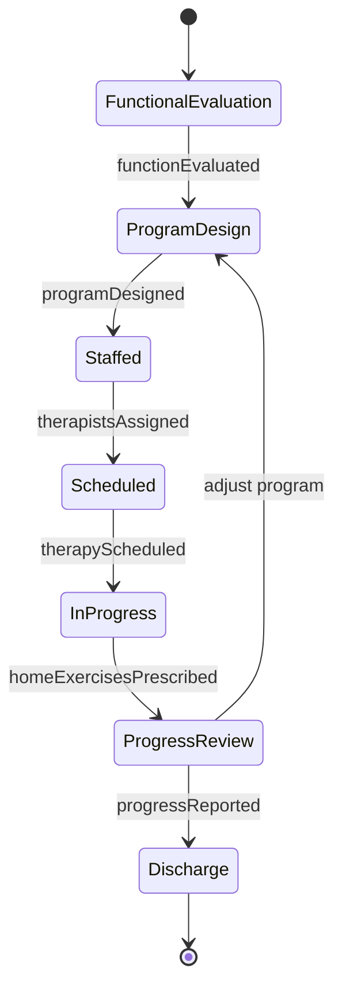
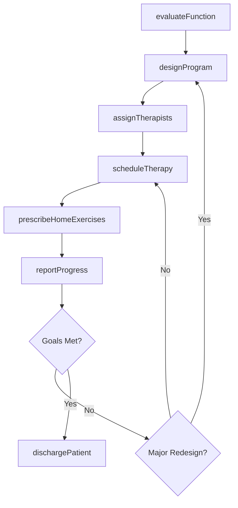
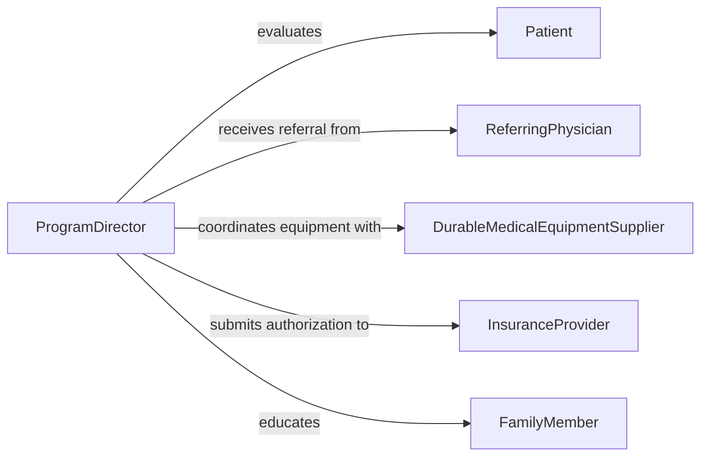

# Develop Patient Therapy Programs

> Business-as-Code definition for developing structured patient therapy programs that combine multiple therapeutic interventions into coordinated rehabilitation or recovery protocols.

## Overview

Developing patient therapy programs involves creating multi-disciplinary rehabilitation or recovery protocols that integrate various therapeutic modalities into a cohesive treatment experience. Programs are designed around patient-specific functional deficits, recovery timelines, and long-term outcomes. Practitioners coordinate physical, occupational, speech, and other therapies into a unified program with shared goals, synchronized scheduling, and integrated progress tracking.

## Actors

| Actor | Description |
|-------|-------------|
| Patient | The individual participating in the therapy program |
| FamilyMember | Supports home exercise programs and monitors daily functioning |
| ReferringPhysician | Prescribes therapy and provides medical clearance |
| InsuranceProvider | Authorizes therapy sessions and program duration |
| DurableMedicalEquipmentSupplier | Provides assistive devices and therapeutic equipment |

## Roles

| Role | Description |
|------|-------------|
| ProgramDirector | Oversees the overall therapy program design and coordination |
| RehabilitationTherapist | Delivers direct therapeutic interventions to patients |
| TherapyAide | Assists with exercises, setup, and patient preparation |
| OutcomesCoordinator | Collects and analyzes functional outcome data across the program |

## Entities

| Entity | Description |
|--------|-------------|
| TherapyProgram | A coordinated set of therapeutic services with defined duration |
| TherapySession | An individual treatment encounter within the program |
| FunctionalGoal | A specific capability the patient aims to restore or improve |
| ProgressReport | Periodic documentation of patient improvement and plan updates |
| HomeExerciseProgram | Prescribed activities for the patient to perform independently |
| DischargeOutcome | Final functional status and recommendations at program completion |

## Actions

| Action | Description |
|--------|-------------|
| evaluateFunction | Assess patient baseline functional abilities and deficits |
| designProgram | Create the multi-modality therapy program structure |
| assignTherapists | Allocate therapists to specific program components |
| scheduleTherapy | Arrange session times across therapy disciplines |
| prescribeHomeExercises | Define activities for patient self-directed practice |
| reportProgress | Document functional improvements at defined intervals |
| dischargePatient | Complete the program and issue final outcome summary |

## Events

| Event | Description |
|-------|-------------|
| functionEvaluated | Baseline functional assessment has been completed |
| programDesigned | The therapy program structure has been created |
| therapistsAssigned | Clinicians have been allocated to program components |
| therapyScheduled | Session schedules have been established |
| homeExercisesPrescribed | Independent activities have been assigned to the patient |
| progressReported | A periodic progress update has been documented |
| patientDischarged | The patient has completed the therapy program |

## Searches

| Search | Description |
|--------|-------------|
| findProgramsByPatient | Retrieve all therapy programs for a specific patient |
| getSessionSchedule | View upcoming therapy sessions for a program |
| getProgressTimeline | Retrieve functional outcome data across all reporting periods |
| findProgramsByOutcome | List programs filtered by discharge outcome category |

## Entity Relationships



## State Diagram



## Workflow



## Actor Relationships



## Usage

### Calling Actions

```typescript
import { developPatientTherapyPrograms } from '@headlessly/develop-patient-therapy-programs'

const programs = developPatientTherapyPrograms()

// Evaluate baseline function
const evaluation = await programs.evaluateFunction({
  patientId: 'pat-6034',
  assessments: ['bergBalance', 'timedUpAndGo', 'functionalIndependenceMeasure'],
  date: '2026-02-05'
})

// Design a stroke rehabilitation program
const program = await programs.designProgram({
  patientId: 'pat-6034',
  diagnosis: 'I63.9',
  disciplines: ['physicalTherapy', 'occupationalTherapy', 'speechTherapy'],
  duration: { weeks: 12 },
  goals: [
    { description: 'Independent ambulation with assistive device', domain: 'mobility' },
    { description: 'Independent feeding and grooming', domain: 'selfCare' },
    { description: 'Functional verbal communication', domain: 'speech' }
  ]
})

// Schedule sessions and assign therapists
await programs.assignTherapists({
  programId: program.id,
  assignments: [
    { discipline: 'physicalTherapy', therapistId: 'th-201', sessionsPerWeek: 3 },
    { discipline: 'occupationalTherapy', therapistId: 'th-305', sessionsPerWeek: 3 },
    { discipline: 'speechTherapy', therapistId: 'th-412', sessionsPerWeek: 2 }
  ]
})
```

### Event-Driven Automation

```typescript
// Generate progress report at intervals
programs.progressReported(async ({ programId, patientId, outcomes }) => {
  await generateReport({
    programId,
    patientId,
    outcomes,
    sendTo: ['referring-physician', 'insurance-provider']
  })
})

// Notify team at discharge
programs.patientDischarged(async ({ programId, patientId, finalOutcome }) => {
  await notify({
    to: 'care-team',
    message: `Patient ${patientId} discharged from program ${programId}: ${finalOutcome.status}`
  })
})
```
