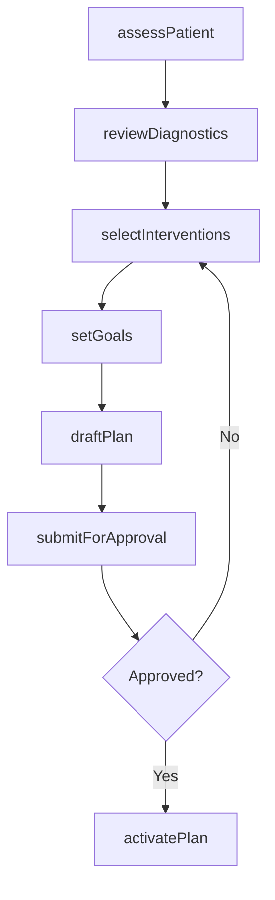
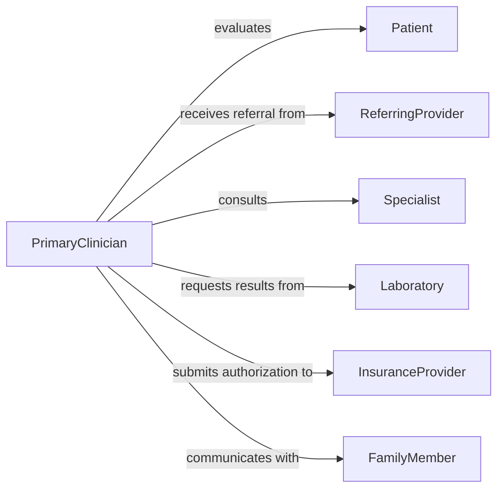

# Develop Treatment Plans Patients Clients

> Business-as-Code definition for developing comprehensive treatment plans that address patient or client healthcare needs across clinical settings.

## Overview

Developing treatment plans for patients or clients involves synthesizing diagnostic findings, patient history, and clinical guidelines to create structured care protocols. The process spans initial assessment through intervention selection, goal setting, and outcome measurement criteria. Treatment plans serve as the central coordination document for multidisciplinary care teams, ensuring continuity and accountability throughout the care episode.

## Actors

| Actor | Description |
|-------|-------------|
| Patient | The individual whose health needs drive the treatment plan |
| FamilyMember | Provides patient history context and supports plan adherence |
| ReferringProvider | Initiates the care episode and supplies referral information |
| InsuranceProvider | Authorizes treatment coverage and defines benefit parameters |
| Specialist | Contributes domain-specific expertise to the plan |
| Laboratory | Provides diagnostic results informing treatment selection |

## Roles

| Role | Description |
|------|-------------|
| PrimaryClinician | Leads treatment plan development and overall care coordination |
| CareCoordinator | Manages scheduling, communication, and resource allocation |
| ClinicalReviewer | Evaluates plan for evidence-based appropriateness |
| DocumentationSpecialist | Ensures plan meets regulatory and payer documentation standards |

## Entities

| Entity | Description |
|--------|-------------|
| TreatmentPlan | A comprehensive care protocol for a patient episode |
| Diagnosis | Clinical condition or problem being addressed |
| Intervention | A specific therapeutic action included in the plan |
| Goal | A measurable treatment objective with timeline |
| ClinicalGuideline | Evidence-based protocol informing intervention selection |
| CareEpisode | The bounded period of treatment from intake to discharge |

## Actions

| Action | Description |
|--------|-------------|
| assessPatient | Conduct comprehensive clinical evaluation |
| reviewDiagnostics | Analyze lab results, imaging, and assessment data |
| selectInterventions | Choose evidence-based therapeutic approaches |
| setGoals | Define measurable treatment objectives |
| draftPlan | Compose the formal treatment plan document |
| submitForApproval | Route plan for clinical or payer authorization |
| activatePlan | Place the approved treatment plan into effect |

## Events

| Event | Description |
|-------|-------------|
| patientAssessed | Clinical evaluation has been completed |
| diagnosticsReviewed | All diagnostic data has been analyzed |
| interventionsSelected | Therapeutic approaches have been chosen |
| goalsEstablished | Treatment objectives have been defined |
| planDrafted | The treatment plan document has been composed |
| planApproved | The plan has received clinical or payer authorization |
| planActivated | The treatment plan is now in effect |

## Searches

| Search | Description |
|--------|-------------|
| findPlansByPatient | Retrieve all treatment plans for a given patient |
| getActivePlans | List currently active treatment plans by clinician or facility |
| findGuidelinesForDiagnosis | Retrieve clinical guidelines applicable to a diagnosis |
| getPendingApprovals | List treatment plans awaiting authorization |

## Workflow



## Actor Relationships



## Usage

### Calling Actions

```typescript
import { developTreatmentPlansPatientsClients } from '@headlessly/develop-treatment-plans-patients-clients'

const plans = developTreatmentPlansPatientsClients()

// Assess patient and review diagnostics
const assessment = await plans.assessPatient({
  patientId: 'pat-5582',
  type: 'comprehensive',
  domains: ['medical', 'functional', 'psychosocial']
})

// Select interventions based on diagnosis
const interventions = await plans.selectInterventions({
  diagnosisCode: 'M54.5',
  guidelines: 'lumbarRadiculopathy-2025',
  patientFactors: { age: 45, comorbidities: ['hypertension'] }
})

// Draft and submit the treatment plan
const plan = await plans.draftPlan({
  patientId: 'pat-5582',
  diagnosis: 'M54.5',
  interventions: interventions.selected,
  goals: [
    { description: 'Reduce pain to 3/10 or below', measure: 'vasScale', target: 3, weeks: 8 },
    { description: 'Return to work duties', measure: 'functionalCapacity', target: 'fullDuty', weeks: 12 }
  ]
})

await plans.submitForApproval({ planId: plan.id })
```

### Event-Driven Automation

```typescript
// Notify care team when plan is activated
plans.planActivated(async ({ planId, patientId, interventions }) => {
  await notify({
    to: 'care-team',
    message: `Treatment plan ${planId} activated with ${interventions.length} interventions`
  })
})

// Schedule follow-up review after plan approval
plans.planApproved(async ({ planId, patientId }) => {
  await scheduleReview({
    planId,
    patientId,
    reviewDate: addWeeks(new Date(), 4)
  })
})
```
