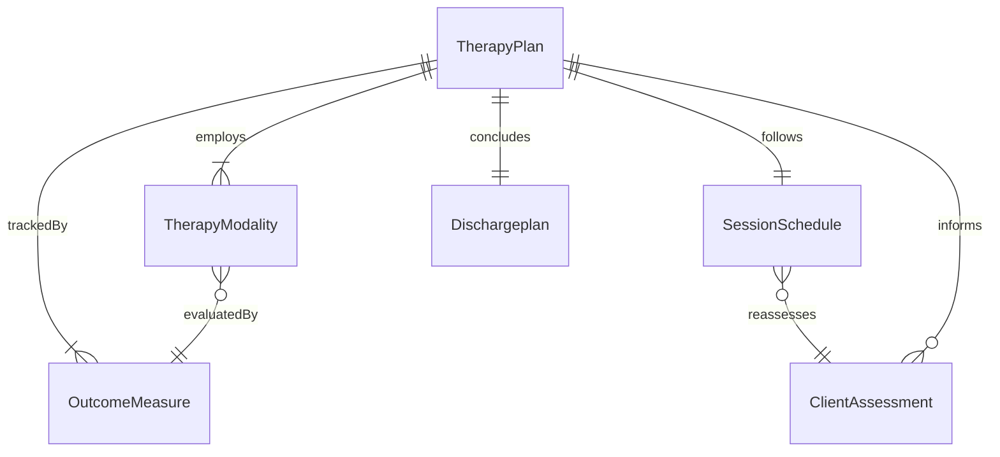
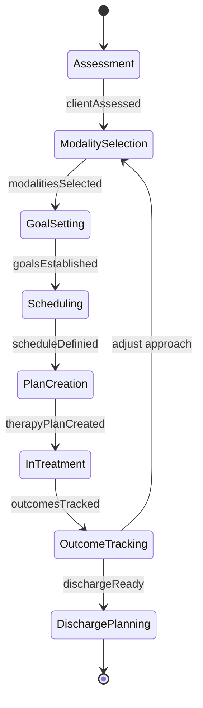
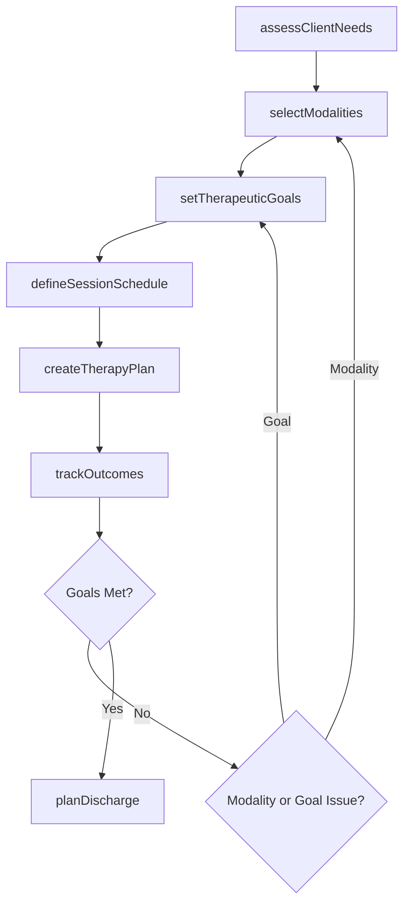
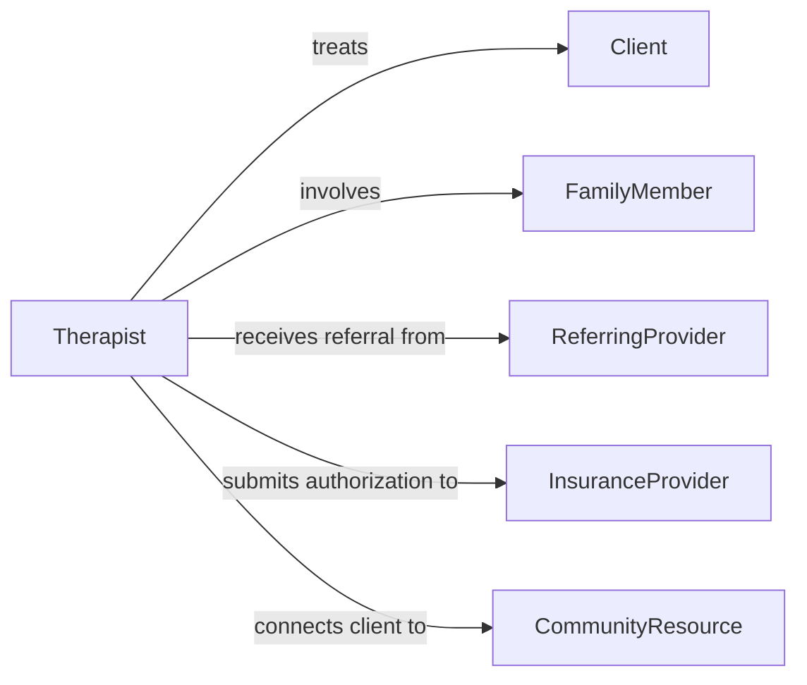

# Develop Treatment Plans Use Non-medical

> Business-as-Code definition for developing treatment plans that incorporate non-medical therapies such as counseling, behavioral interventions, occupational therapy, and complementary approaches.

## Overview

Developing treatment plans that use non-medical therapies involves designing therapeutic programs centered on psychological, behavioral, rehabilitative, or complementary interventions rather than pharmacological or surgical approaches. Practitioners assess client needs, select appropriate modalities such as cognitive behavioral therapy, occupational therapy, art therapy, or mindfulness-based interventions, and structure treatment protocols with measurable outcomes. These plans are common in mental health, substance abuse recovery, developmental services, and holistic wellness settings.

## Actors

| Actor | Description |
|-------|-------------|
| Client | The individual receiving non-medical therapeutic services |
| FamilyMember | Participates in family-based interventions and supports treatment adherence |
| ReferringProvider | Refers the client and communicates relevant clinical background |
| InsuranceProvider | Authorizes coverage for approved non-medical therapies |
| CommunityResource | External organizations providing supplementary support services |

## Roles

| Role | Description |
|------|-------------|
| Therapist | Designs and delivers the non-medical treatment program |
| ClinicalSupervisor | Provides oversight and approves treatment approaches |
| CaseManager | Coordinates services across providers and community resources |
| PeerSpecialist | Supports clients through shared lived experience |

## Entities

| Entity | Description |
|--------|-------------|
| TherapyPlan | A structured non-medical treatment protocol with goals and modalities |
| TherapyModality | A specific non-medical intervention approach (e.g., CBT, DBT, EMDR) |
| SessionSchedule | The planned frequency and duration of therapeutic sessions |
| ClientAssessment | Evaluation of client functioning, symptoms, and readiness for change |
| OutcomeMeasure | Validated instrument for tracking therapeutic progress |
| Dischargeplan | Criteria and plan for transitioning out of active treatment |

## Actions

| Action | Description |
|--------|-------------|
| assessClientNeeds | Evaluate presenting concerns, history, and functional status |
| selectModalities | Choose appropriate non-medical therapy approaches |
| defineSessionSchedule | Set frequency, duration, and format of therapeutic sessions |
| setTherapeuticGoals | Establish measurable objectives for non-medical treatment |
| createTherapyPlan | Formalize the treatment plan with selected interventions |
| trackOutcomes | Administer validated measures to monitor therapeutic progress |
| planDischarge | Define criteria and transition steps for ending treatment |

## Events

| Event | Description |
|-------|-------------|
| clientAssessed | The initial clinical assessment has been completed |
| modalitiesSelected | Non-medical therapy approaches have been chosen |
| scheduleDefinied | Session frequency and format have been established |
| goalsEstablished | Therapeutic objectives have been set |
| therapyPlanCreated | The non-medical treatment plan has been formalized |
| outcomesTracked | Progress measures have been administered and recorded |
| dischargeReady | The client has met criteria for treatment completion |

## Searches

| Search | Description |
|--------|-------------|
| findPlansByModality | Retrieve therapy plans using a specific treatment modality |
| getClientOutcomes | View outcome measure scores across sessions for a client |
| findActiveCaseload | List all active non-medical treatment plans for a therapist |
| getEvidenceBase | Retrieve research support for a modality and presenting concern |

## Entity Relationships



## State Diagram



## Workflow



## Actor Relationships



## Usage

### Calling Actions

```typescript
import { developTreatmentPlansUseNonMedical } from '@headlessly/develop-treatment-plans-use-non-medical'

const therapy = developTreatmentPlansUseNonMedical()

// Assess client needs
const assessment = await therapy.assessClientNeeds({
  clientId: 'cli-2247',
  domains: ['mentalHealth', 'substanceUse', 'socialFunctioning'],
  instruments: ['PHQ-9', 'GAD-7', 'AUDIT']
})

// Select modalities and create plan
const plan = await therapy.createTherapyPlan({
  clientId: 'cli-2247',
  modalities: ['cognitiveBehavioralTherapy', 'mindfulnessBasedStressReduction'],
  goals: [
    { description: 'Reduce depressive symptoms to mild range', measure: 'PHQ-9', target: 9, weeks: 12 },
    { description: 'Develop daily mindfulness practice', measure: 'practiceLog', target: '5daysPerWeek', weeks: 8 }
  ],
  schedule: { frequency: 'weekly', duration: 50, format: 'individual' }
})

// Track outcomes at session intervals
await therapy.trackOutcomes({
  planId: plan.id,
  session: 6,
  scores: { 'PHQ-9': 12, 'GAD-7': 8 }
})
```

### Event-Driven Automation

```typescript
// Alert supervisor when outcomes plateau
therapy.outcomesTracked(async ({ planId, clientId, scores, priorScores }) => {
  const noImprovement = Object.keys(scores).every(
    measure => Math.abs(scores[measure] - priorScores[measure]) < 2
  )
  if (noImprovement) {
    await notify({
      to: 'clinical-supervisor',
      message: `Outcomes plateau detected for client ${clientId} - consider modality adjustment`
    })
  }
})

// Schedule discharge planning when goals are met
therapy.dischargeReady(async ({ planId, clientId }) => {
  await createTask({
    assignee: 'case-manager',
    description: `Prepare discharge and aftercare plan for client ${clientId}`,
    dueDate: addWeeks(new Date(), 2)
  })
})
```
