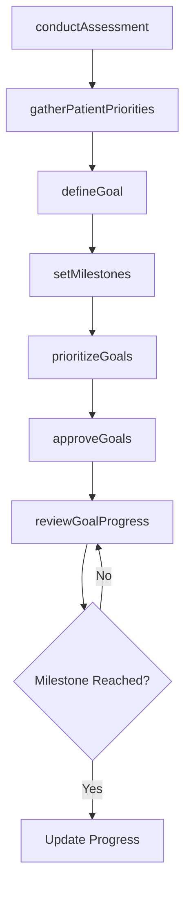
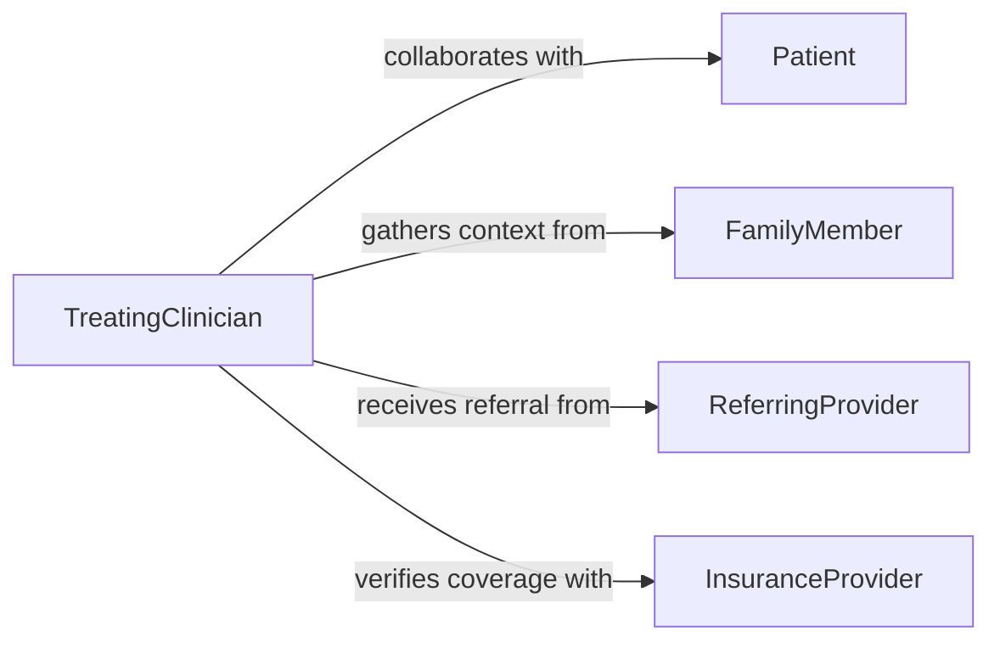

# Establish Treatment Goals

> Business-as-Code definition for establishing measurable treatment goals that guide patient care planning and outcome evaluation.

## Overview

Establishing treatment goals involves collaborating with patients and care teams to define specific, measurable, achievable, relevant, and time-bound objectives for therapeutic interventions. Goals are derived from clinical assessments, patient priorities, and evidence-based benchmarks. This process provides the foundation for treatment planning, progress monitoring, and outcome measurement across healthcare and behavioral health settings.

## Actors

| Actor | Description |
|-------|-------------|
| Patient | Collaborates in setting goals aligned with personal health priorities |
| FamilyMember | Provides context on patient capabilities and home environment |
| ReferringProvider | Supplies diagnostic information and referral expectations |
| InsuranceProvider | Defines coverage parameters that may influence goal scope |

## Roles

| Role | Description |
|------|-------------|
| TreatingClinician | Leads the goal-setting process based on clinical assessment |
| CareCoordinator | Ensures goals are aligned across multidisciplinary team members |
| ClinicalSupervisor | Reviews goal appropriateness and clinical soundness |
| OutcomesAnalyst | Tracks goal attainment rates and informs benchmarking |

## Entities

| Entity | Description |
|--------|-------------|
| TreatmentGoal | A defined objective for patient care with measurable criteria |
| Assessment | Clinical evaluation data used to inform goal selection |
| Benchmark | Evidence-based standard for expected progress |
| GoalMilestone | An intermediate checkpoint toward full goal attainment |
| PatientPriority | Patient-expressed preferences and desired outcomes |
| GoalReview | Periodic evaluation of goal relevance and progress |

## Actions

| Action | Description |
|--------|-------------|
| conductAssessment | Perform clinical evaluation to identify treatment needs |
| gatherPatientPriorities | Collect patient preferences and desired outcomes |
| defineGoal | Create a specific measurable treatment goal |
| setMilestones | Establish intermediate checkpoints for goal progress |
| prioritizeGoals | Rank goals by clinical urgency and patient preference |
| approveGoals | Finalize and authorize the treatment goal set |
| reviewGoalProgress | Evaluate advancement toward established goals |

## Events

| Event | Description |
|-------|-------------|
| assessmentCompleted | Clinical evaluation has been finalized |
| prioritiesGathered | Patient preferences and priorities have been collected |
| goalDefined | A new treatment goal has been formally created |
| milestonesSet | Intermediate checkpoints have been established for a goal |
| goalsPrioritized | Treatment goals have been ranked by importance |
| goalsApproved | The full set of treatment goals has been authorized |
| milestoneReached | A patient has achieved an intermediate goal checkpoint |

## Searches

| Search | Description |
|--------|-------------|
| findGoalsByPatient | Retrieve all treatment goals for a specific patient |
| getGoalProgress | Check current progress status for a treatment goal |
| getBenchmarks | Retrieve evidence-based benchmarks for a condition or intervention |
| findOverdueGoals | List goals that have not met expected milestones on schedule |

## Workflow



## Actor Relationships



## Usage

### Calling Actions

```typescript
import { establishTreatmentGoals } from '@headlessly/establish-treatment-goals'

const goals = establishTreatmentGoals()

// Conduct initial assessment
const assessment = await goals.conductAssessment({
  patientId: 'pat-3310',
  type: 'initialEvaluation',
  domains: ['physical', 'functional', 'psychosocial']
})

// Define a treatment goal with milestones
const goal = await goals.defineGoal({
  patientId: 'pat-3310',
  description: 'Restore shoulder range of motion to functional level',
  measure: 'activeFlexionDegrees',
  target: 160,
  baseline: 90,
  timeframe: { weeks: 12 }
})

await goals.setMilestones({
  goalId: goal.id,
  milestones: [
    { week: 4, target: 110, label: 'Early mobility improvement' },
    { week: 8, target: 140, label: 'Moderate functional recovery' },
    { week: 12, target: 160, label: 'Full functional restoration' }
  ]
})
```

### Event-Driven Automation

```typescript
// Celebrate milestone achievement
goals.milestoneReached(async ({ goalId, patientId, milestone }) => {
  await notify({
    to: patientId,
    message: `Congratulations! You reached: ${milestone.label}`
  })
})

// Alert clinician when goals are overdue
goals.goalsApproved(async ({ patientId, goalIds }) => {
  await scheduleReview({
    patientId,
    goalIds,
    reviewDate: addWeeks(new Date(), 4)
  })
})
```
