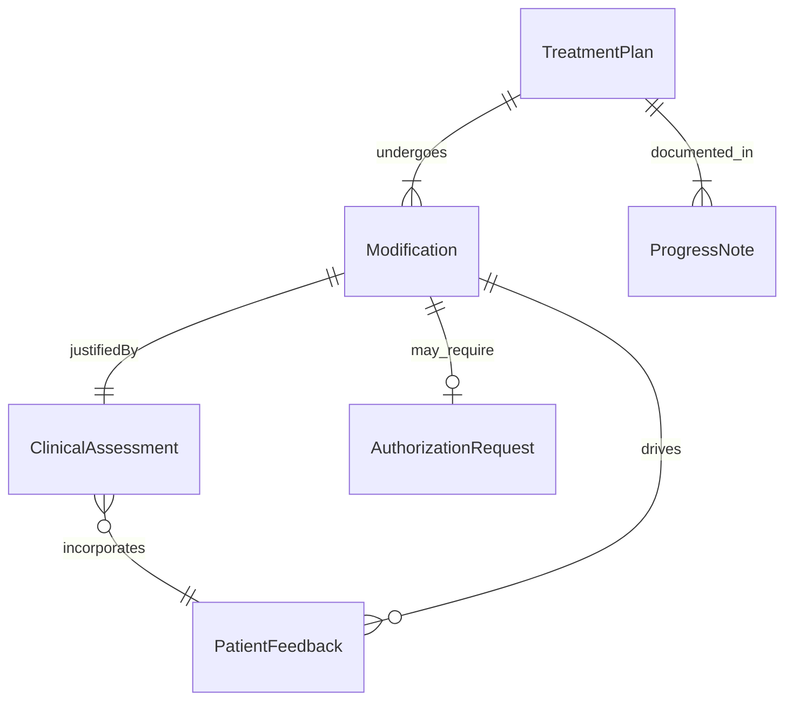
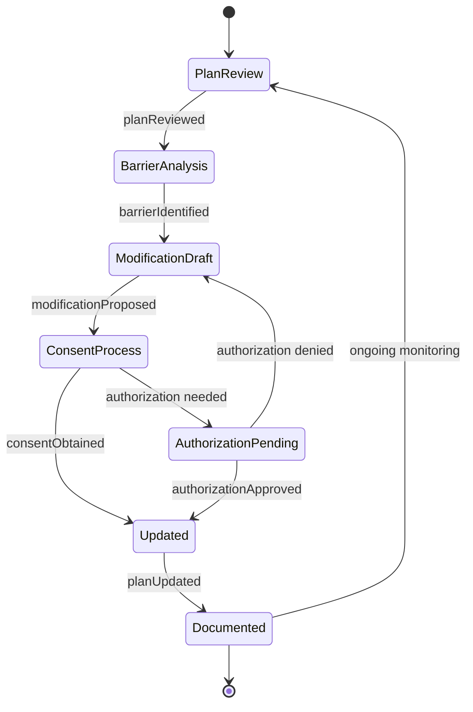
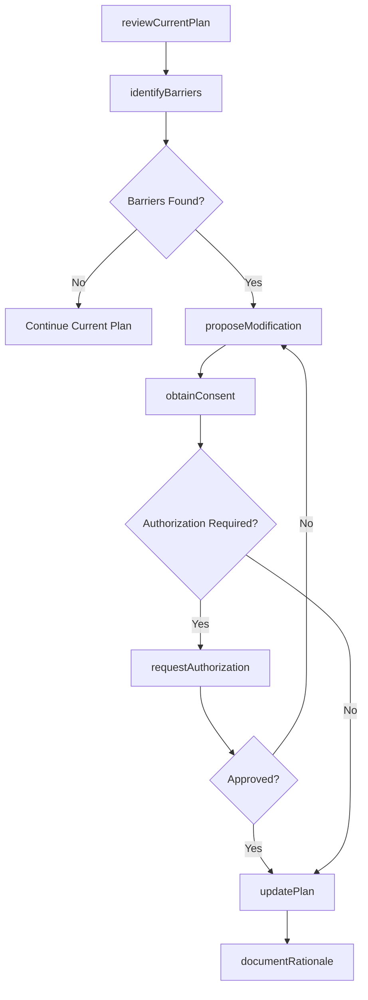
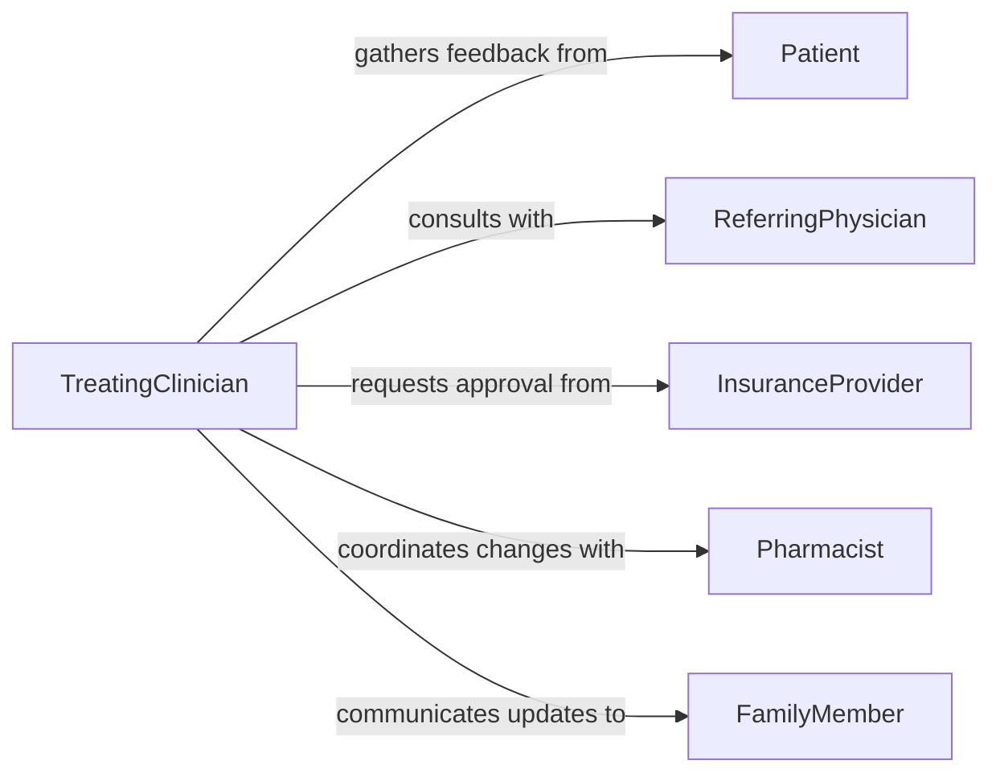

# Modify Treatment Plans Accommodate Client

> Business-as-Code definition for modifying treatment plans to accommodate changing client needs, preferences, and clinical circumstances.

## Overview

Modifying treatment plans to accommodate client needs involves reviewing existing care protocols and adjusting interventions based on patient progress, side effects, lifestyle changes, or evolving clinical presentations. Practitioners evaluate treatment efficacy, gather client feedback, and revise therapeutic approaches to ensure optimal outcomes. This process is central to patient-centered care across medical, behavioral health, and rehabilitative settings.

## Actors

| Actor | Description |
|-------|-------------|
| Patient | The individual receiving treatment whose needs drive plan modifications |
| FamilyMember | Provides input on patient circumstances and supports adherence |
| InsuranceProvider | Authorizes coverage for modified treatment approaches |
| ReferringPhysician | Supplies clinical context and coordinates with treating provider |
| Pharmacist | Advises on medication adjustments and interactions |

## Roles

| Role | Description |
|------|-------------|
| TreatingClinician | Evaluates patient progress and initiates plan modifications |
| CareCoordinator | Manages communication between care team members during changes |
| ClinicalSupervisor | Reviews and approves significant treatment plan revisions |
| PatientAdvocate | Ensures patient preferences and concerns are incorporated |

## Entities

| Entity | Description |
|--------|-------------|
| TreatmentPlan | The current documented care protocol being modified |
| Modification | A specific change to an existing treatment plan element |
| ClinicalAssessment | Evaluation data informing the need for modification |
| PatientFeedback | Client-reported outcomes and preferences |
| AuthorizationRequest | Insurance or supervisory approval for revised treatment |
| ProgressNote | Documentation of patient response to current treatment |

## Actions

| Action | Description |
|--------|-------------|
| reviewCurrentPlan | Assess the existing treatment plan and its effectiveness |
| identifyBarriers | Determine factors preventing treatment adherence or progress |
| proposeModification | Draft specific changes to the treatment approach |
| obtainConsent | Secure patient agreement to the proposed plan changes |
| updatePlan | Apply approved modifications to the treatment plan |
| requestAuthorization | Submit revised plan for insurance or supervisory approval |
| documentRationale | Record the clinical reasoning behind each modification |

## Events

| Event | Description |
|-------|-------------|
| planReviewed | The existing treatment plan has been evaluated for effectiveness |
| barrierIdentified | A specific obstacle to treatment success has been found |
| modificationProposed | A change to the treatment plan has been drafted |
| consentObtained | The patient has agreed to the proposed modifications |
| planUpdated | The treatment plan has been officially revised |
| authorizationApproved | The modified plan has received required approvals |
| rationale Documented | Clinical reasoning for the change has been recorded |

## Searches

| Search | Description |
|--------|-------------|
| findModificationHistory | Retrieve past modifications for a given treatment plan |
| getPendingAuthorizations | List plan changes awaiting insurance or supervisory approval |
| getPatientBarriers | Identify documented barriers for a specific patient |

## Entity Relationships



## State Diagram



## Workflow



## Actor Relationships



## Usage

### Calling Actions

```typescript
import { modifyTreatmentPlansAccommodateClient } from '@headlessly/modify-treatment-plans-accommodate-client'

const plans = modifyTreatmentPlansAccommodateClient()

// Review current plan effectiveness
const review = await plans.reviewCurrentPlan({
  treatmentPlanId: 'tp-2024-0892',
  patientId: 'pat-4471',
  assessmentDate: '2026-02-05'
})

// Identify barriers to adherence
const barriers = await plans.identifyBarriers({
  treatmentPlanId: 'tp-2024-0892',
  categories: ['sideEffects', 'scheduling', 'financial']
})

// Propose and apply modification
const modification = await plans.proposeModification({
  treatmentPlanId: 'tp-2024-0892',
  changes: [
    { element: 'sessionFrequency', from: 'weekly', to: 'biweekly' },
    { element: 'modality', from: 'inPerson', to: 'telehealth' }
  ],
  rationale: 'Patient reports transportation barriers affecting attendance'
})
```

### Event-Driven Automation

```typescript
// Notify care team when plan is updated
plans.planUpdated(async ({ treatmentPlanId, patientId, modifications }) => {
  await notify({
    to: 'care-team',
    message: `Treatment plan ${treatmentPlanId} modified: ${modifications.length} changes applied`
  })
})

// Auto-flag plans needing review after barrier identification
plans.barrierIdentified(async ({ treatmentPlanId, barrier }) => {
  if (barrier.severity === 'high') {
    await escalate({
      to: 'clinical-supervisor',
      planId: treatmentPlanId,
      reason: `High-severity barrier: ${barrier.description}`
    })
  }
})
```
