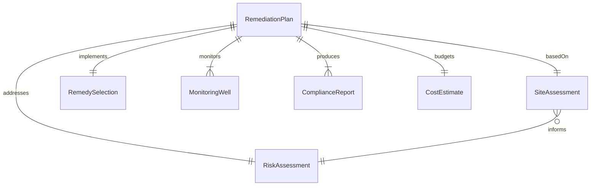
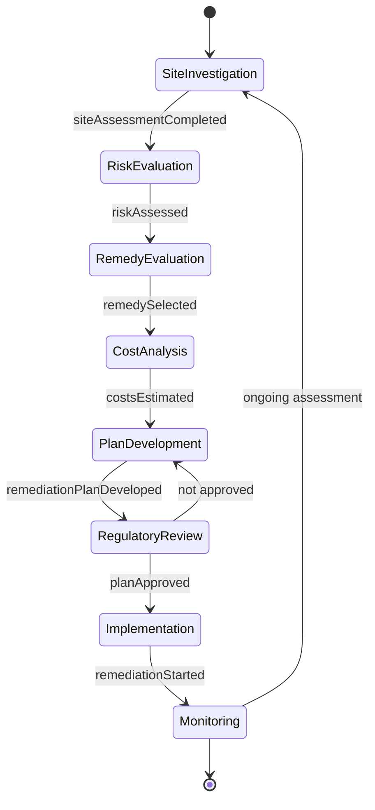
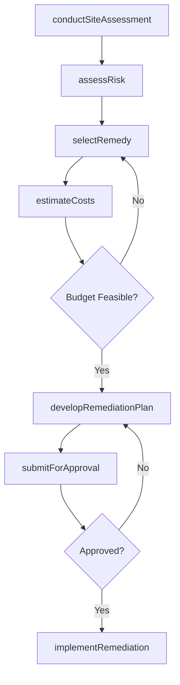
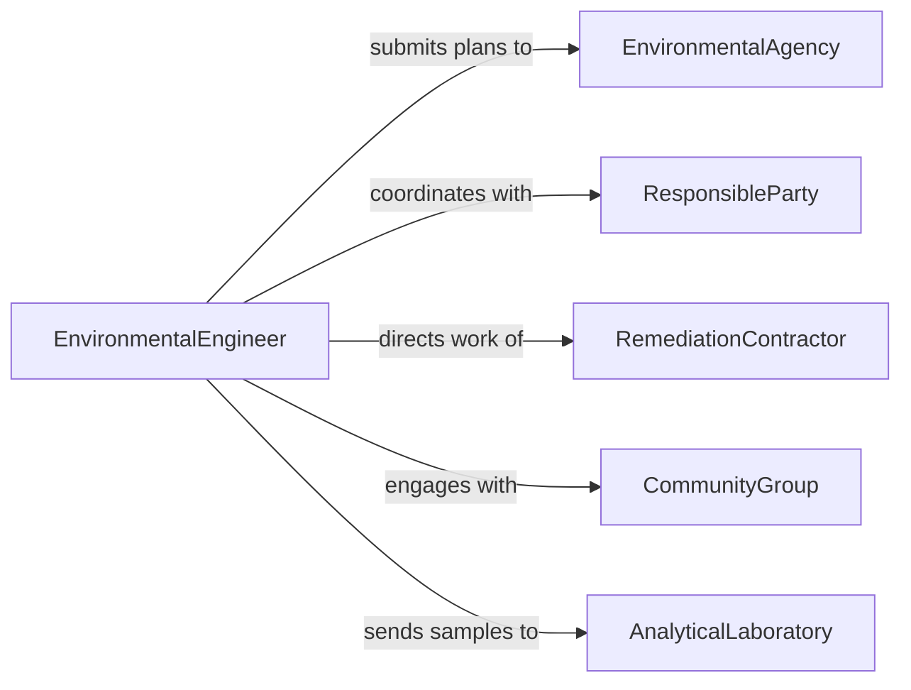

# Develop Environmental Remediation or Protection Plans

> Business-as-Code definition for developing plans that address contaminated site cleanup, pollution prevention, and environmental protection across land, water, and air resources.

## Overview

Environmental remediation and protection planning involves site investigation, contaminant characterization, risk assessment, remedy selection, and implementation scheduling for polluted or at-risk environments. This definition models the regulatory-driven process of developing cleanup plans, protection strategies, and compliance documentation that satisfy environmental agency requirements.

## Actors

| Actor | Description |
|-------|-------------|
| EnvironmentalAgency | Regulatory body overseeing cleanup and compliance (e.g., EPA) |
| ResponsibleParty | Entity liable for contamination and remediation costs |
| RemediationContractor | Firm performing cleanup and treatment activities |
| CommunityGroup | Local residents affected by contamination |
| AnalyticalLaboratory | Facility testing soil, water, and air samples |
| InsuranceCarrier | Entity providing environmental liability coverage |

## Roles

| Role | Description |
|------|-------------|
| EnvironmentalEngineer | Designs remediation strategies and protection plans |
| ProjectManager | Coordinates remediation activities and timelines |
| RiskAssessor | Evaluates human health and ecological risks |
| ComplianceSpecialist | Ensures plans meet regulatory requirements |

## Entities

| Entity | Description |
|--------|-------------|
| RemediationPlan | Formal document describing cleanup strategy and schedule |
| SiteAssessment | Investigation report characterizing contamination |
| RiskAssessment | Analysis of health and ecological exposure risks |
| RemedySelection | Chosen cleanup technology and approach |
| MonitoringWell | Groundwater sampling point for tracking contaminants |
| ComplianceReport | Documentation submitted to regulatory agencies |
| CostEstimate | Projected financial requirements for remediation |

## Actions

| Action | Description |
|--------|-------------|
| conductSiteAssessment | Investigate contamination extent and characteristics |
| assessRisk | Evaluate human health and ecological exposure risks |
| selectRemedy | Choose the appropriate cleanup technology |
| developRemediationPlan | Author the formal cleanup strategy document |
| estimateCosts | Calculate projected remediation expenses |
| submitForApproval | Submit plan to regulatory agency for review |
| implementRemediation | Execute the approved cleanup activities |

## Events

| Event | Description |
|-------|-------------|
| siteAssessmentCompleted | Contamination characterization is finished |
| riskAssessed | Health and ecological risk evaluation is complete |
| remedySelected | A cleanup approach has been chosen |
| remediationPlanDeveloped | The formal plan document has been authored |
| costsEstimated | Financial projections have been calculated |
| planApproved | The regulatory agency has approved the plan |
| remediationStarted | Cleanup activities have begun on site |

## Searches

| Search | Description |
|--------|-------------|
| findRemediationPlans | Search plans by site, contaminant, or status |
| getSiteAssessments | Retrieve investigation reports for a location |
| listContaminants | Enumerate detected contaminants by site |
| getComplianceStatus | Check regulatory approval status |
| findMonitoringData | Query well sampling results by date or analyte |

## Entity Relationships



## State Diagram



## Workflow



## Actor Relationships



## Usage

### Calling Actions

```typescript
import { developEnvironmentalRemediationProtectionPlans } from '@headlessly/develop-environmental-remediation-protection-plans'

const remediation = developEnvironmentalRemediationProtectionPlans()

// Conduct site assessment
const assessment = await remediation.conductSiteAssessment({
  siteName: 'Former Industrial Park',
  location: { lat: 40.7128, lng: -74.006 },
  contaminantsOfConcern: ['TCE', 'PCE', 'heavy-metals'],
  mediaAffected: ['groundwater', 'soil']
})

// Select remedy
const remedy = await remediation.selectRemedy({
  assessmentId: assessment.id,
  options: [
    { technology: 'in-situ-bioremediation', effectiveness: 92 },
    { technology: 'pump-and-treat', effectiveness: 85 },
    { technology: 'soil-vapor-extraction', effectiveness: 88 }
  ],
  selection: 'in-situ-bioremediation'
})

// Develop the plan
await remediation.developRemediationPlan({
  assessmentId: assessment.id,
  remedyId: remedy.id,
  timeline: { phases: 3, totalMonths: 36 }
})
```

### Event-Driven Automation

```typescript
// Notify community when plan is approved
remediation.planApproved(async ({ siteId, planId }) => {
  await notify({
    to: 'community-liaison',
    message: `Remediation plan ${planId} approved for site ${siteId}`
  })
})

// Auto-start monitoring after remediation begins
remediation.remediationStarted(async ({ siteId }) => {
  await scheduleMonitoring({
    siteId,
    frequency: 'monthly',
    parameters: ['groundwater-levels', 'contaminant-concentrations']
  })
})
```
