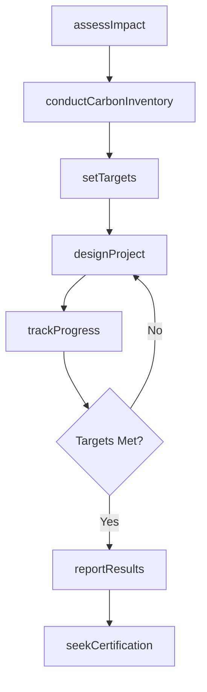
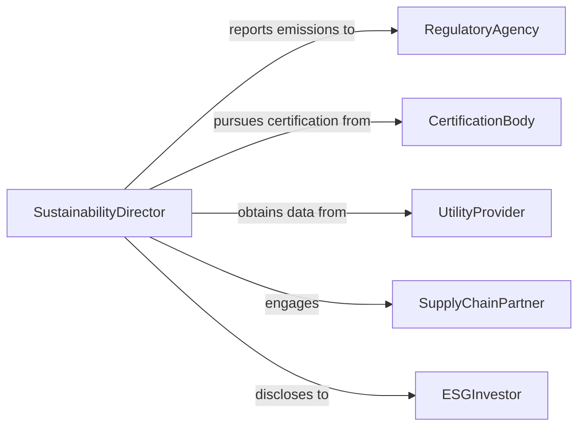

# Develop Environmental Sustainability Plans or Projects

> Business-as-Code definition for developing sustainability plans and projects that reduce environmental impact, improve resource efficiency, and achieve measurable ecological outcomes.

## Overview

Environmental sustainability planning involves setting reduction targets for carbon emissions, waste, and resource consumption, then designing projects and initiatives to achieve those targets. This definition models the process from sustainability assessment and goal-setting through project design, implementation planning, and impact measurement, supporting organizations in codifying their environmental commitments as actionable programs.

## Actors

| Actor | Description |
|-------|-------------|
| CertificationBody | Organization issuing sustainability certifications (e.g., LEED, ISO 14001) |
| UtilityProvider | Energy or water utility providing consumption data |
| SupplyChainPartner | Vendor or supplier participating in sustainability initiatives |
| RegulatoryAgency | Government body enforcing environmental regulations |
| CommunityStakeholder | Local group affected by or contributing to sustainability efforts |
| ESGInvestor | Financial entity evaluating environmental performance |

## Roles

| Role | Description |
|------|-------------|
| SustainabilityDirector | Sets organizational sustainability strategy and targets |
| EnvironmentalAnalyst | Assesses current impact and identifies improvement areas |
| ProjectManager | Coordinates sustainability project execution |
| ReportingSpecialist | Compiles sustainability metrics and disclosures |

## Entities

| Entity | Description |
|--------|-------------|
| SustainabilityPlan | Strategic document outlining environmental goals and actions |
| ImpactAssessment | Evaluation of current environmental footprint |
| ReductionTarget | Quantified goal for decreasing emissions, waste, or consumption |
| SustainabilityProject | Specific initiative designed to achieve a reduction target |
| CarbonInventory | Accounting of greenhouse gas emissions by scope |
| ProgressReport | Periodic summary of sustainability metrics |
| Certification | Formal recognition of sustainability achievement |

## Actions

| Action | Description |
|--------|-------------|
| assessImpact | Measure current environmental footprint and baseline |
| setTargets | Define quantified sustainability reduction goals |
| designProject | Create a project plan for a sustainability initiative |
| conductCarbonInventory | Account for emissions across scopes 1, 2, and 3 |
| trackProgress | Monitor metrics against reduction targets |
| reportResults | Compile and publish sustainability performance data |
| seekCertification | Apply for environmental sustainability certification |

## Events

| Event | Description |
|-------|-------------|
| impactAssessed | Environmental footprint baseline has been established |
| targetsSet | Sustainability reduction goals have been defined |
| projectDesigned | A sustainability initiative plan has been created |
| carbonInventoryCompleted | Emissions accounting has been finalized |
| progressTracked | Metric updates against targets have been recorded |
| resultsReported | Sustainability performance has been published |
| certificationAchieved | A sustainability certification has been awarded |

## Searches

| Search | Description |
|--------|-------------|
| findSustainabilityPlans | Search plans by organization or target type |
| getReductionTargets | Retrieve targets by category or deadline |
| listProjects | Enumerate sustainability projects by status |
| getCarbonInventory | Look up emissions data by scope or period |
| getProgressReports | Retrieve periodic sustainability summaries |

## Workflow



## Actor Relationships



## Usage

### Calling Actions

```typescript
import { developEnvironmentalSustainabilityPlansProjects } from '@headlessly/develop-environmental-sustainability-plans-projects'

const sustainability = developEnvironmentalSustainabilityPlansProjects()

// Assess current environmental impact
const assessment = await sustainability.assessImpact({
  organization: 'Acme Manufacturing',
  categories: ['energy', 'water', 'waste', 'emissions'],
  baselineYear: 2024
})

// Set reduction targets
await sustainability.setTargets({
  assessmentId: assessment.id,
  targets: [
    { category: 'emissions', reduction: 40, unit: 'percent', deadline: '2030' },
    { category: 'water', reduction: 25, unit: 'percent', deadline: '2028' },
    { category: 'waste-to-landfill', reduction: 90, unit: 'percent', deadline: '2030' }
  ]
})

// Design a sustainability project
await sustainability.designProject({
  name: 'Rooftop Solar Installation',
  category: 'energy',
  estimatedReduction: { emissions: 500, unit: 'metric-tons-CO2e-per-year' },
  budget: 850000
})
```

### Event-Driven Automation

```typescript
// Generate report when progress is tracked
sustainability.progressTracked(async ({ organizationId, period }) => {
  await sustainability.reportResults({
    organizationId,
    period,
    format: 'GRI-standards'
  })
})

// Notify ESG stakeholders of certification
sustainability.certificationAchieved(async ({ certification, organizationId }) => {
  await notify({
    to: 'investor-relations',
    message: `${certification} certification achieved for organization ${organizationId}`
  })
})
```
