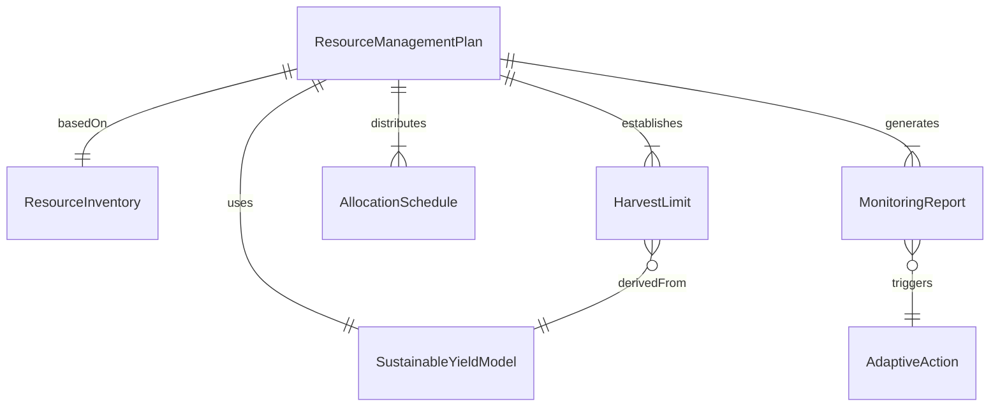
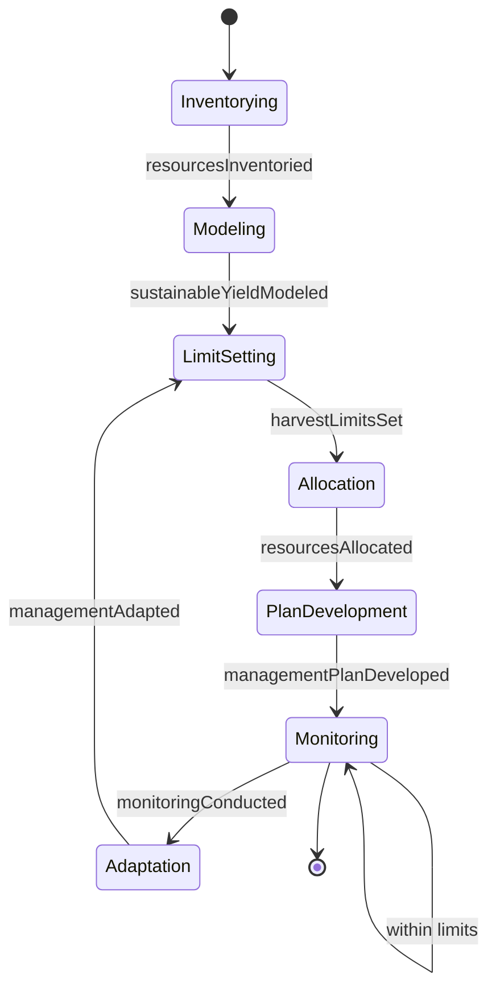
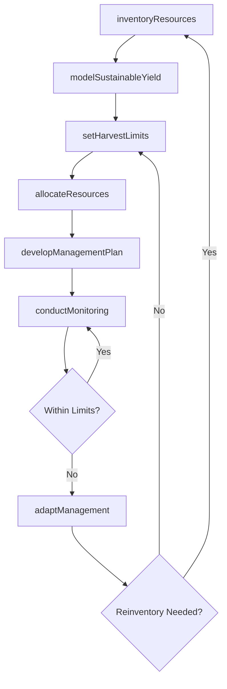
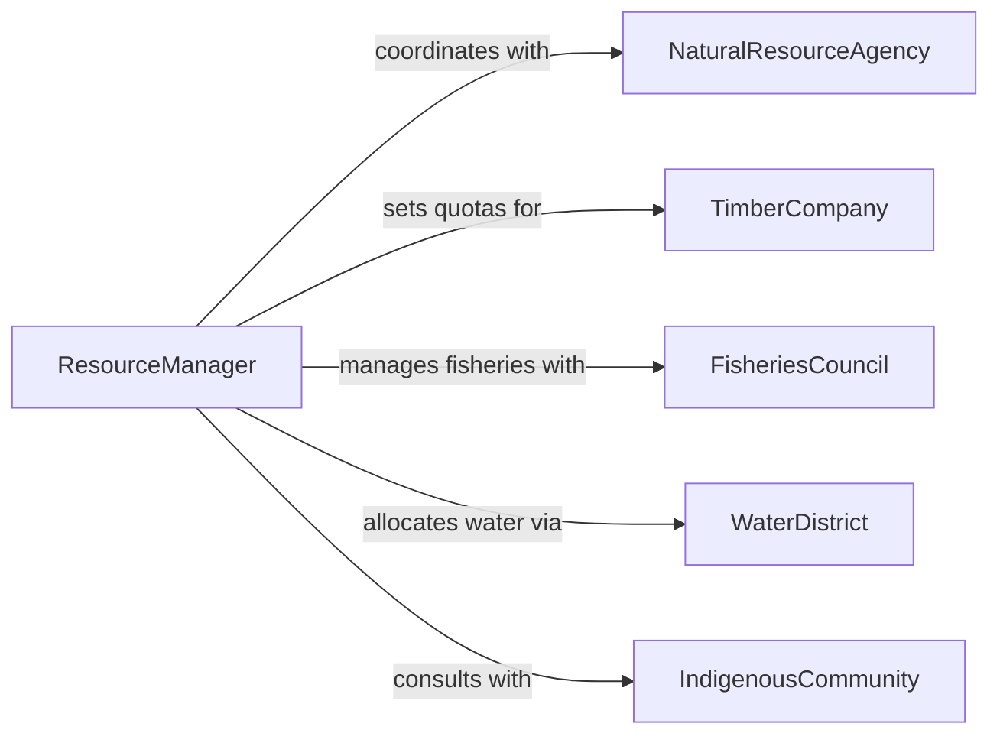

# Develop Plans to Manage Natural or Renewable Resources

> Business-as-Code definition for developing management plans that ensure the sustainable use, allocation, and stewardship of natural and renewable resources such as forests, fisheries, and water systems.

## Overview

Natural and renewable resource management planning involves inventorying available resources, modeling sustainable yield levels, establishing harvest or extraction limits, and designing monitoring programs to ensure long-term viability. This definition covers the process from resource inventory through plan development, stakeholder consultation, and adaptive management based on monitoring outcomes.

## Actors

| Actor | Description |
|-------|-------------|
| NaturalResourceAgency | Government body managing public lands and resources |
| TimberCompany | Commercial entity harvesting forest products |
| FisheriesCouncil | Regional body managing fishing quotas and seasons |
| WaterDistrict | Authority managing water rights and allocations |
| ConservationGroup | Nonprofit advocating for sustainable resource use |
| IndigenousCommunity | Group with traditional resource management practices |

## Roles

| Role | Description |
|------|-------------|
| ResourceManager | Develops and oversees resource management plans |
| ForestEcologist | Assesses forest health and sustainable harvest levels |
| HydrologySpecialist | Models water availability and allocation scenarios |
| PolicyAnalyst | Evaluates regulatory frameworks for resource management |

## Entities

| Entity | Description |
|--------|-------------|
| ResourceManagementPlan | Comprehensive plan for sustainable resource use |
| ResourceInventory | Quantified assessment of available natural resources |
| SustainableYieldModel | Calculation of maximum extraction without depletion |
| HarvestLimit | Maximum allowable extraction for a given period |
| AllocationSchedule | Distribution of resource access among stakeholders |
| MonitoringReport | Periodic assessment of resource condition |
| AdaptiveAction | Management adjustment based on monitoring data |

## Actions

| Action | Description |
|--------|-------------|
| inventoryResources | Quantify available natural and renewable resources |
| modelSustainableYield | Calculate maximum sustainable extraction rates |
| setHarvestLimits | Establish extraction caps for a given period |
| allocateResources | Distribute access among user groups |
| developManagementPlan | Author the comprehensive resource management plan |
| conductMonitoring | Assess resource condition and extraction impacts |
| adaptManagement | Adjust plan based on monitoring outcomes |

## Events

| Event | Description |
|-------|-------------|
| resourcesInventoried | Available resources have been quantified |
| sustainableYieldModeled | Maximum extraction rates have been calculated |
| harvestLimitsSet | Extraction caps have been established |
| resourcesAllocated | Access has been distributed among stakeholders |
| managementPlanDeveloped | The resource management plan has been authored |
| monitoringConducted | Resource condition assessment is complete |
| managementAdapted | Plan adjustments have been made |

## Searches

| Search | Description |
|--------|-------------|
| findManagementPlans | Search plans by resource type or region |
| getResourceInventory | Retrieve inventory data for a given area |
| listHarvestLimits | Enumerate extraction caps by season or area |
| getAllocations | Look up resource allocations by stakeholder |
| getMonitoringReports | Retrieve condition assessments by period |

## Entity Relationships



## State Diagram



## Workflow



## Actor Relationships



## Usage

### Calling Actions

```typescript
import { developPlansManageNaturalRenewable } from '@headlessly/develop-plans-manage-natural-renewable'

const resourcePlan = developPlansManageNaturalRenewable()

// Inventory available resources
const inventory = await resourcePlan.inventoryResources({
  region: 'Pacific Northwest',
  resourceTypes: ['timber', 'salmon', 'freshwater'],
  surveyYear: 2025
})

// Model sustainable yield
const yieldModel = await resourcePlan.modelSustainableYield({
  inventoryId: inventory.id,
  resource: 'timber',
  growthRate: 3.2,
  currentStock: 15000000,
  unit: 'board-feet'
})

// Set harvest limits
await resourcePlan.setHarvestLimits({
  yieldModelId: yieldModel.id,
  annualLimit: 480000,
  unit: 'board-feet',
  season: { start: 'April', end: 'October' }
})
```

### Event-Driven Automation

```typescript
// Alert when monitoring shows resource depletion
resourcePlan.monitoringConducted(async ({ region, resource, currentLevel, threshold }) => {
  if (currentLevel < threshold) {
    await notify({
      to: 'resource-management',
      message: `${resource} in ${region} below sustainable threshold: ${currentLevel}`
    })
  }
})

// Auto-adjust harvest limits when management is adapted
resourcePlan.managementAdapted(async ({ planId, adjustments }) => {
  for (const adj of adjustments) {
    await resourcePlan.setHarvestLimits({
      yieldModelId: adj.yieldModelId,
      annualLimit: adj.newLimit
    })
  }
})
```
