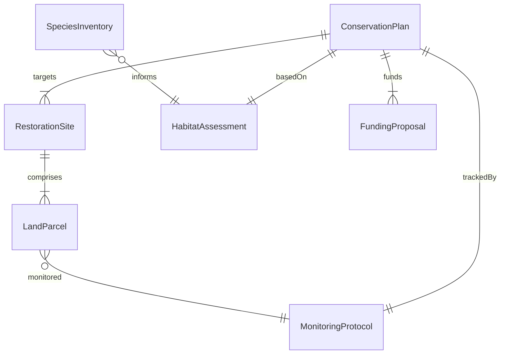
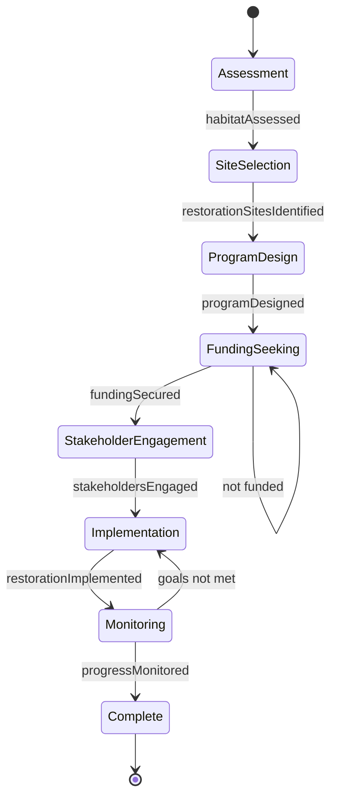
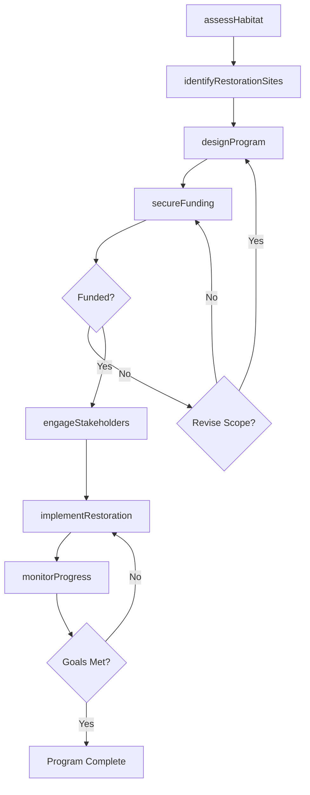
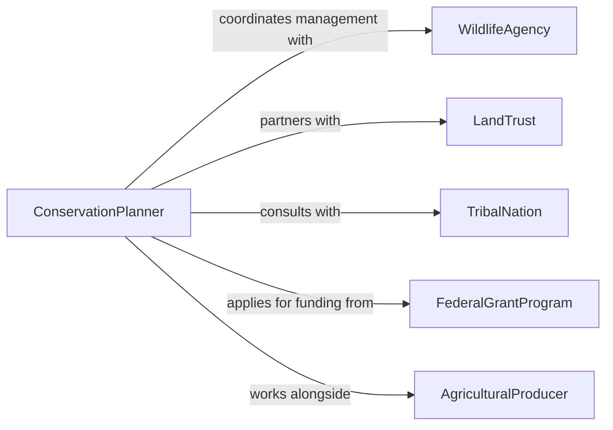

# Plan Natural Resources Conservation or Restoration Programs

> Business-as-Code definition for planning conservation and restoration programs that protect, rehabilitate, and sustain natural resources including land, water, and wildlife habitats.

## Overview

Natural resources conservation and restoration planning involves assessing ecosystem conditions, identifying degradation risks, designing intervention strategies, and coordinating implementation across landowners, agencies, and communities. This definition models the full planning lifecycle from baseline ecological assessment through program design, funding alignment, and stakeholder approval.

## Actors

| Actor | Description |
|-------|-------------|
| WildlifeAgency | Government body managing fish and wildlife resources |
| LandTrust | Nonprofit organization acquiring and protecting land |
| TribalNation | Indigenous community with treaty rights to natural resources |
| FederalGrantProgram | Government funding source for conservation projects |
| AgriculturalProducer | Farmer or rancher whose land borders conservation areas |
| EnvironmentalNGO | Nonprofit advocating for ecosystem protection |

## Roles

| Role | Description |
|------|-------------|
| ConservationPlanner | Designs restoration and protection programs |
| Ecologist | Assesses ecosystem health and species populations |
| WatershedManager | Coordinates water resource conservation efforts |
| GISAnalyst | Maps habitat areas and land use patterns |

## Entities

| Entity | Description |
|--------|-------------|
| ConservationPlan | Comprehensive program document for resource protection |
| HabitatAssessment | Evaluation of ecosystem condition and biodiversity |
| RestorationSite | Geographic area targeted for ecological rehabilitation |
| FundingProposal | Grant application or budget request for program funding |
| SpeciesInventory | Catalog of flora and fauna present in an area |
| LandParcel | Defined geographic unit within the conservation area |
| MonitoringProtocol | Procedures for tracking restoration progress |

## Actions

| Action | Description |
|--------|-------------|
| assessHabitat | Evaluate current ecosystem condition and biodiversity |
| identifyRestorationSites | Select areas requiring ecological rehabilitation |
| designProgram | Create the conservation or restoration program plan |
| secureFunding | Submit proposals and align budget for the program |
| engageStakeholders | Coordinate with landowners, agencies, and communities |
| implementRestoration | Execute habitat improvement activities |
| monitorProgress | Track ecosystem recovery against program goals |

## Events

| Event | Description |
|-------|-------------|
| habitatAssessed | Ecosystem condition evaluation has been completed |
| restorationSitesIdentified | Target areas for rehabilitation have been selected |
| programDesigned | The conservation program plan has been authored |
| fundingSecured | Financial resources have been committed to the program |
| stakeholdersEngaged | Community and agency coordination is established |
| restorationImplemented | Habitat improvement activities have been executed |
| progressMonitored | Recovery metrics have been collected and reviewed |

## Searches

| Search | Description |
|--------|-------------|
| findConservationPlans | Search plans by region, ecosystem type, or status |
| getHabitatAssessments | Retrieve assessments for a specific area |
| listRestorationSites | Enumerate sites by priority or restoration phase |
| findFundingOpportunities | Locate available grants and funding programs |
| getSpeciesInventory | Query species records for a given area |

## Entity Relationships



## State Diagram



## Workflow



## Actor Relationships



## Usage

### Calling Actions

```typescript
import { planNaturalResourcesConservationRestoration } from '@headlessly/plan-natural-resources-conservation-restoration'

const conservation = planNaturalResourcesConservationRestoration()

// Assess habitat condition
const assessment = await conservation.assessHabitat({
  region: 'Columbia River Basin',
  ecosystemType: 'riparian-wetland',
  species: ['salmon', 'steelhead', 'lamprey']
})

// Design the conservation program
const program = await conservation.designProgram({
  assessmentId: assessment.id,
  name: 'Salmon Habitat Restoration Initiative',
  objectives: [
    { metric: 'streamMilesRestored', target: 150 },
    { metric: 'spawningHabitatAcres', target: 2000 }
  ],
  duration: { years: 5 }
})

// Secure funding
await conservation.secureFunding({
  programId: program.id,
  sources: [
    { name: 'NOAA Restoration Center', amount: 2500000 },
    { name: 'State Conservation Fund', amount: 1200000 }
  ]
})
```

### Event-Driven Automation

```typescript
// Notify stakeholders when funding is secured
conservation.fundingSecured(async ({ programId, totalAmount }) => {
  await notify({
    to: 'conservation-partners',
    message: `Funding of $${totalAmount} secured for program ${programId}`
  })
})

// Schedule monitoring after restoration
conservation.restorationImplemented(async ({ siteId }) => {
  await conservation.monitorProgress({
    siteId,
    frequency: 'quarterly',
    metrics: ['water-quality', 'fish-count', 'vegetation-cover']
  })
})
```
