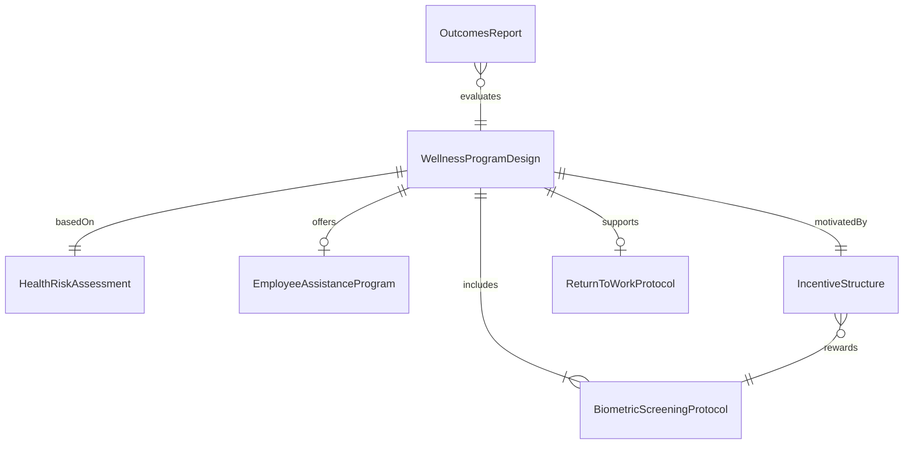
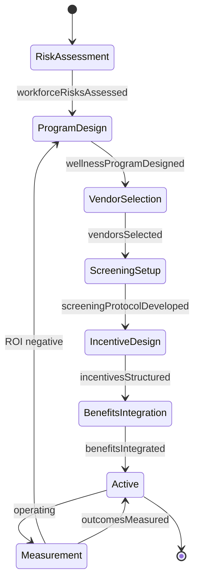
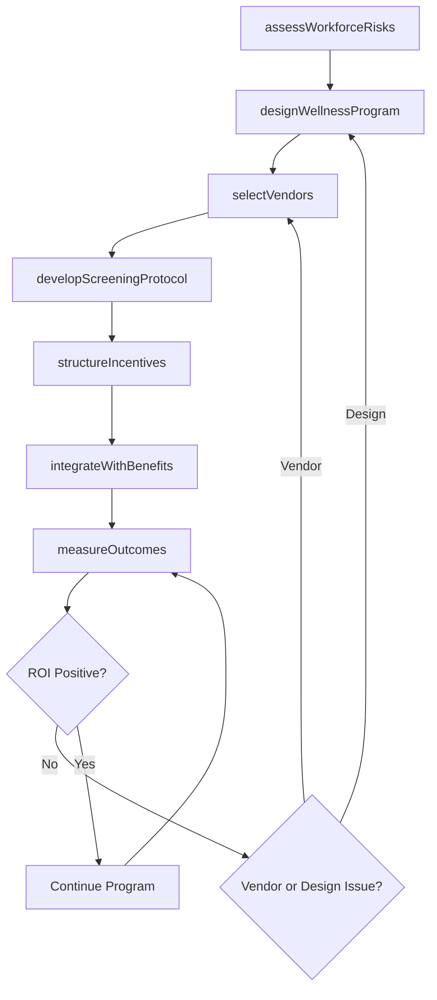
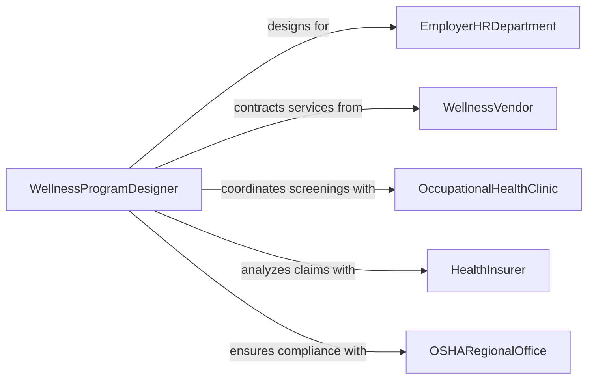

# Design Public or Employee Health Programs

> Business-as-Code definition for designing public or employee health programs including workplace wellness initiatives, occupational health screenings, employee assistance programs, ergonomics interventions, and return-to-work protocols.

## Overview

Public and employee health program design involves assessing workforce health risks, selecting evidence-based interventions, structuring incentive programs, integrating with benefits administration, and measuring health and productivity outcomes. This definition models the process from health risk assessment through program design, vendor selection, implementation planning, and outcomes analysis.

## Actors

| Actor | Description |
|-------|-------------|
| EmployerHRDepartment | Organization sponsoring health programs for employees |
| WellnessVendor | Third-party provider of biometric screenings and coaching |
| OccupationalHealthClinic | Medical facility providing workplace health services |
| HealthInsurer | Carrier managing group health benefits and claims data |
| OSHARegionalOffice | Federal agency enforcing workplace health and safety standards |

## Roles

| Role | Description |
|------|-------------|
| WellnessProgramDesigner | Architects employee health and wellness initiatives |
| OccupationalHealthPhysician | Provides clinical guidance on workplace health protocols |
| BenefitsAnalyst | Integrates wellness programs with health plan design |
| ErgonomicsSpecialist | Designs workplace accommodations to prevent musculoskeletal injury |

## Entities

| Entity | Description |
|--------|-------------|
| HealthRiskAssessment | Survey and biometric data identifying workforce health risks |
| WellnessProgramDesign | Structured plan for health promotion activities and incentives |
| BiometricScreeningProtocol | Procedures for blood pressure, cholesterol, and glucose testing |
| EmployeeAssistanceProgram | Confidential counseling and referral services |
| IncentiveStructure | Rewards framework for participation and health improvement |
| ReturnToWorkProtocol | Procedures for transitioning employees back from medical leave |
| OutcomesReport | Analysis of health improvements, utilization, and ROI |

## Actions

| Action | Description |
|--------|-------------|
| assessWorkforceRisks | Collect health risk data through surveys and biometrics |
| designWellnessProgram | Create structured health promotion activities and incentives |
| selectVendors | Evaluate and contract wellness service providers |
| developScreeningProtocol | Establish biometric testing procedures and schedules |
| structureIncentives | Design participation rewards and health improvement bonuses |
| integrateWithBenefits | Connect wellness program with health plan administration |
| measureOutcomes | Analyze health improvements, claims trends, and program ROI |

## Events

| Event | Description |
|-------|-------------|
| workforceRisksAssessed | Health risk data have been collected and analyzed |
| wellnessProgramDesigned | Health promotion plan and activities are structured |
| vendorsSelected | Wellness service providers have been contracted |
| screeningProtocolDeveloped | Biometric testing procedures are established |
| incentivesStructured | Participation rewards framework is finalized |
| benefitsIntegrated | Wellness program is connected to health plan administration |
| outcomesMeasured | Health improvements and ROI analysis are complete |

## Searches

| Search | Description |
|--------|-------------|
| findPrograms | Search wellness programs by type, industry, or employer size |
| getRiskData | Retrieve aggregate workforce health risk profiles |
| listVendors | Enumerate contracted wellness service providers |
| getOutcomesData | Look up health improvement metrics and claims trends |

## Entity Relationships



## State Diagram



## Workflow



## Actor Relationships



## Usage

### Calling Actions

```typescript
import { designPublicEmployeeHealthPrograms } from '@headlessly/design-public-employee-health-programs'

const wellness = designPublicEmployeeHealthPrograms()

// Assess workforce health risks
const risks = await wellness.assessWorkforceRisks({
  employer: 'manufacturing-corp',
  employees: 2500,
  methods: ['health-risk-questionnaire', 'biometric-screening', 'claims-analysis'],
  period: { year: 2024 }
})

// Design wellness program
const program = await wellness.designWellnessProgram({
  riskAssessmentId: risks.id,
  components: [
    { type: 'biometric-screening', frequency: 'annual' },
    { type: 'tobacco-cessation', modality: 'coaching-plus-NRT' },
    { type: 'diabetes-prevention', modality: 'CDC-DPP-lifestyle-change' },
    { type: 'ergonomics-assessment', setting: 'production-floor' }
  ],
  budget: { perEmployee: 350, currency: 'USD' }
})

// Structure incentive program
await wellness.structureIncentives({
  programId: program.id,
  incentives: [
    { activity: 'biometric-screening', reward: 150, type: 'premium-reduction' },
    { activity: 'health-coaching-completion', reward: 100, type: 'HSA-contribution' },
    { activity: 'fitness-milestone', reward: 50, type: 'gift-card' }
  ]
})
```

### Event-Driven Automation

```typescript
// Alert benefits team when risks indicate program design changes
wellness.workforceRisksAssessed(async ({ employerId, topRisks }) => {
  await notify({
    to: 'benefits-analyst',
    message: `Workforce risk assessment complete for ${employerId} - top risks: ${topRisks.join(', ')}`
  })
})

// Auto-generate outcomes report after measurement period
wellness.outcomesMeasured(async ({ programId, roi, participationRate }) => {
  await notify({
    to: 'hr-leadership',
    message: `Wellness program ${programId}: ${participationRate}% participation, ${roi}:1 ROI - annual review ready`
  })
})
```
