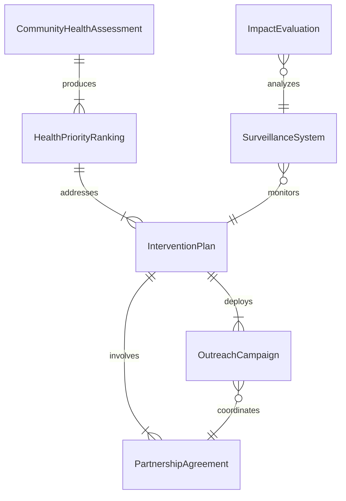
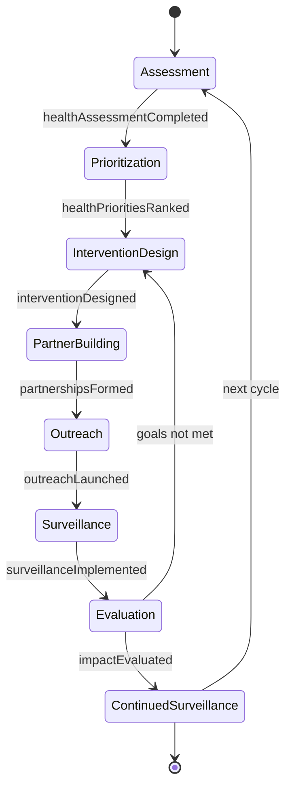
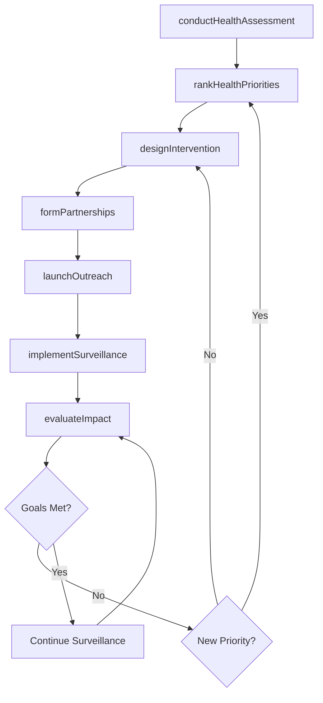
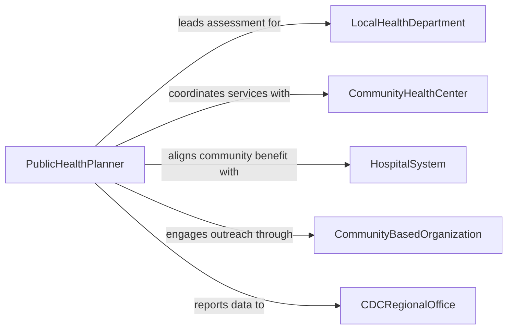

# Plan Programs to Address Community Health Issues

> Business-as-Code definition for planning community health programs including disease prevention campaigns, maternal and child health initiatives, chronic disease management, immunization outreach, and health equity interventions.

## Overview

Community health program planning involves analyzing population health data, identifying health disparities, designing culturally appropriate interventions, mobilizing community partnerships, and establishing surveillance systems to measure outcomes. This definition models the process from community health assessment through priority setting, program design, resource mobilization, and impact evaluation.

## Actors

| Actor | Description |
|-------|-------------|
| LocalHealthDepartment | Government agency responsible for population health services |
| CommunityHealthCenter | Federally qualified health center providing primary care access |
| HospitalSystem | Regional hospital contributing community benefit programs |
| CommunityBasedOrganization | Nonprofit delivering culturally tailored health services |
| CDCRegionalOffice | Federal agency providing epidemiological guidance and funding |

## Roles

| Role | Description |
|------|-------------|
| PublicHealthPlanner | Designs population health interventions based on data |
| CommunityHealthEducator | Develops outreach and behavior change campaigns |
| Epidemiologist | Analyzes disease burden, risk factors, and health disparities |
| ProgramEvaluator | Measures intervention effectiveness and health outcomes |

## Entities

| Entity | Description |
|--------|-------------|
| CommunityHealthAssessment | Population health data analysis identifying priority issues |
| HealthPriorityRanking | Ranked list of community health needs by severity and feasibility |
| InterventionPlan | Detailed program design with target population and methods |
| PartnershipAgreement | Formal collaboration between health organizations |
| OutreachCampaign | Communication strategy for health promotion and education |
| SurveillanceSystem | Ongoing data collection for monitoring health indicators |
| ImpactEvaluation | Assessment of program outcomes against baseline measures |

## Actions

| Action | Description |
|--------|-------------|
| conductHealthAssessment | Analyze population health data and identify priority issues |
| rankHealthPriorities | Score and prioritize health needs by burden and feasibility |
| designIntervention | Create program plan with evidence-based strategies |
| formPartnerships | Establish collaborations with health organizations |
| launchOutreach | Deploy health education and promotion campaigns |
| implementSurveillance | Set up ongoing health indicator monitoring |
| evaluateImpact | Measure program outcomes against baseline health data |

## Events

| Event | Description |
|-------|-------------|
| healthAssessmentCompleted | Population health data analysis is finished |
| healthPrioritiesRanked | Community health needs have been scored and ordered |
| interventionDesigned | Program plan with evidence-based strategies is ready |
| partnershipsFormed | Organizational collaborations have been established |
| outreachLaunched | Health promotion campaigns are active |
| surveillanceImplemented | Health indicator monitoring systems are operational |
| impactEvaluated | Program outcomes have been measured against baselines |

## Searches

| Search | Description |
|--------|-------------|
| findPrograms | Search health programs by issue, population, or region |
| getHealthData | Retrieve community health assessment indicators |
| listPartnerships | Enumerate active organizational collaborations |
| getOutcomeMetrics | Look up program effectiveness and health impact data |

## Entity Relationships



## State Diagram



## Workflow



## Actor Relationships



## Usage

### Calling Actions

```typescript
import { planProgramsAddressCommunityHealth } from '@headlessly/plan-programs-address-community-health'

const communityHealth = planProgramsAddressCommunityHealth()

// Conduct community health assessment
const assessment = await communityHealth.conductHealthAssessment({
  jurisdiction: 'metro-county',
  dataSources: ['vital-statistics', 'BRFSS', 'hospital-discharge', 'census-ACS'],
  indicators: ['diabetes-prevalence', 'infant-mortality', 'vaccination-rates', 'food-insecurity'],
  period: { years: 3 }
})

// Rank health priorities
const priorities = await communityHealth.rankHealthPriorities({
  assessmentId: assessment.id,
  criteria: ['magnitude', 'severity', 'health-equity-gap', 'intervention-feasibility'],
  method: 'Hanlon-prioritization'
})

// Design intervention for top priority
await communityHealth.designIntervention({
  priorityId: priorities.items[0].id,
  strategy: 'diabetes-prevention-program',
  targetPopulation: 'adults-with-prediabetes',
  setting: 'community-health-center',
  evidenceBase: 'CDC-National-DPP',
  duration: { months: 12 }
})
```

### Event-Driven Automation

```typescript
// Alert partners when health assessment reveals disparities
communityHealth.healthAssessmentCompleted(async ({ jurisdictionId, disparities }) => {
  if (disparities.length > 0) {
    await notify({
      to: 'community-health-coalition',
      message: `${disparities.length} health disparities identified in ${jurisdictionId} - priority setting meeting needed`
    })
  }
})

// Auto-schedule evaluation after surveillance period
communityHealth.surveillanceImplemented(async ({ programId, reviewDate }) => {
  await notify({
    to: 'program-evaluator',
    message: `Surveillance active for program ${programId} - impact evaluation scheduled for ${reviewDate}`
  })
})
```
