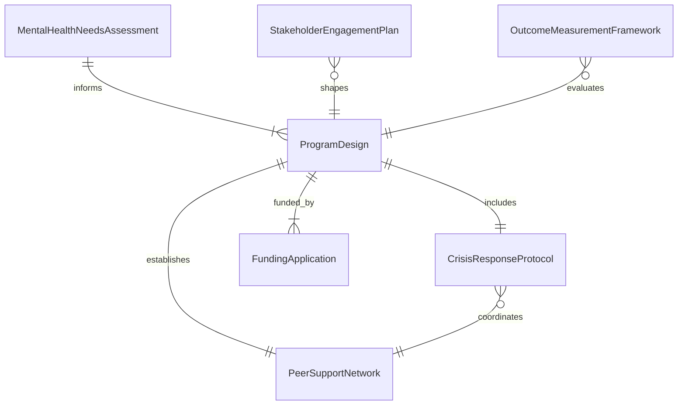
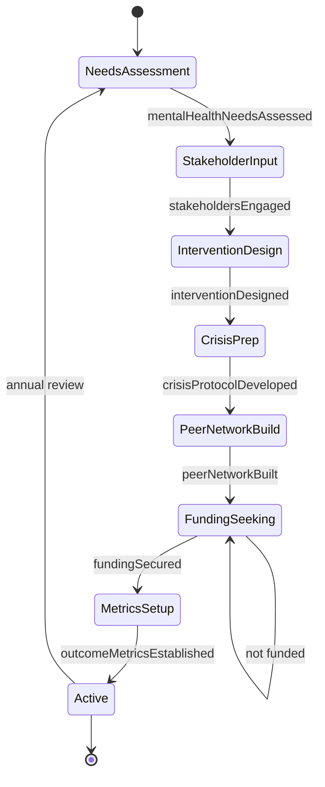
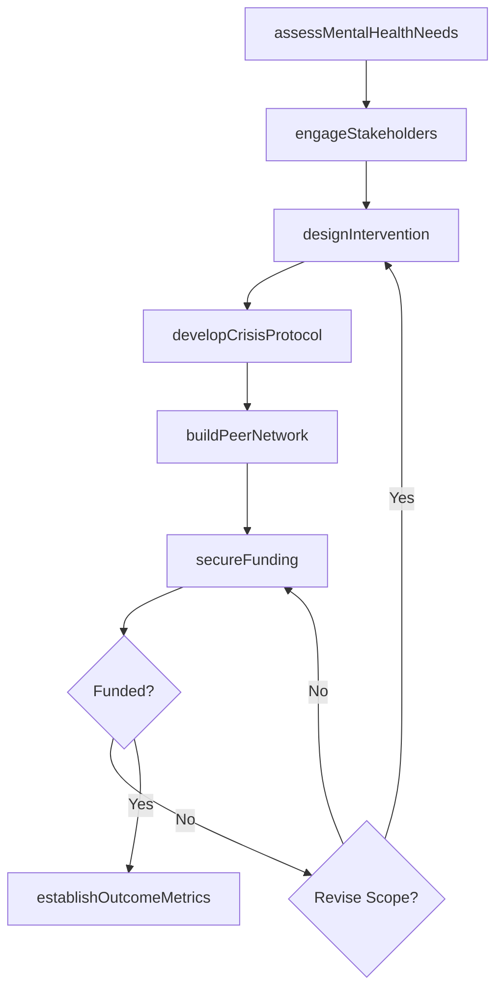
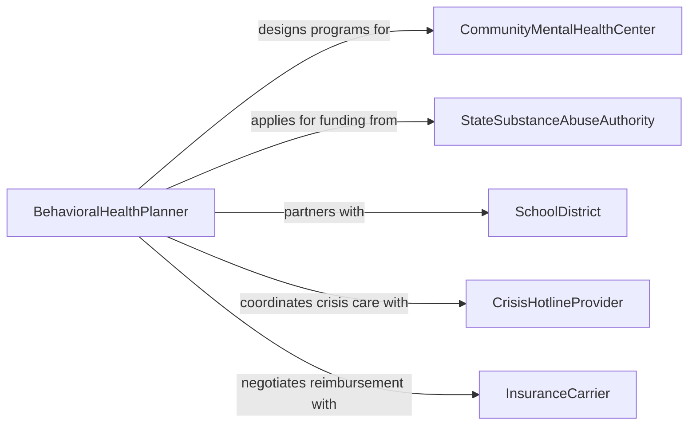

# Plan Programs to Address Community Mental Wellness Needs

> Business-as-Code definition for planning community mental wellness programs including crisis intervention services, substance abuse prevention, peer support networks, school-based counseling, and trauma-informed care initiatives.

## Overview

Community mental wellness program planning involves conducting needs assessments, identifying priority populations, designing evidence-based interventions, securing funding, and establishing outcome measurement frameworks. This definition models the process from community mental health assessment through program design, stakeholder engagement, implementation planning, and ongoing evaluation.

## Actors

| Actor | Description |
|-------|-------------|
| CommunityMentalHealthCenter | Local organization providing outpatient behavioral health services |
| StateSubstanceAbuseAuthority | Agency distributing federal block grants for mental health |
| SchoolDistrict | Educational system seeking student mental health support |
| CrisisHotlineProvider | Organization operating 988 Suicide and Crisis Lifeline services |
| InsuranceCarrier | Payer covering behavioral health benefits |

## Roles

| Role | Description |
|------|-------------|
| BehavioralHealthPlanner | Designs mental wellness programs based on community needs |
| ClinicalProgramDirector | Oversees evidence-based treatment intervention design |
| PeerSupportCoordinator | Develops lived-experience recovery support networks |
| EpidemiologistMentalHealth | Analyzes prevalence data and risk factors for mental illness |

## Entities

| Entity | Description |
|--------|-------------|
| MentalHealthNeedsAssessment | Survey of prevalence, service gaps, and priority populations |
| ProgramDesign | Structured intervention plan with evidence-based modalities |
| CrisisResponseProtocol | Procedures for acute mental health emergencies |
| PeerSupportNetwork | Framework for trained peer specialists and support groups |
| FundingApplication | Grant or contract proposal for program financing |
| StakeholderEngagementPlan | Strategy for involving consumers and community voices |
| OutcomeMeasurementFramework | Metrics and tools for tracking program effectiveness |

## Actions

| Action | Description |
|--------|-------------|
| assessMentalHealthNeeds | Survey community prevalence, risk factors, and service gaps |
| designIntervention | Create evidence-based program structure and clinical protocols |
| developCrisisProtocol | Establish procedures for acute mental health emergencies |
| buildPeerNetwork | Recruit and train peer support specialists |
| secureFunding | Apply for grants, Medicaid waivers, or contract funding |
| engageStakeholders | Involve consumers, families, and advocacy organizations |
| establishOutcomeMetrics | Define measurement tools and data collection processes |

## Events

| Event | Description |
|-------|-------------|
| mentalHealthNeedsAssessed | Community prevalence and gap analysis is complete |
| interventionDesigned | Evidence-based program protocols have been created |
| crisisProtocolDeveloped | Emergency response procedures are established |
| peerNetworkBuilt | Peer support specialists have been recruited and trained |
| fundingSecured | Financial resources for the program have been obtained |
| stakeholdersEngaged | Community voices have been incorporated into planning |
| outcomeMetricsEstablished | Evaluation framework and tools are in place |

## Searches

| Search | Description |
|--------|-------------|
| findPrograms | Search mental wellness programs by modality or population |
| getNeedsData | Retrieve community mental health prevalence and gap data |
| listInterventions | Enumerate evidence-based treatment approaches |
| getOutcomeData | Look up program effectiveness metrics and trends |

## Entity Relationships



## State Diagram



## Workflow



## Actor Relationships



## Usage

### Calling Actions

```typescript
import { planProgramsAddressCommunityMental } from '@headlessly/plan-programs-address-community-mental'

const mentalWellness = planProgramsAddressCommunityMental()

// Assess community mental health needs
const needs = await mentalWellness.assessMentalHealthNeeds({
  community: 'rural-appalachian-county',
  populations: ['adolescents', 'veterans', 'opioid-use-disorder'],
  dataSources: ['BRFSS', 'NSDUH', 'emergency-department-records'],
  period: { year: 2024 }
})

// Design intervention program
const program = await mentalWellness.designIntervention({
  needsAssessmentId: needs.id,
  modalities: [
    { type: 'cognitive-behavioral-therapy', setting: 'school-based', population: 'adolescents' },
    { type: 'medication-assisted-treatment', setting: 'outpatient', population: 'opioid-use-disorder' },
    { type: 'trauma-focused-cbt', setting: 'telehealth', population: 'veterans' }
  ],
  evidenceBase: 'SAMHSA-NREPP'
})

// Build peer support network
await mentalWellness.buildPeerNetwork({
  programId: program.id,
  specialists: 12,
  certificationStandard: 'state-peer-specialist',
  trainingHours: 75
})
```

### Event-Driven Automation

```typescript
// Alert clinical director when needs assessment reveals critical gaps
mentalWellness.mentalHealthNeedsAssessed(async ({ communityId, criticalGaps }) => {
  if (criticalGaps.length > 0) {
    await notify({
      to: 'clinical-program-director',
      message: `${criticalGaps.length} critical service gaps identified in ${communityId} - intervention design needed`
    })
  }
})

// Auto-submit outcome reports after metrics are established
mentalWellness.outcomeMetricsEstablished(async ({ programId }) => {
  await notify({
    to: 'state-substance-abuse-authority',
    message: `Program ${programId} outcome measurement framework active - quarterly reporting scheduled`
  })
})
```
