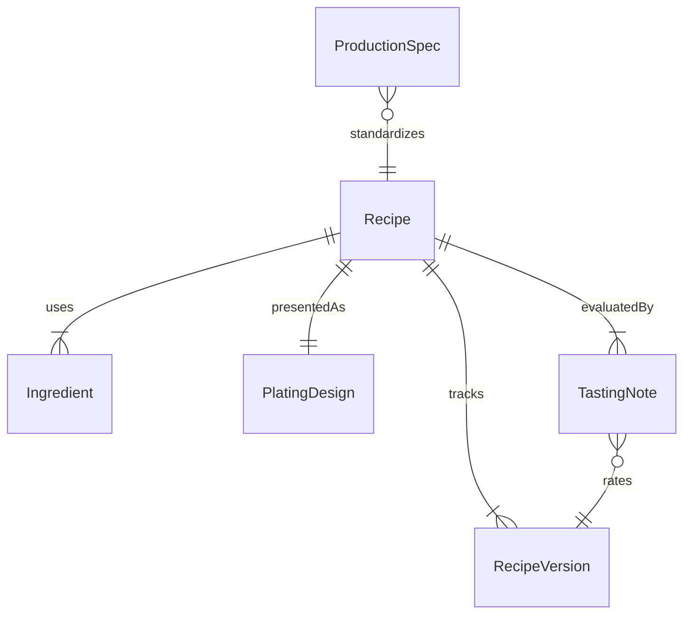
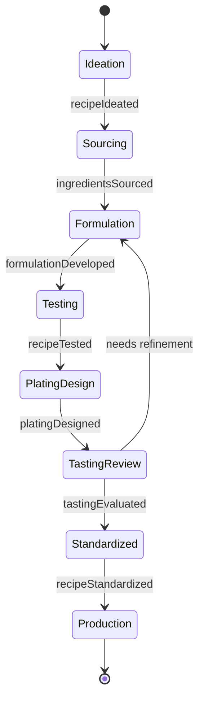
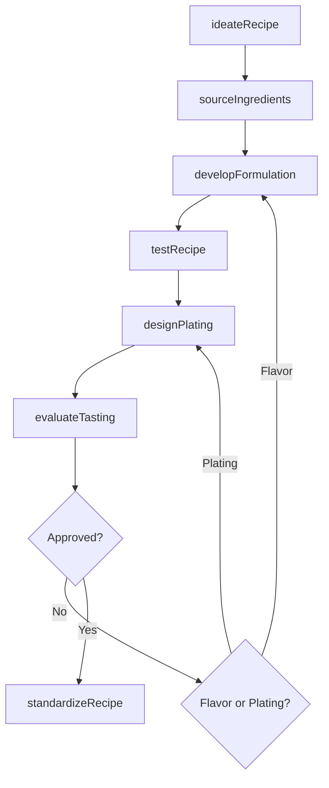
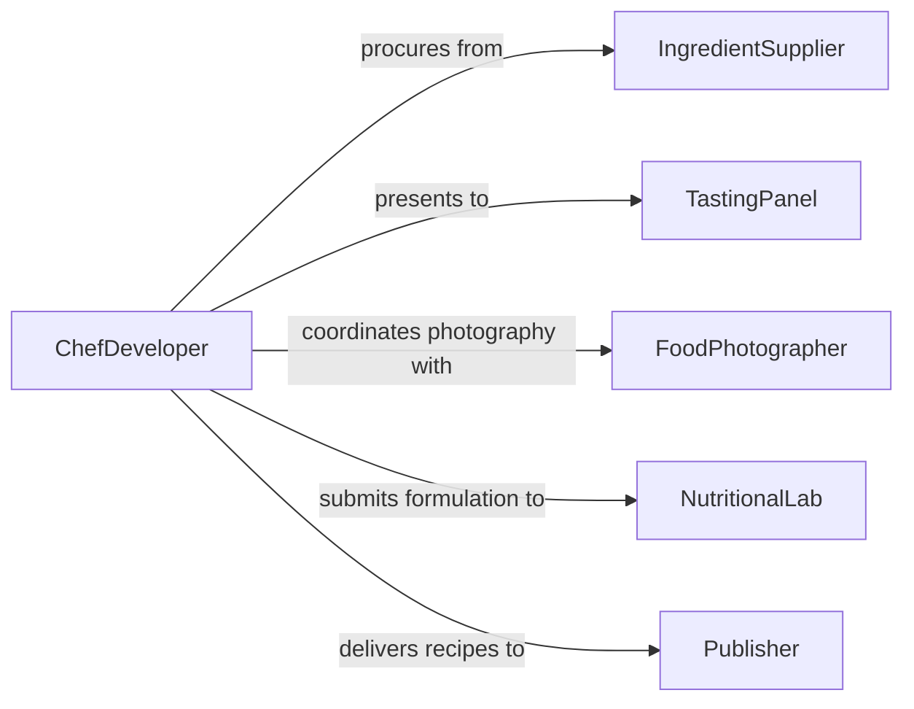

# Create New Recipes Food Presentations

> Business-as-Code definition for creating new recipes and food presentations. Models the culinary development process from ideation and ingredient sourcing through testing, plating design, and recipe standardization.

## Overview

Creating new recipes and food presentations involves developing original dishes, refining cooking techniques, designing visual plating arrangements, and standardizing recipes for consistent production. This encompasses flavor profiling, ingredient experimentation, nutritional balancing, portion control, and photographic documentation of finished presentations. This definition provides actions for the full recipe development lifecycle used in restaurants, food manufacturing, and culinary media.

## Actors

| Actor | Description |
|-------|-------------|
| IngredientSupplier | Provides specialty ingredients, seasonal produce, and product samples |
| FoodPhotographer | Captures professional images of plated presentations for publication |
| TastingPanel | Evaluates flavor, texture, and presentation quality during development |
| NutritionalLab | Performs detailed nutritional analysis on recipe formulations |
| Publisher | Distributes finalized recipes through cookbooks, websites, or media channels |

## Roles

| Role | Description |
|------|-------------|
| ChefDeveloper | Conceives and tests new recipe formulations and plating designs |
| PastryChef | Specializes in dessert and baked goods recipe development |
| SousChef | Assists with testing, scaling, and standardizing recipe procedures |
| FoodStylist | Designs the visual presentation and plating arrangement of dishes |

## Entities

| Entity | Description |
|--------|-------------|
| Recipe | A documented formulation including ingredients, quantities, and procedures |
| Ingredient | A raw material or component used in recipe preparation |
| PlatingDesign | A visual specification for how a dish is arranged on the plate |
| TastingNote | A structured evaluation of flavor, texture, aroma, and appearance |
| RecipeVersion | A tracked iteration of a recipe during the development process |
| ProductionSpec | A standardized version of the recipe scaled for kitchen production |

## Actions

| Action | Description |
|--------|-------------|
| ideateRecipe | Define the concept, flavor profile, and target cuisine for a new dish |
| sourceIngredients | Identify and procure specialty or seasonal ingredients for testing |
| developFormulation | Create the initial recipe with measured ingredients and step-by-step procedures |
| testRecipe | Prepare the dish in a test kitchen and record observations |
| designPlating | Specify the visual arrangement, garnishes, and plate selection |
| evaluateTasting | Conduct a structured tasting evaluation and capture feedback |
| standardizeRecipe | Finalize ingredient ratios, cooking times, and yields for production |

## Events

| Event | Description |
|-------|-------------|
| recipeIdeated | A new recipe concept has been defined |
| ingredientsSourced | Required ingredients have been identified and procured |
| formulationDeveloped | An initial recipe formulation has been documented |
| recipeTested | A test preparation has been completed with observations |
| platingDesigned | A visual plating specification has been created |
| tastingEvaluated | A structured tasting evaluation has been completed |
| recipeStandardized | The recipe has been finalized for consistent production |

## Searches

| Search | Description |
|--------|-------------|
| findRecipes | List recipes by cuisine, course type, or development status |
| getIngredients | Retrieve ingredients by category, season, or dietary classification |
| getTastingNotes | Find tasting evaluations by recipe, evaluator, or score range |
| getRecipeVersions | Retrieve the iteration history for a recipe in development |

## Entity Relationships



## State Diagram



## Workflow



## Actor Relationships



## Usage

### Calling Actions

```typescript
import { createNewRecipesFoodPresentations } from '@headlessly/create-new-recipes-food-presentations'

const recipes = createNewRecipesFoodPresentations()

// Ideate a new seasonal dish
const concept = await recipes.ideateRecipe({
  name: 'Charred Beet Tartare',
  cuisine: 'modern-american',
  course: 'appetizer',
  flavorProfile: ['earthy', 'smoky', 'citrus'],
  dietaryTags: ['vegan', 'gluten-free']
})

// Develop and test the formulation
const formulation = await recipes.developFormulation({
  recipeId: concept.id,
  ingredients: [
    { name: 'Red Beets', quantity: 500, unit: 'g' },
    { name: 'Shallot', quantity: 30, unit: 'g' },
    { name: 'Capers', quantity: 15, unit: 'g' }
  ],
  method: ['Char beets over open flame', 'Cool and dice to 5mm brunoise', 'Fold in shallot and caper mixture']
})

// Evaluate with tasting panel
await recipes.evaluateTasting({
  recipeId: concept.id,
  versionId: formulation.id,
  panelSize: 5
})
```

### Event-Driven Automation

```typescript
// Auto-schedule photography when recipe is standardized
recipes.recipeStandardized(async ({ recipeId, name }) => {
  await schedule({
    task: 'food-photography',
    subject: recipeId,
    message: `Recipe "${name}" is finalized and ready for professional photography`
  })
})

// Notify kitchen team when tasting results arrive
recipes.tastingEvaluated(async ({ recipeId, averageScore, feedback }) => {
  if (averageScore >= 4.0) {
    await notify({
      to: 'culinary-team',
      message: `Recipe ${recipeId} scored ${averageScore}/5.0 - proceed to standardization`
    })
  }
})
```
