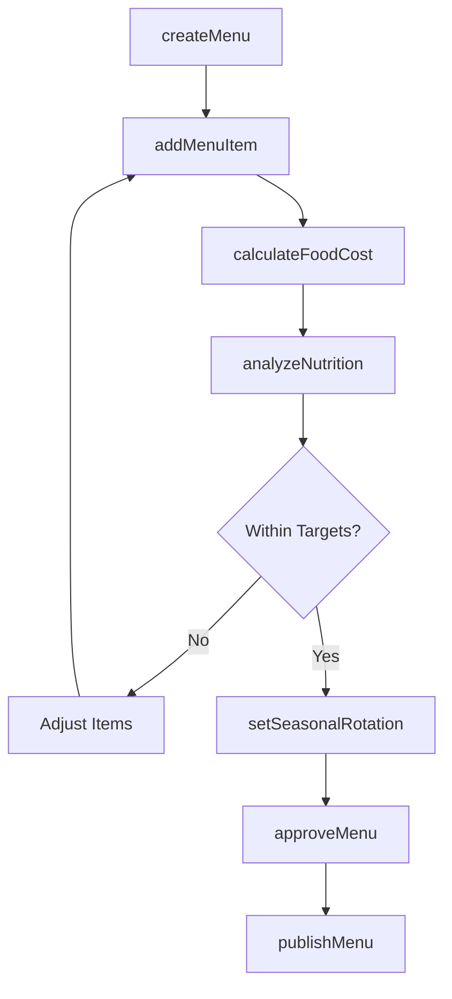
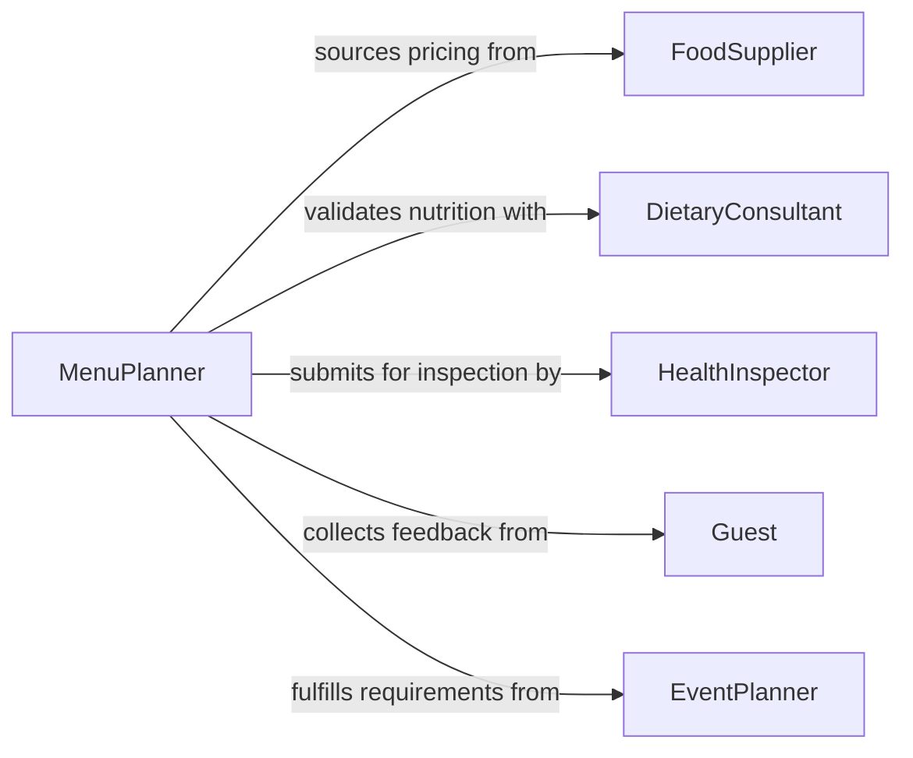

# Plan Menu Options

> Business-as-Code definition for planning menu options. Models the menu development lifecycle from concept and nutritional analysis through costing, approval, and publication.

## Overview

Planning menu options involves designing food and beverage offerings for restaurants, catering services, institutional dining, and hospitality operations. This includes analyzing seasonal ingredient availability, calculating food costs and nutritional profiles, accommodating dietary restrictions, and balancing variety with operational efficiency. This definition provides actions for building, costing, and publishing menus across service periods.

## Actors

| Actor | Description |
|-------|-------------|
| FoodSupplier | Provides ingredient availability, pricing, and seasonal catalogs |
| DietaryConsultant | Advises on nutritional requirements and allergen compliance |
| HealthInspector | Reviews menus for food safety and labeling compliance |
| Guest | Provides preferences, dietary needs, and feedback on menu offerings |
| EventPlanner | Specifies menu requirements for catered events and banquets |

## Roles

| Role | Description |
|------|-------------|
| ExecutiveChef | Designs menu concepts and selects dishes for each service period |
| MenuPlanner | Analyzes costs, nutrition, and variety to build balanced menus |
| FoodCostAnalyst | Calculates ingredient costs and establishes target margins |
| BeverageDirector | Curates drink pairings and beverage selections for the menu |

## Entities

| Entity | Description |
|--------|-------------|
| Menu | A structured collection of dishes and beverages for a specific service period |
| MenuItem | An individual dish or beverage offering with recipe, price, and nutritional data |
| MenuCategory | A grouping such as appetizers, entrees, desserts, or beverages |
| NutritionalProfile | Calorie, macronutrient, and allergen information for a menu item |
| CostSheet | A breakdown of ingredient costs and target margins for a menu item |
| SeasonalCalendar | A schedule of ingredient availability and seasonal menu rotations |

## Actions

| Action | Description |
|--------|-------------|
| createMenu | Initialize a new menu for a service period, location, or event |
| addMenuItem | Add a dish or beverage to a menu with recipe and pricing details |
| calculateFoodCost | Compute ingredient costs and margin analysis for menu items |
| analyzeNutrition | Generate nutritional profiles and allergen flags for menu items |
| setSeasonalRotation | Define seasonal availability windows for menu items |
| approveMenu | Submit the menu for management or client approval |
| publishMenu | Release the approved menu for guest-facing channels |

## Events

| Event | Description |
|-------|-------------|
| menuCreated | A new menu has been initialized |
| menuItemAdded | A dish or beverage has been added to the menu |
| foodCostCalculated | Cost analysis for a menu item has been completed |
| nutritionAnalyzed | Nutritional profile and allergen data have been generated |
| menuApproved | The menu has been formally approved for publication |
| menuPublished | The menu has been released to guest-facing channels |
| seasonalRotationSet | A seasonal rotation schedule has been defined |

## Searches

| Search | Description |
|--------|-------------|
| findMenus | List menus by location, service period, or event |
| getMenuItems | Retrieve menu items by category, dietary tag, or price range |
| getCostSheets | Find cost analysis sheets by menu or margin threshold |
| getNutritionalProfiles | Retrieve nutritional data by allergen type or calorie range |

## Workflow



## Actor Relationships



## Usage

### Calling Actions

```typescript
import { planMenuOptions } from '@headlessly/plan-menu-options'

const menus = planMenuOptions()

// Create a new seasonal dinner menu
const menu = await menus.createMenu({
  name: 'Spring Dinner 2026',
  location: 'main-dining-room',
  servicePeriod: 'dinner',
  season: 'spring'
})

// Add a menu item with cost analysis
const item = await menus.addMenuItem({
  menuId: menu.id,
  name: 'Pan-Seared Halibut',
  category: 'entree',
  price: 38.00,
  dietaryTags: ['gluten-free', 'pescatarian']
})

// Calculate food cost and nutrition
await menus.calculateFoodCost({ menuItemId: item.id })
await menus.analyzeNutrition({ menuItemId: item.id })
```

### Event-Driven Automation

```typescript
// Alert when food cost exceeds target margin
menus.foodCostCalculated(async ({ menuItemId, costPercentage }) => {
  if (costPercentage > 32) {
    await notify({
      to: 'executive-chef',
      message: `Menu item ${menuItemId} has a food cost of ${costPercentage}%, exceeding the 32% target`
    })
  }
})

// Auto-publish when menu is approved
menus.menuApproved(async ({ menuId }) => {
  await menus.publishMenu({ menuId, channels: ['website', 'pos-system', 'mobile-app'] })
})
```
