# Design Research Studies Obtain Scientific

> Business-as-Code definition for designing research studies that obtain scientific information through rigorous experimental and observational methodologies.

## Overview

Designing research studies to obtain scientific information involves formulating hypotheses, selecting appropriate study designs, determining sample sizes, establishing data collection protocols, and planning statistical analyses. This definition exposes actions for study design, participant recruitment planning, ethics review, and data management. It provides events for automating study lifecycle milestones and searches for retrieving study designs, protocols, and approval records.

## Actors

| Actor | Description |
|-------|-------------|
| InstitutionalReviewBoard | Ethics committee that reviews and approves research involving human or animal subjects |
| FundingAgency | Organization that provides financial support for scientific research |
| StudyParticipant | Individual or entity enrolled as a subject in the research study |
| CollaboratingInstitution | Partner organization contributing resources, expertise, or data |
| RegulatoryAuthority | Government body ensuring research compliance with scientific and safety standards |
| PeerReviewer | Expert who evaluates the scientific merit and design rigor of the study |

## Roles

| Role | Description |
|------|-------------|
| PrincipalInvestigator | Leads study design, execution oversight, and scientific accountability |
| StudyDesigner | Develops the research framework, methodology, and analytical approach |
| Biostatistician | Determines sample sizes, randomization schemes, and statistical analysis plans |
| ResearchCoordinator | Manages participant recruitment, scheduling, and data collection logistics |
| DataManager | Oversees data integrity, storage, and preparation for analysis |

## Entities

| Entity | Description |
|--------|-------------|
| StudyDesign | The structured plan specifying the research approach, variables, and controls |
| Hypothesis | A testable statement predicting the relationship between study variables |
| SamplePlan | The specification of sample size, selection criteria, and recruitment strategy |
| DataCollectionProtocol | A documented procedure for gathering measurements and observations |
| StatisticalAnalysisPlan | A pre-specified plan for analyzing study data and testing hypotheses |
| EthicsApplication | A submission requesting approval from an institutional review board |

## Actions

| Action | Description |
|--------|-------------|
| formulateHypothesis | Define the research question and testable prediction |
| selectStudyDesign | Choose the appropriate experimental or observational design framework |
| determineSamplePlan | Calculate required sample sizes and define recruitment criteria |
| developDataCollectionProtocol | Create standardized procedures for gathering study measurements |
| createStatisticalAnalysisPlan | Specify analytical methods, tests, and significance thresholds |
| submitEthicsApplication | Send the study design to an institutional review board for approval |
| finalizeStudyDesign | Consolidate all design elements into a complete study protocol |

## Events

| Event | Description |
|-------|-------------|
| hypothesisFormulated | A research question and testable prediction have been defined |
| studyDesignSelected | The research design framework has been chosen |
| samplePlanDetermined | Sample size calculations and recruitment criteria have been established |
| dataCollectionProtocolDeveloped | Standardized measurement procedures have been documented |
| statisticalAnalysisPlanCreated | The analytical approach and testing methods have been specified |
| ethicsApplicationSubmitted | The study has been submitted for institutional review board approval |
| studyDesignFinalized | All design elements have been consolidated into a complete protocol |

## Searches

| Search | Description |
|--------|-------------|
| findStudyDesigns | List research study designs by discipline, type, or approval status |
| getHypotheses | Retrieve formulated hypotheses by research area or investigator |
| getSamplePlans | Search sample specifications by size, criteria, or recruitment status |
| getEthicsApprovalStatus | Retrieve the review and approval status for submitted ethics applications |

## Entity Relationships


## State Diagram

```mermaid
stateDiagram-v2
    [*] --> HypothesisFormulation
    HypothesisFormulation --> DesignSelection : hypothesisFormulated
    DesignSelection --> SamplePlanning : studyDesignSelected
    SamplePlanning --> ProtocolDevelopment : samplePlanDetermined
    ProtocolDevelopment --> AnalysisPlanning : dataCollectionProtocolDeveloped
    AnalysisPlanning --> EthicsReview : statisticalAnalysisPlanCreated
    EthicsReview --> DesignSelection : ethics revisions needed
    EthicsReview --> Finalized : ethicsApplicationSubmitted
    Finalized --> Execution : studyDesignFinalized
    Execution → [*]
```



## Workflow


## Actor Relationships


## Usage

### Calling Actions

```typescript
import { designResearchStudiesObtainScientific } from '@headlessly/design-research-studies-obtain-scientific'

const studies = designResearchStudiesObtainScientific()

// Formulate the research hypothesis
const hypothesis = await studies.formulateHypothesis({
  researchQuestion: 'Does intermittent fasting reduce inflammatory markers in adults over 50?',
  prediction: 'Participants following a 16:8 fasting protocol will show lower CRP levels after 12 weeks',
  variables: {
    independent: 'fasting-protocol',
    dependent: 'CRP-levels',
    controlled: ['age-range', 'baseline-health', 'medication-use']
  }
})

// Select study design
const design = await studies.selectStudyDesign({
  hypothesisId: hypothesis.id,
  type: 'randomized-controlled-trial',
  blinding: 'single-blind',
  duration: { weeks: 12 }
})

// Determine sample plan
await studies.determineSamplePlan({
  studyDesignId: design.id,
  powerAnalysis: { effectSize: 0.5, alpha: 0.05, power: 0.80 },
  estimatedSampleSize: 120,
  inclusionCriteria: ['age-50-plus', 'no-diabetes', 'BMI-under-35'],
  exclusionCriteria: ['current-fasting-practice', 'immunosuppressant-use']
})
```

### Event-Driven Automation

```typescript
// Auto-submit ethics application when all design elements are ready
studies.statisticalAnalysisPlanCreated(async ({ studyDesignId }) => {
  const design = await studies.findStudyDesigns({ id: studyDesignId })
  if (design.status === 'components-complete') {
    await studies.submitEthicsApplication({ studyDesignId })
  }
})

// Notify team when ethics approval is granted
studies.studyDesignFinalized(async ({ studyDesignId }) => {
  await notify({
    to: 'research-coordinator',
    message: `Study ${studyDesignId} finalized and approved - begin participant recruitment`
  })
})
```
