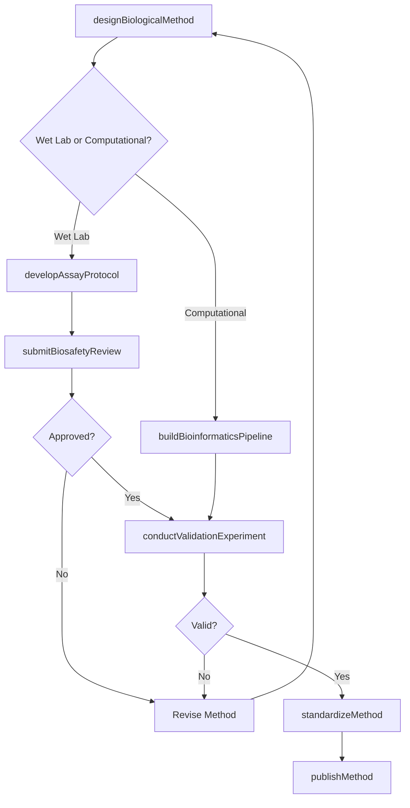
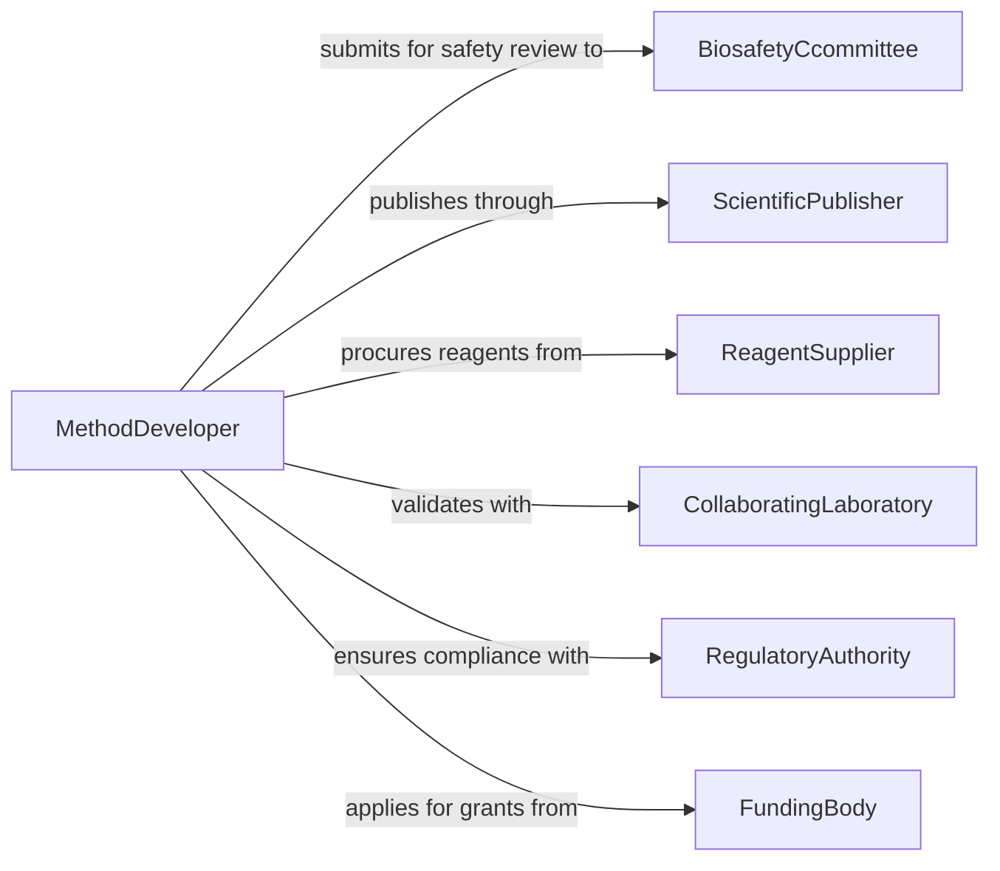

# Develop Biological Research Methods

> Business-as-Code definition for developing biological research methods that advance techniques for studying living organisms, cellular processes, genetics, and ecosystems.

## Overview

Developing biological research methods involves designing novel experimental techniques, creating assay protocols, establishing bioinformatics pipelines, and developing field and laboratory procedures for studying biological systems. This definition exposes actions for method creation, assay development, validation, and standardization. It provides events for automating method lifecycle management and searches for retrieving method libraries, validation outcomes, and adoption data.

## Actors

| Actor | Description |
|-------|-------------|
| BiosafetyCcommittee | Institutional body that reviews and approves biological research protocols for safety |
| ScientificPublisher | Journal or platform that disseminates validated biological research methods |
| ReagentSupplier | Vendor providing biological reagents, kits, and consumables for research |
| CollaboratingLaboratory | Partner lab that validates or co-develops biological methods |
| RegulatoryAuthority | Government body overseeing biosafety, genetic research, and clinical applications |
| FundingBody | Organization that provides grants for biological research method development |

## Roles

| Role | Description |
|------|-------------|
| MethodDeveloper | Designs and creates novel biological research techniques and protocols |
| LaboratoryScientist | Executes bench experiments to test and optimize biological methods |
| BioinformaticsSpecialist | Develops computational pipelines for analyzing biological data |
| QualityAssuranceScientist | Validates methods for accuracy, sensitivity, and reproducibility |
| BiosafetyOfficer | Ensures methods comply with biosafety regulations and containment requirements |

## Entities

| Entity | Description |
|--------|-------------|
| BiologicalMethod | A documented technique for investigating biological systems or processes |
| AssayProtocol | A step-by-step procedure for measuring a specific biological analyte or activity |
| BioinformaticsPipeline | A computational workflow for processing and analyzing biological sequence or image data |
| ValidationExperiment | A controlled study testing a method's sensitivity, specificity, and reproducibility |
| ReagentSpecification | Technical requirements for biological materials used in the method |
| StandardOperatingProcedure | A detailed, standardized document ensuring consistent method execution |

## Actions

| Action | Description |
|--------|-------------|
| designBiologicalMethod | Create a new technique for studying biological systems |
| developAssayProtocol | Build a standardized procedure for measuring biological targets |
| buildBioinformaticsPipeline | Construct computational workflows for biological data analysis |
| conductValidationExperiment | Test the method under controlled conditions for reliability |
| submitBiosafetyReview | Send the method to biosafety committees for safety evaluation |
| standardizeMethod | Convert a validated method into a standard operating procedure |
| publishMethod | Release the validated method through scientific publications |

## Events

| Event | Description |
|-------|-------------|
| biologicalMethodDesigned | A new biological research technique has been created |
| assayProtocolDeveloped | A measurement procedure for biological targets has been established |
| bioinformaticsPipelineBuilt | A computational analysis workflow has been constructed |
| validationExperimentConducted | A method has been tested for reliability under controlled conditions |
| biosafetyReviewCompleted | The biosafety committee has evaluated the method |
| methodStandardized | A validated method has been formalized as a standard operating procedure |
| methodPublished | A biological research method has been released through publication |

## Searches

| Search | Description |
|--------|-------------|
| findBiologicalMethods | List methods by discipline, organism, technique type, or validation status |
| getAssayProtocols | Retrieve assay procedures by target analyte, sensitivity, or application |
| getValidationResults | Search validation experiment outcomes by method, metric, or date |
| getBioinformaticsPipelines | Find computational workflows by data type, tool, or analysis application |

## Workflow



## Actor Relationships



## Usage

### Calling Actions

```typescript
import { developBiologicalResearchMethods } from '@headlessly/develop-biological-research-methods'

const bioMethods = developBiologicalResearchMethods()

// Design a new biological method
const method = await bioMethods.designBiologicalMethod({
  name: 'CRISPR-Based Gene Expression Reporter Assay',
  discipline: 'Molecular Biology',
  objective: 'Real-time monitoring of gene expression changes in live cells',
  biosafety: 'BSL-2',
  organisms: ['HEK293T', 'iPSC']
})

// Develop the assay protocol
await bioMethods.developAssayProtocol({
  methodId: method.id,
  protocol: {
    name: 'Fluorescent Reporter Quantification',
    steps: [
      'Transfect cells with CRISPR reporter construct',
      'Incubate for 48 hours at 37C with 5% CO2',
      'Measure fluorescence intensity at 488nm excitation',
      'Normalize to internal control reporter'
    ],
    reagents: ['Cas9-mRNA', 'guide-RNA', 'reporter-plasmid', 'lipofectamine'],
    readout: 'fluorescence-intensity'
  }
})

// Run validation experiment
const validation = await bioMethods.conductValidationExperiment({
  methodId: method.id,
  replicates: 6,
  controls: ['positive', 'negative', 'no-transfection'],
  acceptanceCriteria: { sensitivity: 0.85, coefficientOfVariation: 0.15 }
})
```

### Event-Driven Automation

```typescript
// Auto-standardize when validation passes
bioMethods.validationExperimentConducted(async ({ methodId, results }) => {
  if (results.sensitivity >= 0.85 && results.cv <= 0.15) {
    await bioMethods.standardizeMethod({
      methodId,
      sopFormat: 'ISO-17025'
    })
  }
})

// Notify collaborators when method is published
bioMethods.methodPublished(async ({ methodId, publication }) => {
  await notify({
    to: 'collaborating-laboratories',
    message: `New biological method published: ${publication.title} (DOI: ${publication.doi})`
  })
})
```
