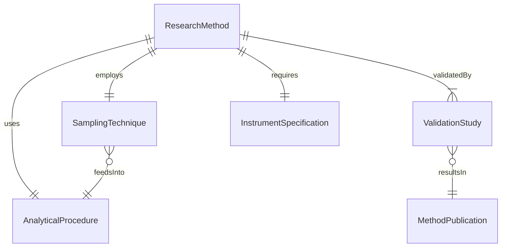
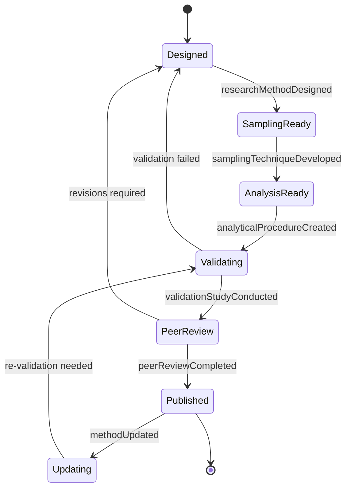
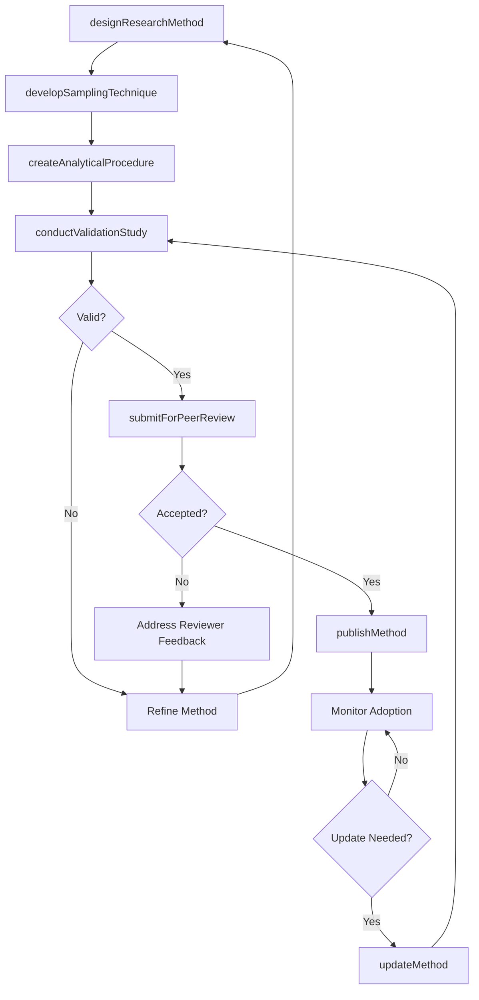
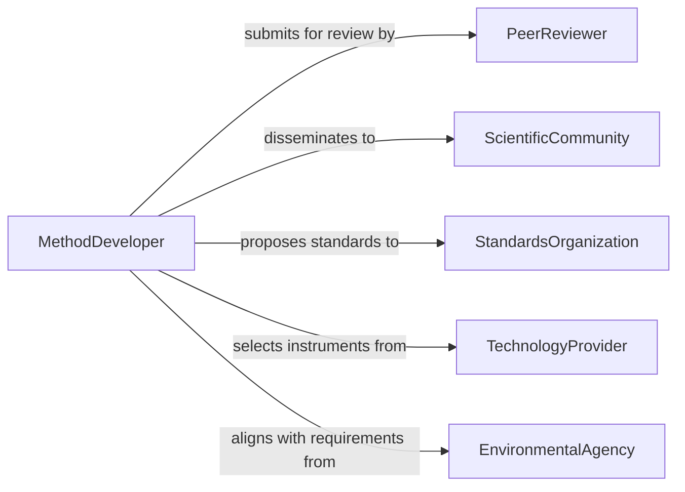

# Develop Environmental Research Methods

> Business-as-Code definition for developing environmental research methods that advance techniques for studying ecosystems, pollution, biodiversity, and climate change.

## Overview

Developing environmental research methods involves creating novel sampling techniques, analytical procedures, remote sensing approaches, and data modeling frameworks tailored to ecological and environmental investigations. This definition exposes actions for method design, validation, peer review, and publication. It provides events for automating method lifecycle management and searches for retrieving method libraries, validation data, and adoption metrics.

## Actors

| Actor | Description |
|-------|-------------|
| ScientificCommunity | Researchers and institutions that adopt and refine environmental methods |
| StandardsOrganization | Body that codifies validated methods into official standards |
| TechnologyProvider | Vendor supplying instruments, sensors, and analytical tools for environmental research |
| PeerReviewer | Subject matter expert who evaluates the rigor and validity of new methods |
| EnvironmentalAgency | Regulatory body that may mandate specific research methods for compliance |

## Roles

| Role | Description |
|------|-------------|
| MethodDeveloper | Designs and creates new environmental research techniques and procedures |
| ValidationScientist | Tests new methods for accuracy, precision, and reproducibility |
| EnvironmentalEngineer | Applies engineering principles to develop field-deployable research methods |
| StatisticalModeler | Develops quantitative frameworks for analyzing environmental data |

## Entities

| Entity | Description |
|--------|-------------|
| ResearchMethod | A documented technique or procedure for conducting environmental investigation |
| SamplingTechnique | A specific approach to collecting environmental specimens or measurements |
| AnalyticalProcedure | A laboratory or computational process for analyzing environmental samples |
| ValidationStudy | A controlled experiment confirming the reliability of a new method |
| MethodPublication | A peer-reviewed document describing and disseminating a research method |
| InstrumentSpecification | Technical requirements for equipment used in the research method |

## Actions

| Action | Description |
|--------|-------------|
| designResearchMethod | Create a new environmental research method with documented procedures |
| developSamplingTechnique | Build a novel approach for collecting environmental data or specimens |
| createAnalyticalProcedure | Establish laboratory or computational steps for sample analysis |
| conductValidationStudy | Test the method under controlled conditions for accuracy and reproducibility |
| submitForPeerReview | Send the method to subject matter experts for scientific evaluation |
| publishMethod | Release the validated method for adoption by the research community |
| updateMethod | Revise an existing method based on new technologies or findings |

## Events

| Event | Description |
|-------|-------------|
| researchMethodDesigned | A new environmental research method has been created |
| samplingTechniqueDeveloped | A novel data collection approach has been established |
| analyticalProcedureCreated | A new analysis process has been documented |
| validationStudyConducted | A method has been tested for reliability and accuracy |
| peerReviewCompleted | Expert evaluation of the method has been finalized |
| methodPublished | A validated method has been released for community adoption |
| methodUpdated | An existing method has been revised with improvements |

## Searches

| Search | Description |
|--------|-------------|
| findResearchMethods | List environmental research methods by discipline, status, or application |
| getValidationResults | Retrieve validation study outcomes by method, accuracy, or date |
| getMethodPublications | Search published methods by topic, journal, or citation count |
| getInstrumentRequirements | Retrieve equipment specifications for a given research method |

## Entity Relationships



## State Diagram



## Workflow



## Actor Relationships



## Usage

### Calling Actions

```typescript
import { developEnvironmentalResearchMethods } from '@headlessly/develop-environmental-research-methods'

const methods = developEnvironmentalResearchMethods()

// Design a new environmental research method
const method = await methods.designResearchMethod({
  name: 'eDNA Metabarcoding for Aquatic Biodiversity',
  discipline: 'Molecular Ecology',
  objective: 'Non-invasive species detection in freshwater systems',
  targetAnalytes: ['environmental-DNA', 'species-barcodes']
})

// Develop the sampling technique
await methods.developSamplingTechnique({
  methodId: method.id,
  technique: {
    name: 'Filtered Water eDNA Collection',
    sampleVolume: '2L',
    filterPoreSize: '0.45um',
    preservationMethod: 'ethanol-fixation',
    storageTemperature: '-20C'
  }
})

// Conduct validation study
const validation = await methods.conductValidationStudy({
  methodId: method.id,
  trialSites: 5,
  replicatesPerSite: 3,
  acceptanceCriteria: { sensitivity: 0.90, specificity: 0.95 }
})
```

### Event-Driven Automation

```typescript
// Auto-submit for peer review when validation passes
methods.validationStudyConducted(async ({ methodId, results }) => {
  if (results.sensitivity >= 0.90 && results.specificity >= 0.95) {
    await methods.submitForPeerReview({
      methodId,
      journal: 'Methods in Ecology and Evolution'
    })
  }
})

// Notify community when method is published
methods.methodPublished(async ({ methodId, publication }) => {
  await notify({
    to: 'environmental-research-network',
    message: `New method published: ${publication.title} - available at ${publication.doi}`
  })
})
```
