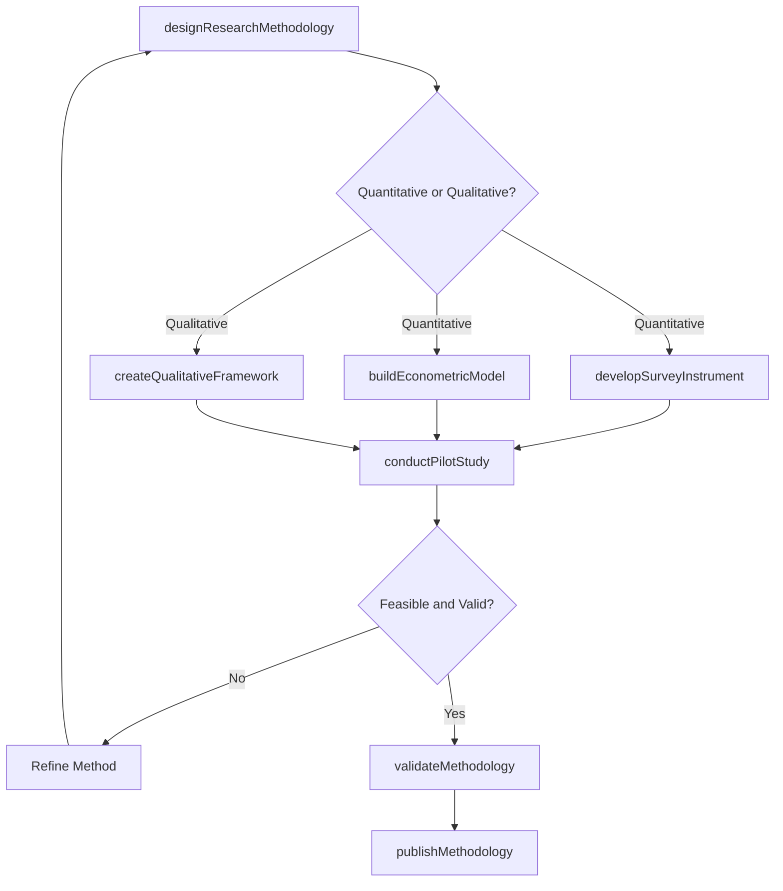
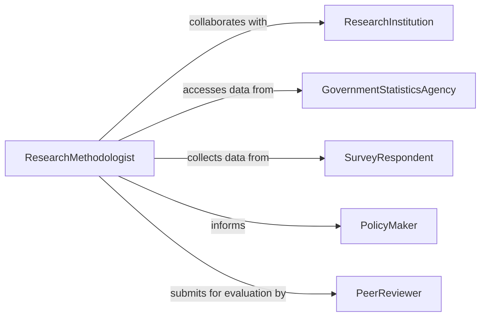

# Develop Methods Social Economic Research

> Business-as-Code definition for developing methods of social or economic research that enable systematic investigation of human behavior, institutions, and economic systems.

## Overview

Developing methods of social or economic research involves designing survey instruments, creating econometric models, establishing qualitative research frameworks, and developing data collection and analysis techniques for studying populations, markets, and societal phenomena. This definition exposes actions for method design, instrument development, pilot testing, and methodology documentation. It provides events for automating method validation workflows and searches for retrieving research methodologies, instrument libraries, and validation data.

## Actors

| Actor | Description |
|-------|-------------|
| ResearchInstitution | University or think tank that develops and applies social research methods |
| GovernmentStatisticsAgency | Public body that collects and publishes social and economic data |
| SurveyRespondent | Individual or household providing data through research instruments |
| PolicyMaker | Government official who uses research findings to inform policy decisions |
| PeerReviewer | Academic expert who evaluates methodological rigor and validity |

## Roles

| Role | Description |
|------|-------------|
| ResearchMethodologist | Designs and develops new approaches to social and economic investigation |
| SurveyDesigner | Creates questionnaires, interview guides, and data collection instruments |
| Econometrician | Develops statistical models for analyzing economic relationships and trends |
| QualitativeResearcher | Designs frameworks for interpretive research including ethnography and case studies |
| DataArchitect | Structures data collection systems and ensures data quality standards |

## Entities

| Entity | Description |
|--------|-------------|
| ResearchMethodology | A documented framework defining the approach to social or economic investigation |
| SurveyInstrument | A questionnaire or interview guide used to collect data from respondents |
| EconometricModel | A statistical model representing relationships between economic variables |
| QualitativeFramework | A structured approach for interpretive analysis of social phenomena |
| PilotStudy | A small-scale preliminary study testing the feasibility of a research method |
| MethodologyPublication | A peer-reviewed paper documenting and disseminating a research method |

## Actions

| Action | Description |
|--------|-------------|
| designResearchMethodology | Create a new framework for investigating social or economic questions |
| developSurveyInstrument | Build questionnaires and interview guides with validated scales |
| buildEconometricModel | Construct statistical models for analyzing economic data |
| createQualitativeFramework | Establish structured approaches for interpretive social research |
| conductPilotStudy | Test a new method on a small sample to assess feasibility and validity |
| validateMethodology | Confirm that the method produces reliable and valid results |
| publishMethodology | Release the validated methodology for adoption by the research community |

## Events

| Event | Description |
|-------|-------------|
| researchMethodologyDesigned | A new social or economic research framework has been created |
| surveyInstrumentDeveloped | A data collection instrument has been built and tested |
| econometricModelBuilt | A statistical model for economic analysis has been constructed |
| qualitativeFrameworkCreated | An interpretive research approach has been established |
| pilotStudyConducted | A preliminary test of the method has been completed |
| methodologyValidated | The method has been confirmed for reliability and validity |
| methodologyPublished | The validated method has been released for community use |

## Searches

| Search | Description |
|--------|-------------|
| findResearchMethodologies | List methodologies by discipline, type, or validation status |
| getSurveyInstruments | Retrieve survey instruments by topic, scale type, or language |
| getEconometricModels | Search economic models by variable type, specification, or application area |
| getPilotStudyResults | Retrieve results from pilot studies by method, sample size, or outcome |

## Workflow



## Actor Relationships



## Usage

### Calling Actions

```typescript
import { developMethodsSocialEconomicResearch } from '@headlessly/develop-methods-social-economic-research'

const methods = developMethodsSocialEconomicResearch()

// Design a new research methodology
const methodology = await methods.designResearchMethodology({
  name: 'Mixed-Methods Income Mobility Analysis',
  discipline: 'Economic Sociology',
  researchQuestion: 'How do social networks influence intergenerational income mobility?',
  approach: 'mixed-methods'
})

// Develop the survey instrument
await methods.developSurveyInstrument({
  methodologyId: methodology.id,
  instrument: {
    name: 'Social Network Income Survey',
    sections: ['demographics', 'income-history', 'social-connections', 'perceived-mobility'],
    scales: [
      { name: 'network-strength', type: 'likert-5', items: 12 },
      { name: 'mobility-perception', type: 'likert-7', items: 8 }
    ],
    languages: ['en', 'es']
  }
})

// Conduct pilot study
const pilot = await methods.conductPilotStudy({
  methodologyId: methodology.id,
  sampleSize: 50,
  location: 'Metropolitan Statistical Area',
  duration: { weeks: 4 },
  metrics: ['response-rate', 'completion-time', 'internal-consistency']
})
```

### Event-Driven Automation

```typescript
// Auto-validate when pilot shows feasibility
methods.pilotStudyConducted(async ({ methodologyId, results }) => {
  if (results.responseRate >= 0.60 && results.cronbachAlpha >= 0.70) {
    await methods.validateMethodology({
      methodologyId,
      validationType: 'construct-validity'
    })
  }
})

// Notify policy stakeholders when method is published
methods.methodologyPublished(async ({ methodologyId, publication }) => {
  await notify({
    to: 'policy-research-network',
    message: `New social research method available: ${publication.title}`
  })
})
```
