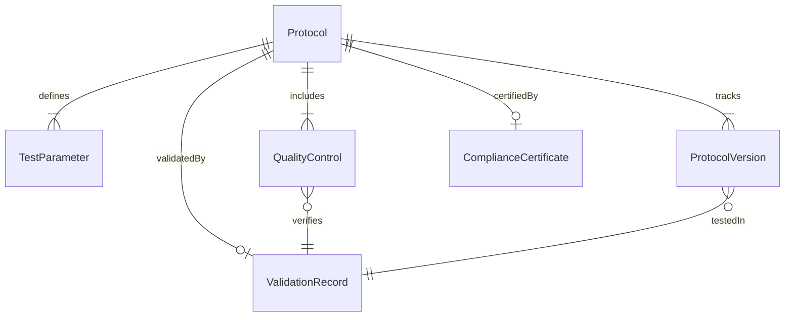
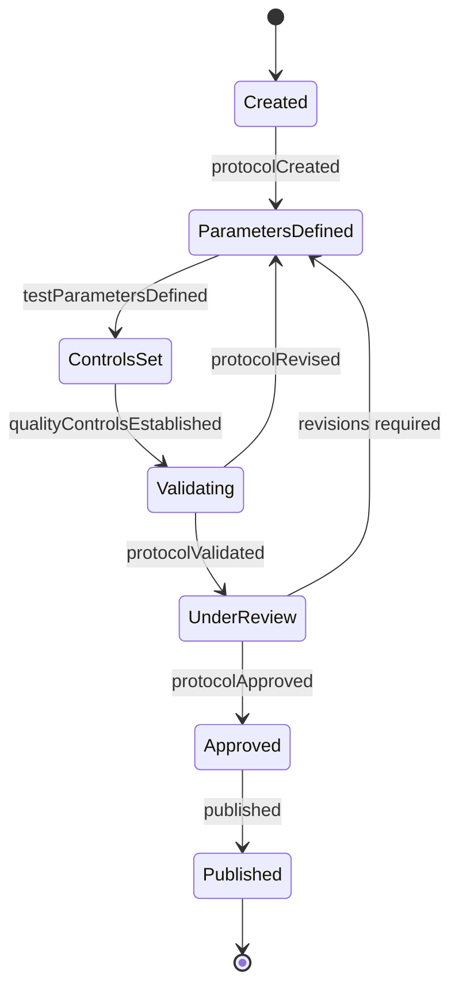
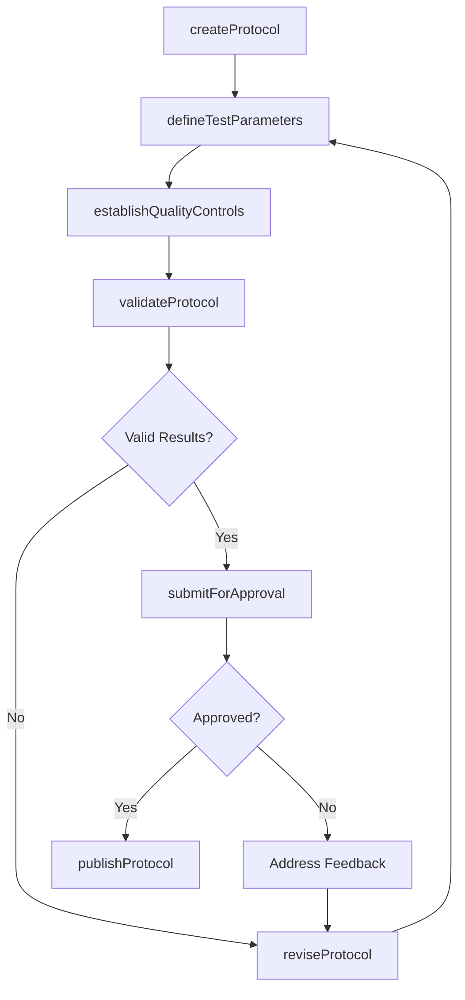
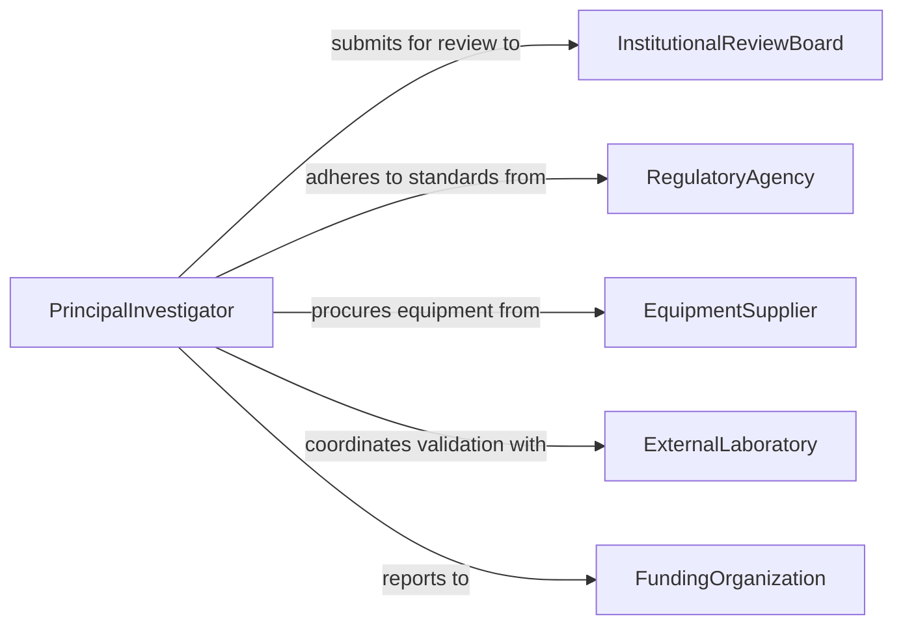

# Devise Research Testing Protocols

> Business-as-Code definition for devising research and testing protocols that ensure rigorous, reproducible, and standards-compliant experimental procedures.

## Overview

Devising research or testing protocols involves designing structured experimental procedures, defining measurement criteria, establishing quality controls, and documenting methodologies for reproducibility. This definition exposes actions for protocol creation, validation, and version management. It provides events for automating review and approval workflows and searches for retrieving protocol libraries and compliance records.

## Actors

| Actor | Description |
|-------|-------------|
| RegulatoryAgency | Government body that mandates testing standards and approves protocols |
| InstitutionalReviewBoard | Ethics committee that evaluates and approves research involving human subjects |
| EquipmentSupplier | Vendor providing instruments and materials required by the protocol |
| ExternalLaboratory | Third-party lab that may execute or validate testing protocols |
| FundingOrganization | Grant provider or sponsor requiring adherence to specific research standards |

## Roles

| Role | Description |
|------|-------------|
| PrincipalInvestigator | Leads protocol design and takes responsibility for scientific rigor |
| ProtocolDesigner | Creates detailed step-by-step experimental procedures and controls |
| QualityAssuranceSpecialist | Validates that protocols meet regulatory and organizational standards |
| LabManager | Oversees implementation feasibility and resource availability |

## Entities

| Entity | Description |
|--------|-------------|
| Protocol | A documented set of procedures defining how research or testing is conducted |
| TestParameter | A specific variable or condition being measured or controlled in the protocol |
| QualityControl | A checkpoint or standard used to verify protocol accuracy and reliability |
| ProtocolVersion | A tracked revision of a protocol with change history |
| ValidationRecord | Documentation confirming that a protocol produces reliable, reproducible results |
| ComplianceCertificate | Formal attestation that a protocol meets regulatory requirements |

## Actions

| Action | Description |
|--------|-------------|
| createProtocol | Initialize a new research or testing protocol document |
| defineTestParameters | Specify the variables, conditions, and measurement criteria |
| establishQualityControls | Set up checkpoints and standards for protocol reliability |
| validateProtocol | Execute a trial run to confirm reproducibility and accuracy |
| submitForApproval | Send the protocol to review boards or regulatory bodies for approval |
| publishProtocol | Release an approved protocol for use by research teams |
| reviseProtocol | Update an existing protocol based on new findings or requirements |

## Events

| Event | Description |
|-------|-------------|
| protocolCreated | A new research or testing protocol has been initialized |
| testParametersDefined | Variables and measurement criteria have been specified |
| qualityControlsEstablished | Validation checkpoints and standards have been set |
| protocolValidated | A trial run has confirmed protocol reproducibility |
| protocolSubmittedForApproval | The protocol has been sent for regulatory or ethics review |
| protocolApproved | The protocol has received formal approval |
| protocolRevised | An existing protocol has been updated with new revisions |

## Searches

| Search | Description |
|--------|-------------|
| findProtocols | List protocols by type, status, discipline, or approval state |
| getTestParameters | Retrieve parameter definitions for a given protocol |
| getValidationRecords | Search validation history by protocol, date, or outcome |
| getApprovalStatus | Retrieve the review and approval status for submitted protocols |

## Entity Relationships



## State Diagram



## Workflow



## Actor Relationships



## Usage

### Calling Actions

```typescript
import { deviseResearchTestingProtocols } from '@headlessly/devise-research-testing-protocols'

const protocols = deviseResearchTestingProtocols()

// Create a new testing protocol
const protocol = await protocols.createProtocol({
  name: 'Material Fatigue Testing Protocol',
  discipline: 'Materials Science',
  objective: 'Determine fatigue life of titanium alloy under cyclic loading',
  standard: 'ASTM E466'
})

// Define test parameters
await protocols.defineTestParameters({
  protocolId: protocol.id,
  parameters: [
    { name: 'cyclicLoadFrequency', unit: 'Hz', range: { min: 1, max: 50 } },
    { name: 'stressAmplitude', unit: 'MPa', range: { min: 100, max: 800 } },
    { name: 'temperature', unit: 'C', fixed: 23 }
  ]
})

// Validate with trial run
const validation = await protocols.validateProtocol({
  protocolId: protocol.id,
  trialRuns: 3,
  acceptanceCriteria: { reproducibility: 0.95 }
})
```

### Event-Driven Automation

```typescript
// Auto-submit for approval when validation passes
protocols.protocolValidated(async ({ protocolId, results }) => {
  if (results.reproducibility >= 0.95) {
    await protocols.submitForApproval({
      protocolId,
      reviewBoard: 'institutional-review-board'
    })
  }
})

// Notify team when protocol is approved
protocols.protocolApproved(async ({ protocolId, approvedBy }) => {
  await notify({
    to: 'research-team',
    message: `Protocol ${protocolId} approved by ${approvedBy} - ready for use`
  })
})
```
