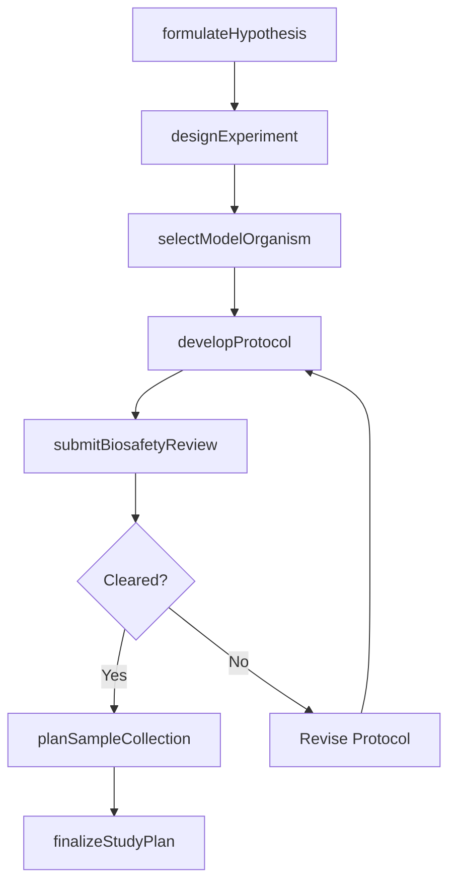
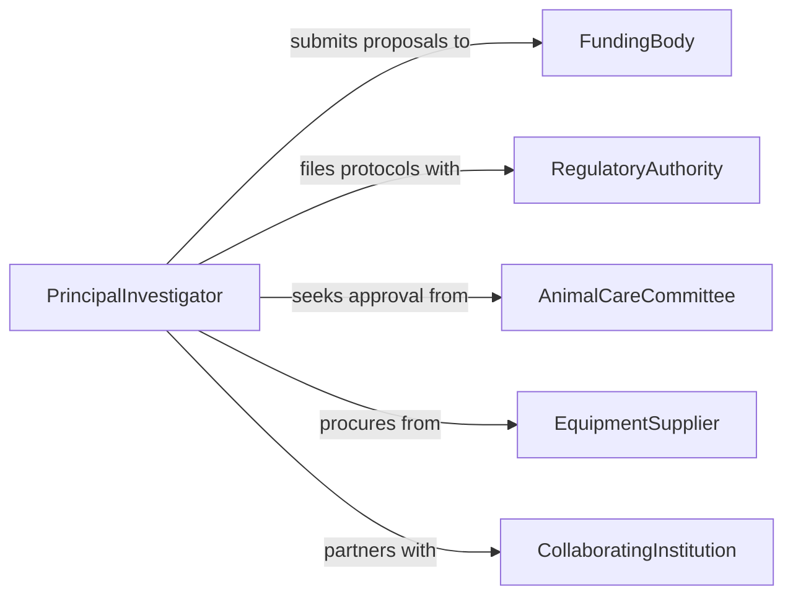

# Plan Biological Research

> Business-as-Code definition for planning biological research studies. Models the research planning lifecycle from hypothesis formation through experimental design and regulatory approval.

## Overview

Planning biological research involves formulating hypotheses, designing experiments, selecting model organisms or systems, and securing regulatory and safety approvals. This definition exposes actions for each stage of the biological research planning process, events for workflow automation, and searches for retrieving protocols, safety records, and study plans.

## Actors

| Actor | Description |
|-------|-------------|
| FundingBody | Provides research grants and sets funding criteria |
| RegulatoryAuthority | Oversees compliance with biosafety and environmental regulations |
| AnimalCareCommittee | Reviews and approves protocols involving animal subjects |
| EquipmentSupplier | Provides laboratory instruments, reagents, and biological materials |
| CollaboratingInstitution | Partner organizations contributing expertise or resources |

## Roles

| Role | Description |
|------|-------------|
| PrincipalInvestigator | Leads hypothesis formation and overall study design |
| LabManager | Coordinates laboratory resources, safety protocols, and personnel |
| ResearchScientist | Designs experimental procedures and analytical methods |
| BiostatisticianRole | Plans sample sizes, controls, and statistical analyses |

## Entities

| Entity | Description |
|--------|-------------|
| StudyPlan | A formal document describing objectives, methods, and timelines |
| Hypothesis | A testable statement the experiment seeks to validate or refute |
| ExperimentalProtocol | Step-by-step procedures for conducting the experiment |
| BiosafetyClearance | Approval from safety committees for handling biological materials |
| ModelOrganism | The biological system selected for experimentation |
| SamplePlan | The design for specimen collection, handling, and storage |

## Actions

| Action | Description |
|--------|-------------|
| formulateHypothesis | Define the central hypothesis and supporting predictions |
| designExperiment | Configure experimental conditions, controls, and variables |
| selectModelOrganism | Choose the appropriate biological system for the study |
| developProtocol | Create detailed step-by-step experimental procedures |
| submitBiosafetyReview | File protocols with safety committees for clearance |
| planSampleCollection | Define specimen types, quantities, and collection schedules |
| finalizeStudyPlan | Lock the study plan after all approvals are obtained |

## Events

| Event | Description |
|-------|-------------|
| hypothesisFormulated | The central hypothesis has been defined and documented |
| experimentDesigned | The experimental design has been completed |
| modelOrganismSelected | A model organism has been chosen for the study |
| protocolDeveloped | The experimental protocol has been finalized |
| biosafetyReviewSubmitted | The biosafety application has been filed |
| biosafetyClearanceGranted | Safety approval has been received |
| studyPlanFinalized | The complete study plan has been locked for execution |

## Searches

| Search | Description |
|--------|-------------|
| findStudyPlans | List study plans by status, organism, or investigator |
| getProtocols | Retrieve experimental protocols by type or research area |
| getBiosafetyClearances | Find biosafety clearances by status or committee |
| findModelOrganisms | Search available model organisms by species or application |

## Workflow



## Actor Relationships



## Usage

### Calling Actions

```typescript
import { planBiologicalResearch } from '@headlessly/plan-biological-research'

const research = planBiologicalResearch()

// Formulate the hypothesis
const hypothesis = await research.formulateHypothesis({
  title: 'CRISPR-Cas9 knockout of gene XYZ reduces tumor growth',
  predictions: [
    'Knockout mice show 50% reduction in tumor volume',
    'Expression of downstream markers is suppressed'
  ]
})

// Design the experiment
const experiment = await research.designExperiment({
  hypothesisId: hypothesis.id,
  type: 'controlled-trial',
  groups: ['control', 'knockout'],
  replicates: 10
})

// Submit for biosafety review
await research.submitBiosafetyReview({
  planId: hypothesis.planId,
  biosafetyLevel: 'BSL-2',
  organisms: ['Mus musculus']
})
```

### Event-Driven Automation

```typescript
// Notify team when biosafety clearance is granted
research.biosafetyClearanceGranted(async ({ planId, committee }) => {
  await notify({
    to: 'lab-team',
    message: `Biosafety clearance granted by ${committee} for plan ${planId}`
  })
})

// Log hypothesis creation for audit trail
research.hypothesisFormulated(async ({ hypothesisId, title }) => {
  await logActivity({
    type: 'research-planning',
    action: 'hypothesis-formulated',
    hypothesisId,
    title
  })
})
```
