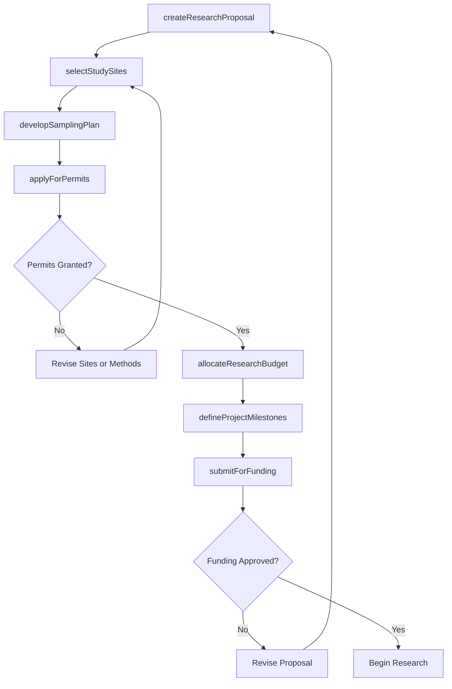
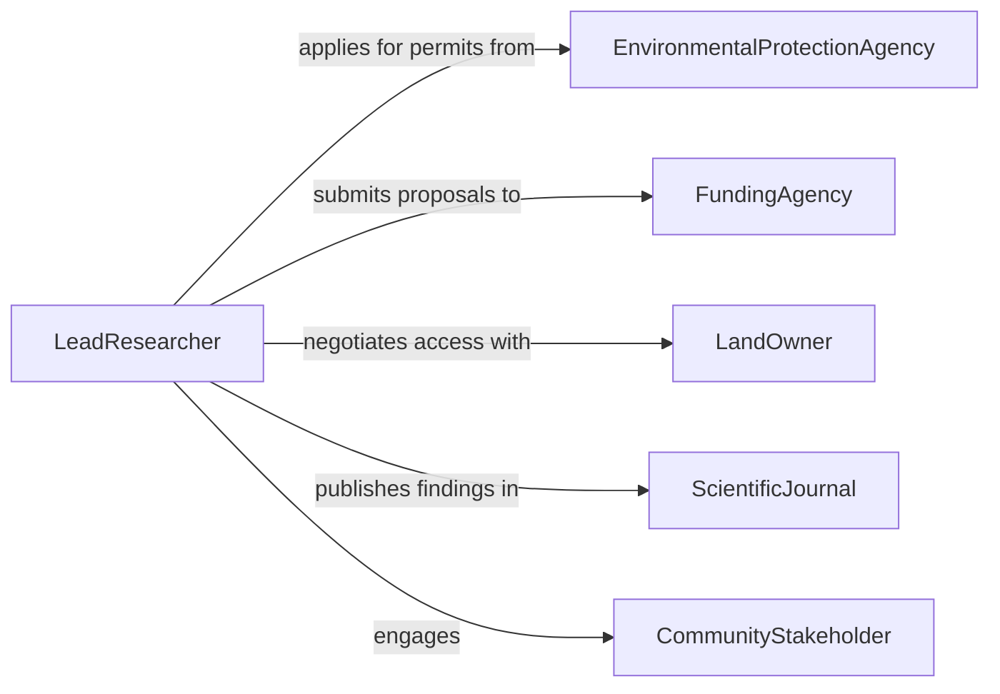

# Plan Environmental Research

> Business-as-Code definition for planning environmental research projects that investigate ecological systems, pollution, climate impacts, and natural resource management.

## Overview

Planning environmental research involves identifying research questions, designing study frameworks, securing permits and funding, organizing field data collection, and ensuring compliance with environmental regulations and ethical standards. This definition exposes actions for research proposal creation, site selection, resource planning, and regulatory permitting. It provides events for automating approval workflows and milestone tracking, along with searches for retrieving research project and permit data.

## Actors

| Actor | Description |
|-------|-------------|
| EnvironmentalProtectionAgency | Regulatory body overseeing environmental research standards and permits |
| FundingAgency | Grant-making organization that finances environmental research projects |
| LandOwner | Property holder who grants access to research sites |
| ScientificJournal | Publication that disseminates environmental research findings |
| CommunityStakeholder | Local resident or group affected by or interested in research outcomes |

## Roles

| Role | Description |
|------|-------------|
| LeadResearcher | Directs overall research planning, design, and execution oversight |
| FieldCoordinator | Organizes site logistics, sampling schedules, and field team deployment |
| DataScientist | Designs data collection frameworks and statistical analysis plans |
| PermitSpecialist | Manages regulatory applications, environmental permits, and compliance |

## Entities

| Entity | Description |
|--------|-------------|
| ResearchProposal | A formal plan outlining research objectives, methods, timeline, and budget |
| StudySite | A geographic location selected for environmental data collection |
| FieldSamplingPlan | A schedule defining when, where, and how environmental samples are collected |
| ResearchPermit | Authorization from regulatory agencies to conduct research at specific sites |
| BudgetAllocation | Financial resources assigned to personnel, equipment, and fieldwork |
| MilestoneSchedule | A timeline of key deliverables and checkpoints for the research project |

## Actions

| Action | Description |
|--------|-------------|
| createResearchProposal | Draft a new environmental research proposal with objectives and methods |
| selectStudySites | Identify and evaluate candidate locations for field research |
| developSamplingPlan | Design the data collection schedule, methods, and sample specifications |
| applyForPermits | Submit applications for environmental research permits |
| allocateResearchBudget | Assign funding across personnel, equipment, travel, and analysis |
| defineProjectMilestones | Establish key deliverables and timeline checkpoints |
| submitForFunding | Submit the research proposal to grant agencies for financial support |

## Events

| Event | Description |
|-------|-------------|
| researchProposalCreated | A new environmental research proposal has been drafted |
| studySitesSelected | Candidate research locations have been identified and evaluated |
| samplingPlanDeveloped | The data collection schedule and methods have been finalized |
| permitsApplied | Regulatory permit applications have been submitted |
| permitsGranted | Environmental research permits have been approved |
| budgetAllocated | Research funding has been distributed across project categories |
| fundingApproved | A grant agency has approved financial support for the project |

## Searches

| Search | Description |
|--------|-------------|
| findResearchProposals | List environmental research proposals by topic, status, or funding source |
| getStudySites | Retrieve study site data by geography, ecosystem type, or permit status |
| getPermitStatus | Search permit applications by agency, site, or approval status |
| getProjectMilestones | Retrieve milestone schedules and completion status for research projects |

## Workflow



## Actor Relationships



## Usage

### Calling Actions

```typescript
import { planEnvironmentalResearch } from '@headlessly/plan-environmental-research'

const research = planEnvironmentalResearch()

// Create a research proposal
const proposal = await research.createResearchProposal({
  title: 'Microplastic Contamination in Great Lakes Tributaries',
  objectives: ['Quantify microplastic concentrations', 'Identify primary sources', 'Assess ecological impact'],
  duration: { months: 24 },
  estimatedBudget: 350000
})

// Select study sites
await research.selectStudySites({
  proposalId: proposal.id,
  sites: [
    { name: 'Rouge River Delta', coordinates: { lat: 42.28, lng: -83.15 }, ecosystemType: 'riverine' },
    { name: 'Maumee Bay Estuary', coordinates: { lat: 41.70, lng: -83.38 }, ecosystemType: 'estuarine' }
  ]
})

// Apply for required permits
await research.applyForPermits({
  proposalId: proposal.id,
  permits: [
    { agency: 'EPA', type: 'water-sampling', sites: ['Rouge River Delta', 'Maumee Bay Estuary'] },
    { agency: 'State DNR', type: 'wildlife-disturbance', sites: ['Maumee Bay Estuary'] }
  ]
})
```

### Event-Driven Automation

```typescript
// Auto-allocate budget when funding is approved
research.fundingApproved(async ({ proposalId, amount }) => {
  await research.allocateResearchBudget({
    proposalId,
    allocations: [
      { category: 'Personnel', percentage: 45 },
      { category: 'Equipment', percentage: 25 },
      { category: 'Fieldwork', percentage: 20 },
      { category: 'Analysis', percentage: 10 }
    ],
    totalAmount: amount
  })
})

// Notify team when permits are granted
research.permitsGranted(async ({ proposalId, permits }) => {
  await notify({
    to: 'field-coordinator',
    message: `All permits granted for project ${proposalId} - field work can begin`
  })
})
```
