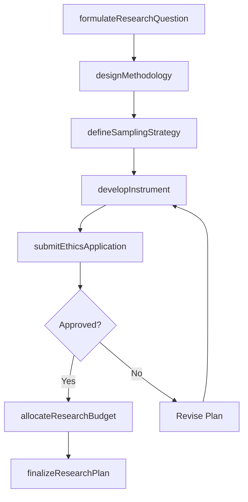
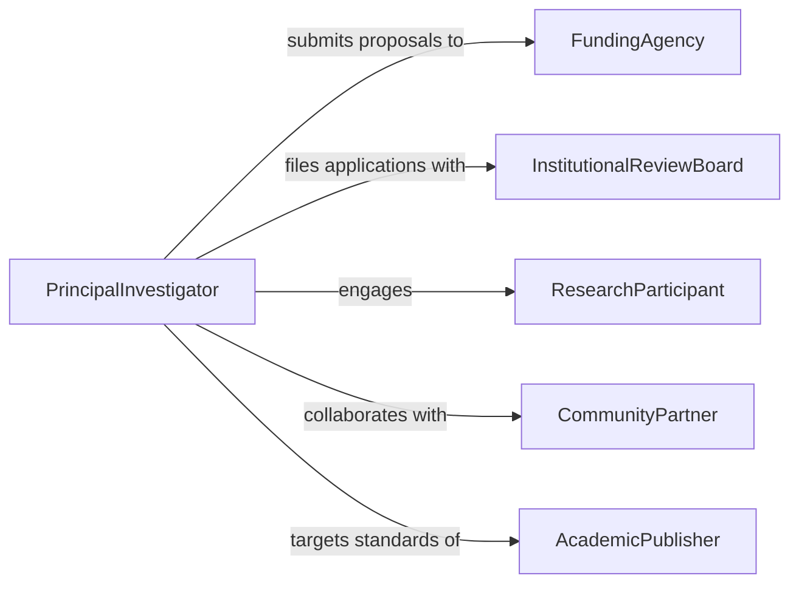

# Plan Social Sciences Research

> Business-as-Code definition for planning social sciences research initiatives. Models the full research planning lifecycle from question formulation through methodology design and institutional review.

## Overview

Planning social sciences research involves formulating research questions, designing methodologies, selecting data collection instruments, and securing institutional approvals. This definition exposes actions for each phase of the research planning process, events for workflow automation, and searches for retrieving research plans, methodology templates, and approval records.

## Actors

| Actor | Description |
|-------|-------------|
| FundingAgency | Provides grants and sets research funding requirements |
| InstitutionalReviewBoard | Reviews and approves research ethics and human subjects protocols |
| ResearchParticipant | Individuals or groups who are subjects of the study |
| AcademicPublisher | Sets publication standards that influence research design |
| CommunityPartner | Organizations or groups collaborating in community-based research |

## Roles

| Role | Description |
|------|-------------|
| PrincipalInvestigator | Leads the research design and oversees execution |
| ResearchMethodologist | Designs sampling strategies, instruments, and analytical frameworks |
| ResearchCoordinator | Manages logistics, timelines, and team coordination |
| DataAnalyst | Plans statistical and qualitative analysis approaches |

## Entities

| Entity | Description |
|--------|-------------|
| ResearchPlan | A comprehensive document describing objectives, methods, and timelines |
| ResearchQuestion | A formal statement of the inquiry the study seeks to answer |
| Methodology | The systematic approach for data collection and analysis |
| EthicsApplication | A submission to the institutional review board for approval |
| SamplingStrategy | The plan for selecting participants or data sources |
| DataCollectionInstrument | Surveys, interview guides, or observation protocols used in the study |

## Actions

| Action | Description |
|--------|-------------|
| formulateResearchQuestion | Define the central question and sub-questions for the study |
| designMethodology | Select and configure the research approach and analytical framework |
| defineSamplingStrategy | Specify population, sample size, and selection criteria |
| developInstrument | Create surveys, interview guides, or observation protocols |
| submitEthicsApplication | File the research plan with the institutional review board |
| allocateResearchBudget | Assign funding across personnel, fieldwork, and analysis |
| finalizeResearchPlan | Lock the plan after all approvals are received |

## Events

| Event | Description |
|-------|-------------|
| researchQuestionFormulated | The central research question has been defined |
| methodologyDesigned | The research methodology has been selected and documented |
| samplingStrategyDefined | The sampling plan has been established |
| instrumentDeveloped | A data collection instrument has been created |
| ethicsApplicationSubmitted | The ethics application has been filed for review |
| ethicsApprovalGranted | The institutional review board has approved the study |
| researchPlanFinalized | The research plan has been locked and is ready for execution |

## Searches

| Search | Description |
|--------|-------------|
| findResearchPlans | List research plans by status, discipline, or investigator |
| getMethodologyTemplates | Retrieve available methodology frameworks and templates |
| getEthicsApplications | Find ethics submissions by status or review board |
| findInstruments | Search for existing data collection instruments by type or topic |

## Workflow



## Actor Relationships



## Usage

### Calling Actions

```typescript
import { planSocialSciencesResearch } from '@headlessly/plan-social-sciences-research'

const research = planSocialSciencesResearch()

// Formulate the research question
const question = await research.formulateResearchQuestion({
  title: 'Impact of Remote Work on Social Cohesion',
  discipline: 'Sociology',
  subQuestions: [
    'How does remote work affect informal workplace relationships?',
    'What role does geographic proximity play in team trust?'
  ]
})

// Design the methodology
const methodology = await research.designMethodology({
  questionId: question.id,
  approach: 'mixed-methods',
  qualitativeMethod: 'semi-structured-interviews',
  quantitativeMethod: 'longitudinal-survey'
})

// Submit for ethics review
await research.submitEthicsApplication({
  planId: question.planId,
  board: 'University IRB',
  humanSubjects: true
})
```

### Event-Driven Automation

```typescript
// Notify team when ethics approval is granted
research.ethicsApprovalGranted(async ({ planId, board }) => {
  await notify({
    to: 'research-team',
    message: `Ethics approval granted by ${board} for plan ${planId}`
  })
})

// Auto-finalize plan when budget is allocated
research.researchQuestionFormulated(async ({ questionId, discipline }) => {
  await logActivity({
    type: 'research-planning',
    discipline,
    questionId
  })
})
```
