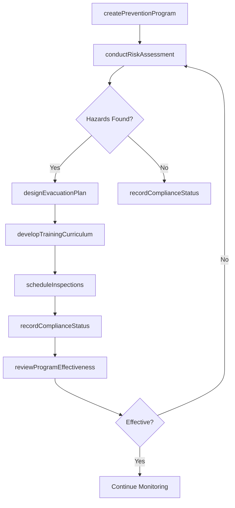
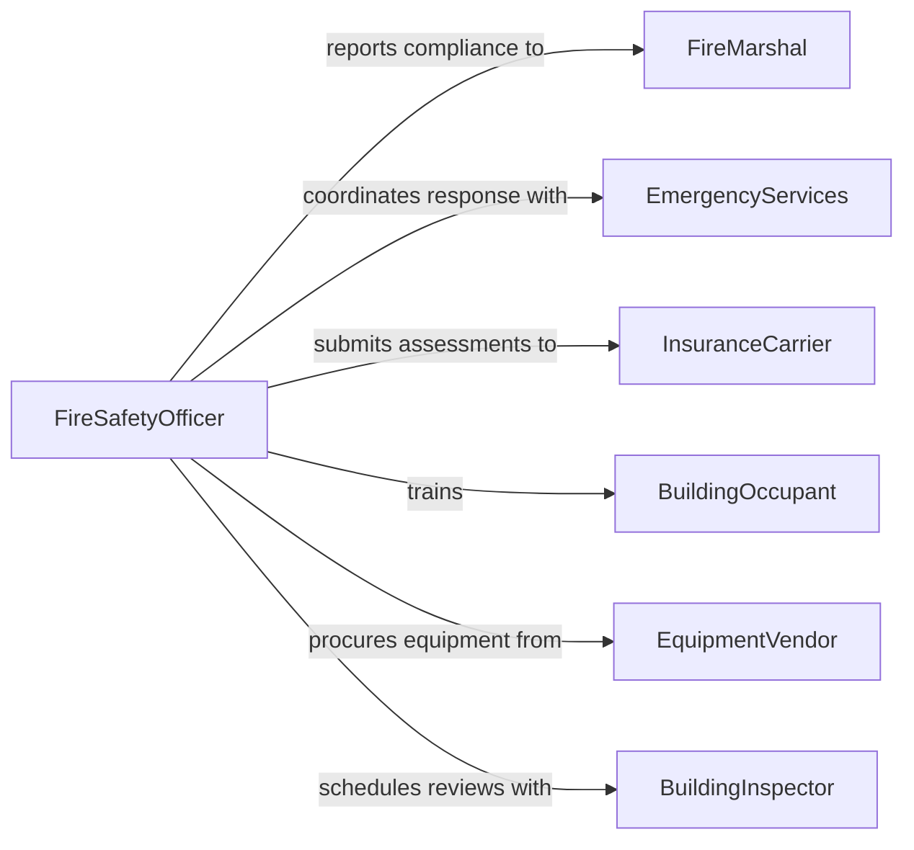

# Develop Fire Safety Prevention Programs

> Business-as-Code definition for developing fire safety and prevention programs that protect people, property, and assets through proactive planning, education, and compliance.

## Overview

Developing fire safety or prevention programs involves conducting risk assessments, designing prevention protocols, establishing emergency response procedures, and creating training curricula for personnel and occupants. This definition exposes actions for building fire prevention plans, managing inspection schedules, and tracking compliance with fire codes and regulations. It provides events for automation around inspection results and compliance milestones and searches for retrieving risk assessment and incident data.

## Actors

| Actor | Description |
|-------|-------------|
| FireMarshal | Government authority responsible for enforcing fire codes and regulations |
| InsuranceCarrier | Underwriter that evaluates fire risk and sets coverage terms |
| BuildingOccupant | Person or tenant who must follow fire safety procedures |
| EquipmentVendor | Supplier of fire detection, suppression, and safety equipment |
| EmergencyServices | Local fire department and first responders |
| BuildingInspector | Official who evaluates structural fire safety compliance |

## Roles

| Role | Description |
|------|-------------|
| FireSafetyOfficer | Leads fire prevention program development and compliance oversight |
| RiskAssessor | Conducts fire risk evaluations and hazard identification |
| TrainingCoordinator | Develops and delivers fire safety training programs |
| FacilitiesManager | Maintains fire safety equipment and building systems |

## Entities

| Entity | Description |
|--------|-------------|
| PreventionProgram | A structured plan defining fire prevention strategies and procedures |
| RiskAssessment | An evaluation of fire hazards, vulnerabilities, and mitigation measures |
| InspectionSchedule | A calendar of planned fire safety inspections and equipment checks |
| EvacuationPlan | A documented procedure for safe building evacuation during fire events |
| TrainingCurriculum | Educational content covering fire prevention, detection, and response |
| ComplianceRecord | Documentation of adherence to fire codes and regulatory requirements |

## Actions

| Action | Description |
|--------|-------------|
| createPreventionProgram | Initialize a new fire safety prevention program |
| conductRiskAssessment | Evaluate fire hazards and identify vulnerable areas |
| designEvacuationPlan | Create documented evacuation routes and procedures |
| scheduleInspections | Set up recurring fire safety inspections and equipment checks |
| developTrainingCurriculum | Create fire safety education materials and training sessions |
| recordComplianceStatus | Document adherence to fire codes and regulatory requirements |
| reviewProgramEffectiveness | Assess whether prevention measures are reducing fire risk |

## Events

| Event | Description |
|-------|-------------|
| preventionProgramCreated | A new fire safety prevention program has been initialized |
| riskAssessmentCompleted | Fire hazard evaluation has been finalized |
| evacuationPlanDesigned | Evacuation routes and procedures have been documented |
| inspectionCompleted | A fire safety inspection has been performed |
| trainingDelivered | Fire safety training has been conducted for personnel |
| complianceViolationDetected | A fire code violation has been identified |
| programEffectivenessReviewed | Prevention program results have been evaluated |

## Searches

| Search | Description |
|--------|-------------|
| findPreventionPrograms | List fire prevention programs by building, status, or date |
| getRiskAssessments | Retrieve risk evaluations by location, hazard type, or severity |
| getInspectionResults | Search inspection records by building, date, or compliance status |
| getTrainingRecords | Retrieve training completion data by personnel or certification |
| getComplianceViolations | Find open fire code violations by location or severity |

## Workflow



## Actor Relationships



## Usage

### Calling Actions

```typescript
import { developFireSafetyPreventionPrograms } from '@headlessly/develop-fire-safety-prevention-programs'

const fireSafety = developFireSafetyPreventionPrograms()

// Create a new fire prevention program
const program = await fireSafety.createPreventionProgram({
  name: 'Corporate Campus Fire Prevention 2026',
  building: 'Headquarters - Building A',
  occupancy: 450,
  fireCode: 'NFPA 101'
})

// Conduct risk assessment
const assessment = await fireSafety.conductRiskAssessment({
  programId: program.id,
  areas: ['server-room', 'kitchen', 'warehouse', 'parking-garage'],
  factors: ['electrical-load', 'flammable-materials', 'egress-capacity']
})

// Schedule recurring inspections
await fireSafety.scheduleInspections({
  programId: program.id,
  schedule: [
    { type: 'sprinkler-system', frequency: 'quarterly' },
    { type: 'fire-extinguisher', frequency: 'monthly' },
    { type: 'alarm-system', frequency: 'semi-annual' }
  ]
})
```

### Event-Driven Automation

```typescript
// Alert on compliance violations
fireSafety.complianceViolationDetected(async ({ programId, violation }) => {
  await notify({
    to: 'fire-safety-officer',
    message: `Violation in ${violation.location}: ${violation.description}`,
    priority: violation.severity === 'critical' ? 'urgent' : 'normal'
  })
})

// Auto-schedule retraining after incidents
fireSafety.inspectionCompleted(async ({ programId, results }) => {
  if (results.deficienciesFound > 0) {
    await fireSafety.developTrainingCurriculum({
      programId,
      focus: results.deficiencyAreas,
      audience: 'all-occupants'
    })
  }
})
```
