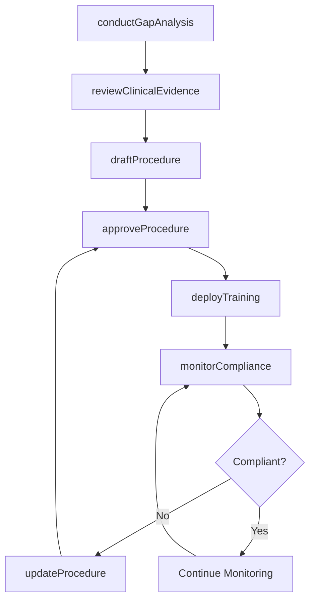
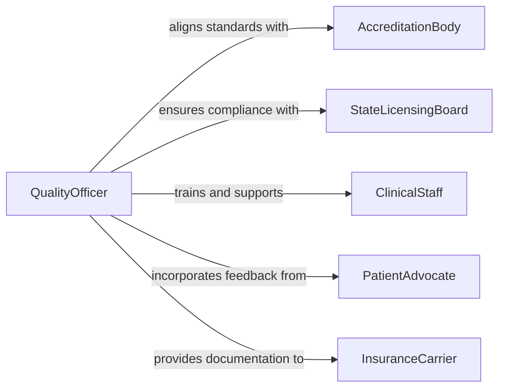

# Develop Healthcare Quality Safety Procedures

> Business-as-Code definition for developing healthcare quality and safety procedures. Models the clinical governance lifecycle from gap analysis and evidence review through procedure drafting, staff training, and continuous monitoring.

## Overview

Developing healthcare quality and safety procedures involves creating standardized clinical protocols, infection control policies, patient safety checklists, medication administration guidelines, and incident reporting processes. This encompasses reviewing clinical evidence and regulatory requirements, drafting procedure documents, conducting staff training, implementing monitoring metrics, and performing periodic audits. This definition provides actions for the quality management lifecycle used in hospitals, clinics, and healthcare systems to achieve and maintain accreditation standards.

## Actors

| Actor | Description |
|-------|-------------|
| AccreditationBody | Sets quality standards and conducts surveys such as Joint Commission or CMS |
| StateLicensingBoard | Enforces state-level healthcare facility regulations |
| ClinicalStaff | Follows procedures in daily patient care and reports incidents |
| PatientAdvocate | Represents patient safety interests and provides feedback on care processes |
| InsuranceCarrier | Requires quality metrics and safety documentation for malpractice coverage |

## Roles

| Role | Description |
|------|-------------|
| QualityOfficer | Leads the development and oversight of quality and safety procedures |
| ClinicalNurseSpecialist | Provides clinical expertise for procedure content and workflow design |
| ComplianceAnalyst | Maps procedures to regulatory requirements and tracks compliance gaps |
| TrainingCoordinator | Develops and delivers staff education programs on new procedures |

## Entities

| Entity | Description |
|--------|-------------|
| Procedure | A documented step-by-step protocol for a clinical or safety process |
| QualityMetric | A measurable indicator of care quality such as infection rate or fall rate |
| IncidentReport | A structured record of an adverse event or near-miss occurrence |
| GapAnalysis | An assessment identifying discrepancies between current practice and standards |
| TrainingModule | An educational unit covering a specific procedure or safety topic |
| AuditRecord | A documented review of procedure adherence and outcome measures |

## Actions

| Action | Description |
|--------|-------------|
| conductGapAnalysis | Assess current practices against accreditation standards and regulatory requirements |
| reviewClinicalEvidence | Examine research literature and best practice guidelines relevant to the procedure |
| draftProcedure | Write the step-by-step protocol with roles, materials, and decision criteria |
| approveProcedure | Route the draft through clinical leadership and compliance for formal approval |
| deployTraining | Create and deliver staff education materials and competency assessments |
| monitorCompliance | Track quality metrics and audit procedure adherence at defined intervals |
| updateProcedure | Revise the procedure based on incident data, audit findings, or regulatory changes |

## Events

| Event | Description |
|-------|-------------|
| gapAnalysisCompleted | A gap assessment has identified areas requiring new or revised procedures |
| evidenceReviewed | Clinical evidence and best practices have been evaluated |
| procedureDrafted | A new procedure document has been written |
| procedureApproved | The procedure has received formal approval from clinical leadership |
| trainingDeployed | Staff education and competency assessments have been delivered |
| complianceAudited | A periodic audit of procedure adherence has been completed |
| procedureUpdated | An existing procedure has been revised and republished |

## Searches

| Search | Description |
|--------|-------------|
| findProcedures | List procedures by department, standard, or effective date |
| getQualityMetrics | Retrieve quality indicator data by metric, unit, or time period |
| getIncidentReports | Find incident reports by type, severity, or department |
| getAuditRecords | Retrieve audit results by procedure, auditor, or compliance score |

## Workflow



## Actor Relationships



## Usage

### Calling Actions

```typescript
import { developHealthcareQualitySafetyProcedures } from '@headlessly/develop-healthcare-quality-safety-procedures'

const quality = developHealthcareQualitySafetyProcedures()

// Conduct a gap analysis for surgical site infection prevention
const gap = await quality.conductGapAnalysis({
  department: 'surgical-services',
  standard: 'joint-commission-npsg-07',
  currentPractice: 'pre-operative-checklist-v2'
})

// Draft and approve a revised procedure
const procedure = await quality.draftProcedure({
  title: 'Surgical Site Infection Prevention Protocol',
  department: 'surgical-services',
  gapAnalysisId: gap.id,
  sections: ['pre-operative-preparation', 'intra-operative-technique', 'post-operative-monitoring']
})

await quality.approveProcedure({
  procedureId: procedure.id,
  approvers: ['chief-medical-officer', 'director-of-nursing', 'infection-preventionist']
})
```

### Event-Driven Automation

```typescript
// Auto-deploy training when a procedure is approved
quality.procedureApproved(async ({ procedureId, department, title }) => {
  await quality.deployTraining({
    procedureId,
    targetAudience: department,
    dueDate: '30-days',
    format: 'online-module'
  })
})

// Alert quality team when compliance drops below threshold
quality.complianceAudited(async ({ procedureId, complianceRate, department }) => {
  if (complianceRate < 0.90) {
    await notify({
      to: 'quality-committee',
      message: `Compliance for procedure ${procedureId} in ${department} is ${(complianceRate * 100).toFixed(1)}% - below 90% threshold`
    })
  }
})
```
