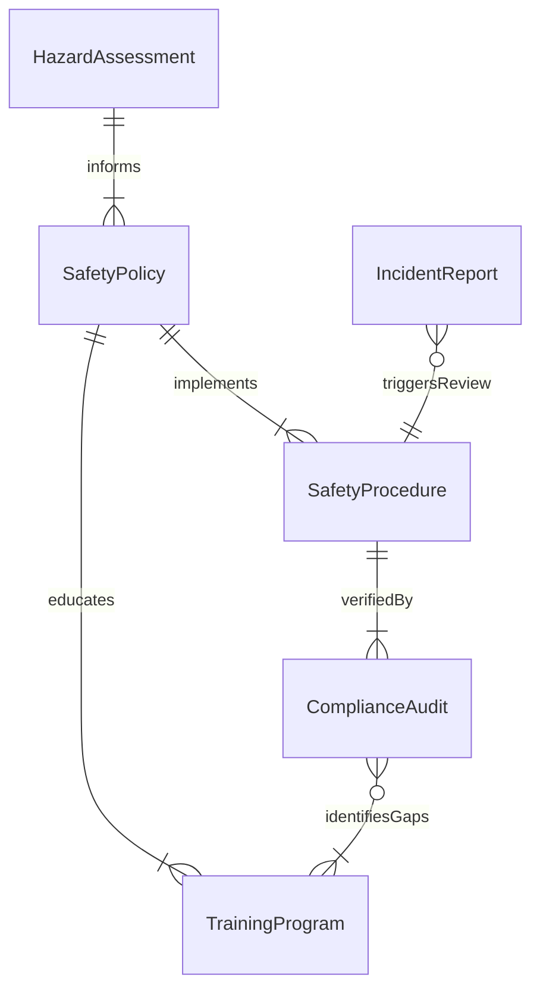
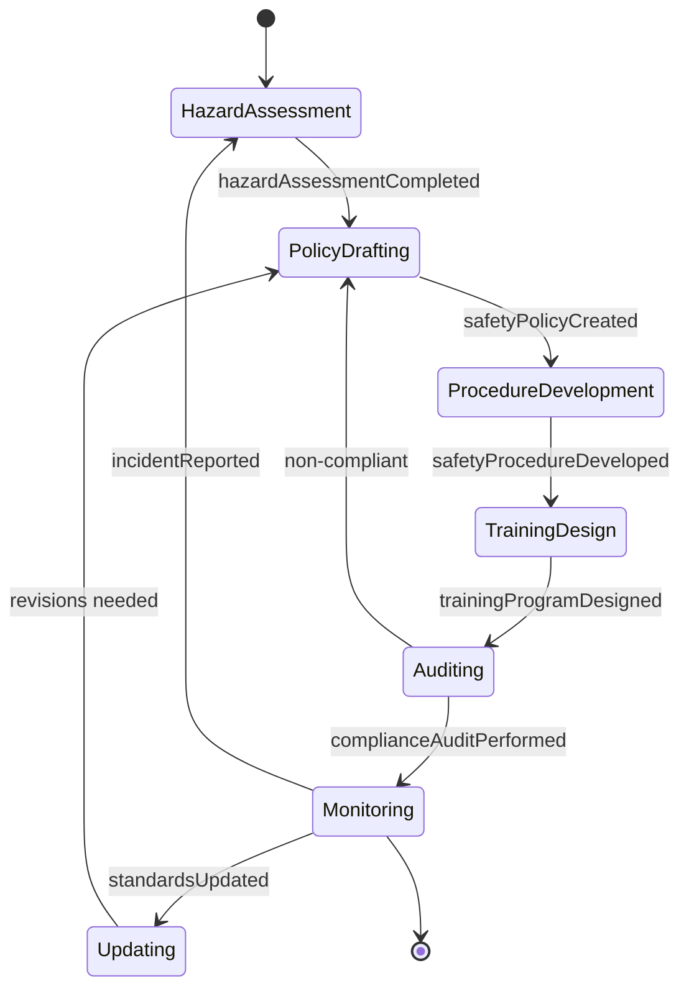
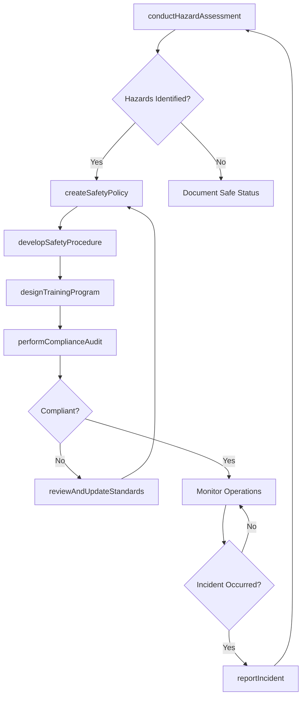
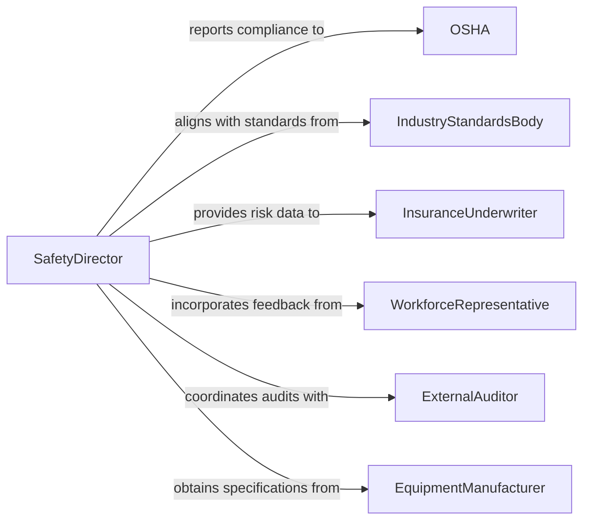

# Develop Safety Standards Policies Procedures

> Business-as-Code definition for developing safety standards, policies, and procedures that protect workers, the public, and organizational assets from hazards and risks.

## Overview

Developing safety standards, policies, or procedures involves identifying workplace and operational hazards, establishing preventive measures, creating documented safety protocols, and ensuring compliance with occupational health and safety regulations. This definition exposes actions for hazard assessment, policy drafting, training program creation, and compliance tracking. It provides events for automating safety review cycles and incident response, along with searches for retrieving hazard, incident, and compliance data.

## Actors

| Actor | Description |
|-------|-------------|
| OSHA | Federal regulatory agency enforcing workplace safety standards |
| IndustryStandardsBody | Organization that publishes safety standards and best practices |
| InsuranceUnderwriter | Carrier that assesses safety risk and determines coverage premiums |
| WorkforceRepresentative | Employee or union delegate providing input on safety concerns |
| ExternalAuditor | Third-party inspector who evaluates safety compliance |
| EquipmentManufacturer | Supplier providing safety specifications and operational guidelines for equipment |

## Roles

| Role | Description |
|------|-------------|
| SafetyDirector | Leads organizational safety program development and regulatory compliance |
| RiskManager | Identifies, assesses, and prioritizes hazards across operations |
| SafetyTrainer | Develops and delivers safety education and certification programs |
| ComplianceSpecialist | Monitors regulatory changes and ensures organizational adherence |
| IncidentInvestigator | Examines safety incidents to determine root causes and corrective actions |

## Entities

| Entity | Description |
|--------|-------------|
| SafetyPolicy | A formal document establishing organizational safety rules and expectations |
| HazardAssessment | An evaluation identifying potential dangers and their severity |
| SafetyProcedure | A step-by-step protocol for performing work safely |
| IncidentReport | A documented record of a safety event including cause and response |
| ComplianceAudit | A structured review of adherence to safety regulations and standards |
| TrainingProgram | An educational curriculum covering safety practices and certifications |

## Actions

| Action | Description |
|--------|-------------|
| createSafetyPolicy | Draft a new safety policy document for organizational adoption |
| conductHazardAssessment | Identify and evaluate workplace hazards and risk levels |
| developSafetyProcedure | Create detailed step-by-step protocols for safe operations |
| designTrainingProgram | Build safety education curricula and certification pathways |
| performComplianceAudit | Conduct a structured review of safety regulation adherence |
| reportIncident | Document a safety event with root cause analysis and corrective actions |
| reviewAndUpdateStandards | Revise safety standards based on regulatory changes or incident learnings |

## Events

| Event | Description |
|-------|-------------|
| safetyPolicyCreated | A new safety policy has been drafted for review |
| hazardAssessmentCompleted | Workplace hazard evaluation has been finalized |
| safetyProcedureDeveloped | A new safety procedure has been documented |
| trainingProgramDesigned | A safety training curriculum has been created |
| complianceAuditPerformed | A safety compliance review has been completed |
| incidentReported | A safety incident has been documented |
| standardsUpdated | Safety standards have been revised based on new information |

## Searches

| Search | Description |
|--------|-------------|
| findSafetyPolicies | List safety policies by category, status, or effective date |
| getHazardAssessments | Retrieve hazard evaluations by location, type, or risk level |
| getIncidentReports | Search incident records by date, severity, or location |
| getComplianceStatus | Retrieve audit results and compliance standings by standard or facility |
| getTrainingCompletion | Retrieve training records by employee, program, or certification status |

## Entity Relationships



## State Diagram



## Workflow



## Actor Relationships



## Usage

### Calling Actions

```typescript
import { developSafetyStandardsPoliciesProcedures } from '@headlessly/develop-safety-standards-policies-procedures'

const safety = developSafetyStandardsPoliciesProcedures()

// Conduct hazard assessment
const assessment = await safety.conductHazardAssessment({
  facility: 'Manufacturing Plant - West Wing',
  areas: ['assembly-line', 'chemical-storage', 'loading-dock'],
  standards: ['OSHA-29CFR1910', 'ANSI-Z10']
})

// Create safety policy based on findings
const policy = await safety.createSafetyPolicy({
  name: 'Chemical Handling and Storage Policy',
  category: 'Hazardous Materials',
  scope: 'All production and warehouse personnel',
  hazardAssessmentId: assessment.id,
  effectiveDate: '2026-04-01'
})

// Develop supporting procedures
await safety.developSafetyProcedure({
  policyId: policy.id,
  name: 'Spill Response Procedure',
  steps: [
    'Evacuate immediate area and alert nearby workers',
    'Activate spill containment kit',
    'Notify safety officer and document incident',
    'Initiate cleanup per material safety data sheet'
  ]
})
```

### Event-Driven Automation

```typescript
// Trigger immediate review after incident
safety.incidentReported(async ({ incidentId, severity, location }) => {
  if (severity === 'serious') {
    await safety.conductHazardAssessment({
      facility: location,
      triggeredBy: incidentId,
      priority: 'urgent'
    })
  }
})

// Auto-schedule retraining when standards are updated
safety.standardsUpdated(async ({ policyId, changes }) => {
  await safety.designTrainingProgram({
    policyId,
    focus: changes.map(c => c.area),
    audience: 'affected-personnel',
    deadline: '30-days'
  })
})
```
