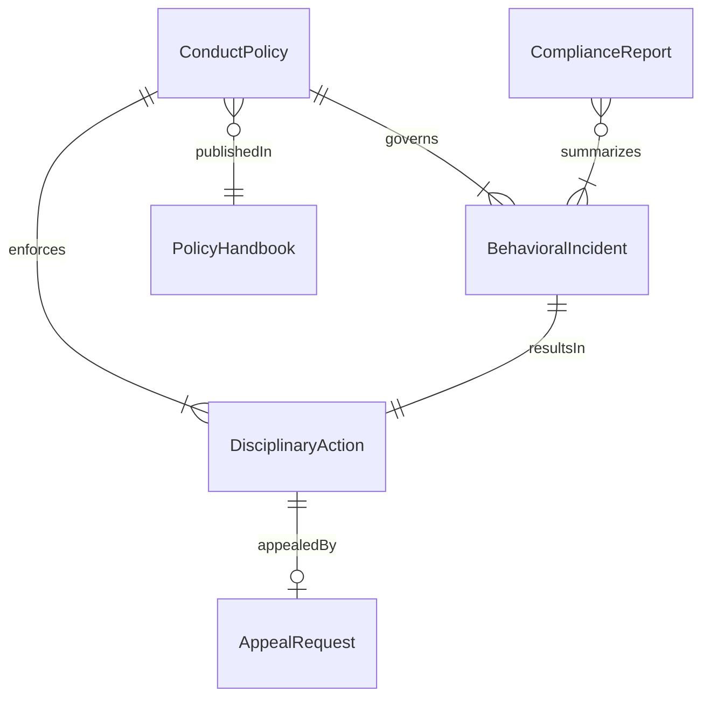
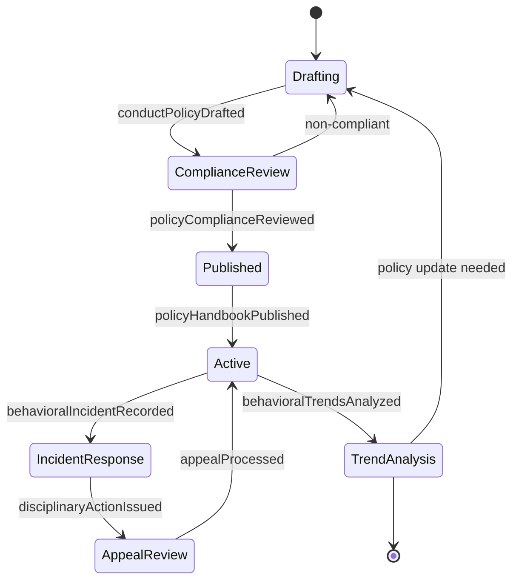
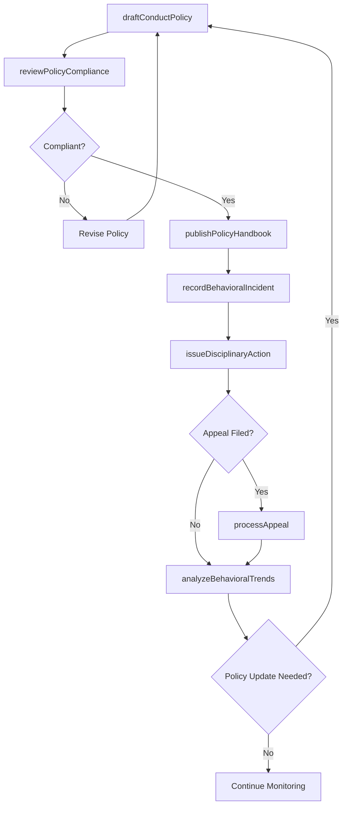
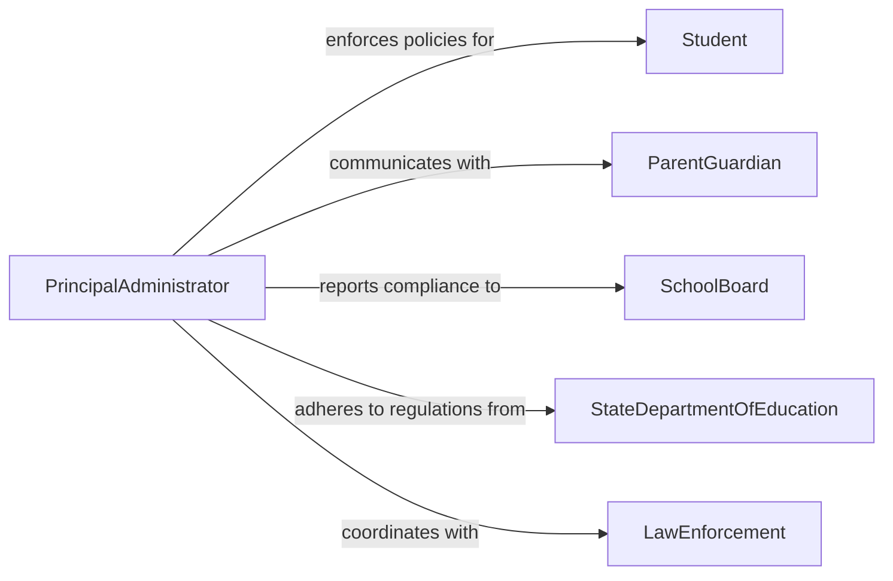

# Establish Rules Policies Governing Student

> Business-as-Code definition for establishing rules and policies that govern student behavior to maintain safe, orderly, and productive learning environments.

## Overview

Establishing rules or policies governing student behavior involves defining behavioral expectations, creating disciplinary frameworks, developing anti-bullying and safety protocols, and ensuring compliance with educational regulations. This definition exposes actions for drafting conduct policies, managing disciplinary procedures, and tracking policy adherence. It provides events for automating responses to behavioral incidents and searches for retrieving policy, incident, and compliance data.

## Actors

| Actor | Description |
|-------|-------------|
| Student | Individual enrolled in the educational institution subject to conduct policies |
| ParentGuardian | Family member responsible for supporting student compliance with policies |
| SchoolBoard | Governing body that approves and mandates institutional policies |
| StateDepartmentOfEducation | Regulatory authority establishing legal requirements for student policies |
| LawEnforcement | External authority involved when student behavior requires legal intervention |

## Roles

| Role | Description |
|------|-------------|
| PrincipalAdministrator | Senior leader responsible for policy approval and enforcement oversight |
| DeanOfStudents | Manages student conduct, disciplinary proceedings, and behavioral interventions |
| SchoolCounselor | Provides guidance and support to students regarding behavioral expectations |
| PolicyDraftingCommittee | Group of educators and administrators who develop and review policy language |

## Entities

| Entity | Description |
|--------|-------------|
| ConductPolicy | A formal document defining behavioral expectations and consequences |
| DisciplinaryAction | A recorded response to a policy violation including warnings, suspensions, or expulsions |
| BehavioralIncident | A documented event where student conduct violated established rules |
| PolicyHandbook | A comprehensive publication communicating all student policies to stakeholders |
| AppealRequest | A formal request to review or reconsider a disciplinary decision |
| ComplianceReport | A summary of policy adherence rates and incident trends over a period |

## Actions

| Action | Description |
|--------|-------------|
| draftConductPolicy | Create or revise a student conduct policy document |
| reviewPolicyCompliance | Evaluate whether existing policies meet regulatory requirements |
| publishPolicyHandbook | Distribute updated policies to students, parents, and staff |
| recordBehavioralIncident | Document a student conduct violation with details and context |
| issueDisciplinaryAction | Assign consequences for a documented policy violation |
| processAppeal | Review and adjudicate a request to reconsider a disciplinary decision |
| analyzeBehavioralTrends | Examine incident data to identify patterns and inform policy updates |

## Events

| Event | Description |
|-------|-------------|
| conductPolicyDrafted | A new or revised student conduct policy has been created |
| policyComplianceReviewed | Regulatory compliance of existing policies has been assessed |
| policyHandbookPublished | Updated policy handbook has been distributed to stakeholders |
| behavioralIncidentRecorded | A student conduct violation has been documented |
| disciplinaryActionIssued | Consequences have been assigned for a policy violation |
| appealProcessed | A disciplinary appeal has been reviewed and decided |
| behavioralTrendsAnalyzed | Incident data analysis has been completed |

## Searches

| Search | Description |
|--------|-------------|
| findConductPolicies | List student conduct policies by category, status, or effective date |
| getBehavioralIncidents | Retrieve incident records by student, type, date range, or severity |
| getDisciplinaryActions | Search disciplinary records by action type, status, or student |
| getComplianceReports | Retrieve policy compliance summaries by period or regulatory standard |

## Entity Relationships



## State Diagram



## Workflow



## Actor Relationships



## Usage

### Calling Actions

```typescript
import { establishRulesPoliciesGoverningStudent } from '@headlessly/establish-rules-policies-governing-student'

const studentPolicy = establishRulesPoliciesGoverningStudent()

// Draft a new conduct policy
const policy = await studentPolicy.draftConductPolicy({
  name: 'Digital Device Usage Policy',
  category: 'Technology',
  scope: 'All Students K-12',
  effectiveDate: '2026-08-15',
  provisions: [
    { rule: 'Personal devices must remain off during instructional time', consequence: 'Device confiscation for remainder of day' },
    { rule: 'No recording of students or staff without consent', consequence: 'Suspension pending review' }
  ]
})

// Review for regulatory compliance
await studentPolicy.reviewPolicyCompliance({
  policyId: policy.id,
  standards: ['state-education-code', 'FERPA', 'district-guidelines']
})

// Record an incident
await studentPolicy.recordBehavioralIncident({
  studentId: 'stu-456',
  policyId: policy.id,
  description: 'Student used phone during exam period',
  severity: 'minor',
  witnesses: ['teacher-jones']
})
```

### Event-Driven Automation

```typescript
// Notify parents when disciplinary action is issued
studentPolicy.disciplinaryActionIssued(async ({ studentId, action }) => {
  const parent = await getParentContact(studentId)
  await notify({
    to: parent.email,
    message: `Disciplinary action issued: ${action.type} - ${action.description}`
  })
})

// Flag patterns for administrative review
studentPolicy.behavioralTrendsAnalyzed(async ({ period, trends }) => {
  if (trends.repeatOffenders.length > 10) {
    await notify({
      to: 'dean-of-students',
      message: `${trends.repeatOffenders.length} repeat offenders identified in ${period} - policy review recommended`
    })
  }
})
```
