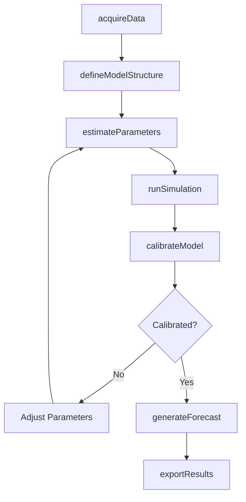
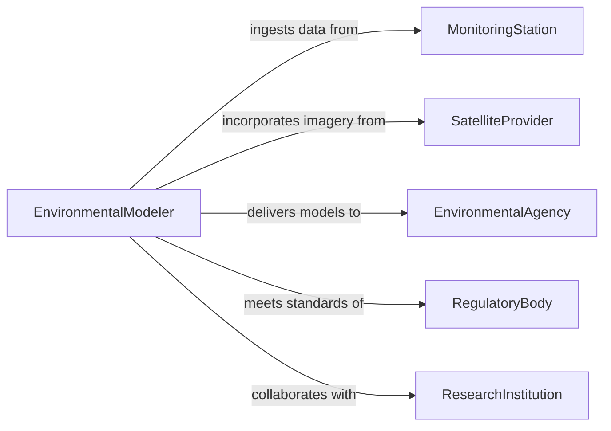

# Develop Mathematical Models Environmental Conditions

> Business-as-Code definition for developing mathematical models of environmental conditions. Models the scientific workflow from data acquisition and parameter estimation through simulation, calibration, and forecasting.

## Overview

Developing mathematical models of environmental conditions involves constructing quantitative representations of ecosystems, atmospheric systems, hydrological cycles, pollution dispersion, and climate patterns. These models use differential equations, statistical methods, and computational simulations to predict environmental behavior under varying scenarios. This definition provides actions for building, calibrating, and running environmental models used in resource management, regulatory compliance, and climate research.

## Actors

| Actor | Description |
|-------|-------------|
| EnvironmentalAgency | Commissions models for regulatory impact assessment and policy development |
| MonitoringStation | Provides real-time and historical environmental measurement data |
| SatelliteProvider | Supplies remote sensing imagery and geospatial environmental datasets |
| RegulatoryBody | Sets model accuracy standards and accepts model outputs for compliance |
| ResearchInstitution | Collaborates on model development and provides peer validation |

## Roles

| Role | Description |
|------|-------------|
| EnvironmentalModeler | Designs and implements mathematical models of environmental systems |
| DataScientist | Processes observational data and estimates model parameters |
| ClimateAnalyst | Interprets model outputs for climate projections and trend analysis |
| QASpecialist | Validates model accuracy against observed data and benchmark standards |

## Entities

| Entity | Description |
|--------|-------------|
| EnvironmentalModel | A mathematical representation of an environmental system or process |
| ParameterSet | A collection of calibrated coefficients and constants for a model |
| ObservationDataset | Time-series or spatial measurements from monitoring stations or satellites |
| SimulationRun | An execution of the model under a specific scenario and parameter configuration |
| CalibrationResult | The outcome of fitting model parameters to observed data |
| ForecastScenario | A defined set of future conditions used to project environmental outcomes |

## Actions

| Action | Description |
|--------|-------------|
| acquireData | Ingest observational data from monitoring stations, satellites, or field surveys |
| defineModelStructure | Specify the governing equations, boundary conditions, and spatial domain |
| estimateParameters | Fit model parameters to observational data using optimization or statistical methods |
| runSimulation | Execute the model for a defined time period and scenario configuration |
| calibrateModel | Adjust parameters iteratively to minimize deviation from observed conditions |
| generateForecast | Project future environmental conditions under specified scenarios |
| exportResults | Produce model output datasets, maps, and summary reports |

## Events

| Event | Description |
|-------|-------------|
| dataAcquired | Observational data has been ingested and preprocessed |
| modelStructureDefined | Governing equations and domain have been specified |
| parametersEstimated | Model parameters have been fitted to observations |
| simulationCompleted | A model run has finished processing |
| modelCalibrated | Calibration has achieved acceptable fit against observed data |
| forecastGenerated | Future condition projections have been produced |
| resultsExported | Model outputs have been packaged for delivery |

## Searches

| Search | Description |
|--------|-------------|
| findModels | List environmental models by system type, domain, or calibration status |
| getObservationData | Retrieve monitoring data by location, parameter, or date range |
| getSimulationRuns | Find simulation outputs by model, scenario, or time period |
| getCalibrationMetrics | Retrieve goodness-of-fit statistics for model calibration results |

## Workflow



## Actor Relationships



## Usage

### Calling Actions

```typescript
import { developMathematicalModelsEnvironmentalConditions } from '@headlessly/develop-mathematical-models-environmental-conditions'

const envModels = developMathematicalModelsEnvironmentalConditions()

// Acquire watershed monitoring data
const data = await envModels.acquireData({
  source: 'usgs-streamflow',
  region: 'chesapeake-bay-watershed',
  parameters: ['discharge', 'nitrogen', 'phosphorus'],
  dateRange: { start: '2020-01-01', end: '2025-12-31' }
})

// Define a nutrient loading model
const model = await envModels.defineModelStructure({
  name: 'Chesapeake Nutrient Loading Model',
  type: 'advection-diffusion',
  spatialDomain: 'chesapeake-bay-watershed',
  temporalResolution: 'daily'
})

// Calibrate and generate forecasts
await envModels.calibrateModel({ modelId: model.id, observationDataId: data.id })
await envModels.generateForecast({
  modelId: model.id,
  scenario: 'baseline-2030',
  projectionYears: 5
})
```

### Event-Driven Automation

```typescript
// Auto-run simulations when new observation data arrives
envModels.dataAcquired(async ({ datasetId, modelId }) => {
  await envModels.runSimulation({
    modelId,
    observationDataId: datasetId,
    scenario: 'updated-baseline'
  })
})

// Notify analysts when calibration is complete
envModels.modelCalibrated(async ({ modelId, rSquared, rmse }) => {
  await notify({
    to: 'climate-analysis-team',
    message: `Model ${modelId} calibrated with R-squared=${rSquared.toFixed(3)} and RMSE=${rmse.toFixed(2)}`
  })
})
```
