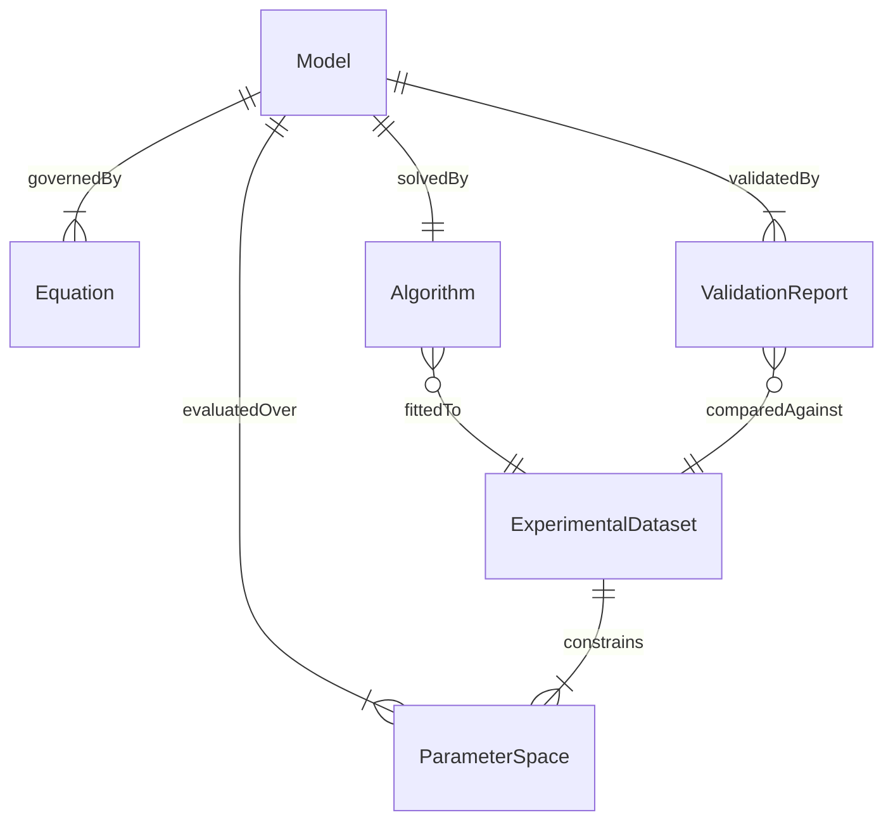
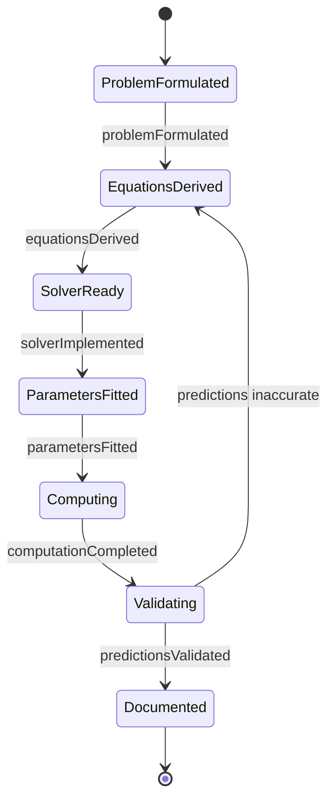
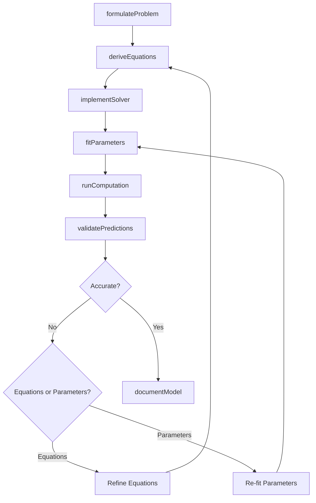
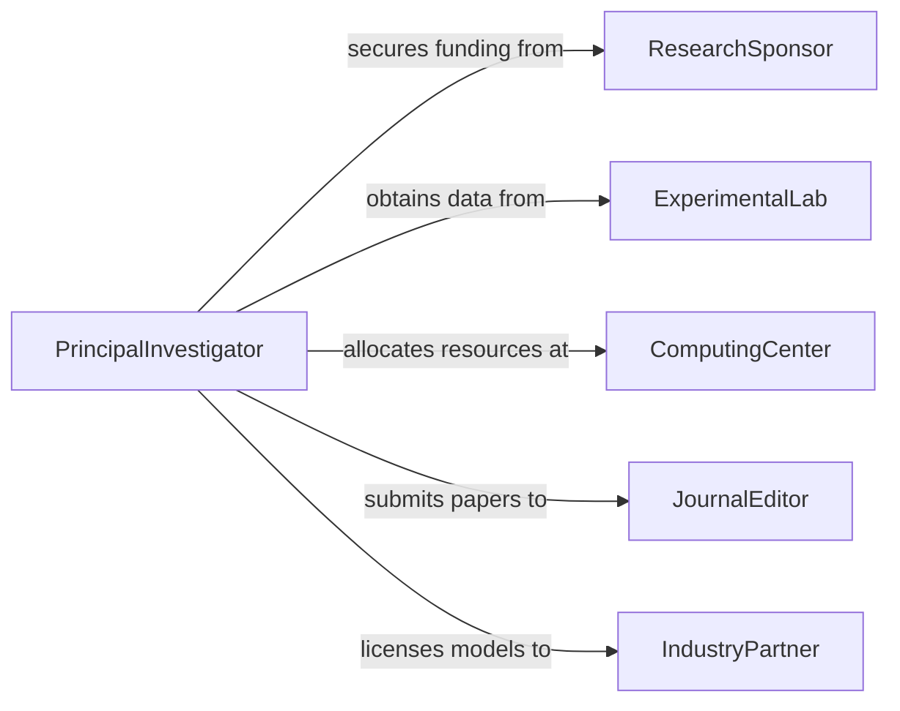

# Develop Scientific Mathematical Models

> Business-as-Code definition for developing scientific and mathematical models. Models the research workflow from problem formulation through mathematical construction, computational implementation, validation, and dissemination.

## Overview

Developing scientific and mathematical models involves translating observed phenomena into formal mathematical frameworks that describe, explain, and predict system behavior. This spans disciplines including physics, biology, engineering, and economics, encompassing activities such as deriving governing equations, implementing numerical solvers, fitting parameters to empirical data, and verifying model accuracy. This definition provides actions for the full model development lifecycle used in research laboratories, engineering firms, and computational science centers.

## Actors

| Actor | Description |
|-------|-------------|
| ResearchSponsor | Funds model development and defines the scientific objectives |
| ExperimentalLab | Produces empirical data used for model calibration and validation |
| ComputingCenter | Provides high-performance computing resources for model execution |
| JournalEditor | Manages peer review and publication of model findings |
| IndustryPartner | Applies validated models to commercial products or processes |

## Roles

| Role | Description |
|------|-------------|
| PrincipalInvestigator | Directs the research program and defines the modeling approach |
| MathematicalModeler | Derives equations, constructs proofs, and formalizes model structure |
| ComputationalScientist | Implements numerical methods, algorithms, and simulation code |
| ExperimentalScientist | Designs and conducts experiments to generate validation data |

## Entities

| Entity | Description |
|--------|-------------|
| Model | A formal mathematical representation of a scientific system or process |
| Equation | A governing relationship expressed in mathematical notation |
| Algorithm | A computational procedure that solves or approximates the model equations |
| ExperimentalDataset | Measured observations used for parameter fitting and validation |
| ParameterSpace | The range of input values over which the model is evaluated |
| ValidationReport | A document comparing model predictions to experimental outcomes |

## Actions

| Action | Description |
|--------|-------------|
| formulateProblem | Define the scientific question, scope, and governing assumptions |
| deriveEquations | Develop the mathematical relationships that describe the system |
| implementSolver | Write computational code to solve or simulate the model equations |
| fitParameters | Estimate model parameters by minimizing error against experimental data |
| runComputation | Execute the model on computing infrastructure for a defined parameter space |
| validatePredictions | Compare model outputs to independent experimental or observational data |
| documentModel | Produce a formal description of the model for publication or reuse |

## Events

| Event | Description |
|-------|-------------|
| problemFormulated | The scientific question and modeling scope have been defined |
| equationsDerived | Governing equations have been established |
| solverImplemented | Computational code for the model is ready for execution |
| parametersFitted | Model parameters have been estimated from data |
| computationCompleted | A model run has finished on computing infrastructure |
| predictionsValidated | Model outputs have been compared to experimental data |
| modelDocumented | A formal model description has been produced |

## Searches

| Search | Description |
|--------|-------------|
| findModels | List models by discipline, author, or validation status |
| getExperimentalData | Retrieve datasets by experiment type, date range, or variable |
| getComputationRuns | Find model execution results by parameter configuration or run date |
| getValidationReports | Retrieve validation outcomes and accuracy metrics for a model |

## Entity Relationships



## State Diagram



## Workflow



## Actor Relationships



## Usage

### Calling Actions

```typescript
import { developScientificMathematicalModels } from '@headlessly/develop-scientific-mathematical-models'

const models = developScientificMathematicalModels()

// Formulate a heat transfer modeling problem
const problem = await models.formulateProblem({
  domain: 'heat-transfer',
  description: 'Transient conduction in composite materials under cyclic thermal loading',
  assumptions: ['isotropic-layers', 'perfect-contact-resistance', 'adiabatic-boundaries']
})

// Implement and run the solver
const solver = await models.implementSolver({
  problemId: problem.id,
  method: 'finite-element',
  language: 'python',
  meshResolution: 0.001
})

const result = await models.runComputation({
  solverId: solver.id,
  parameterSpace: {
    thermalConductivity: [0.5, 1.0, 2.0],
    cycleFrequency: [0.1, 0.5, 1.0]
  },
  timeSteps: 10000
})
```

### Event-Driven Automation

```typescript
// Auto-validate when computation finishes
models.computationCompleted(async ({ modelId, runId }) => {
  await models.validatePredictions({
    modelId,
    runId,
    validationDataset: 'thermal-cycling-experiment-2025'
  })
})

// Notify team when validation succeeds
models.predictionsValidated(async ({ modelId, rSquared, meanError }) => {
  if (rSquared > 0.95) {
    await notify({
      to: 'research-team',
      message: `Model ${modelId} validated with R-squared=${rSquared.toFixed(3)} - ready for documentation`
    })
  }
})
```
