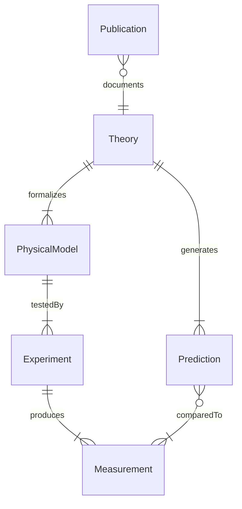
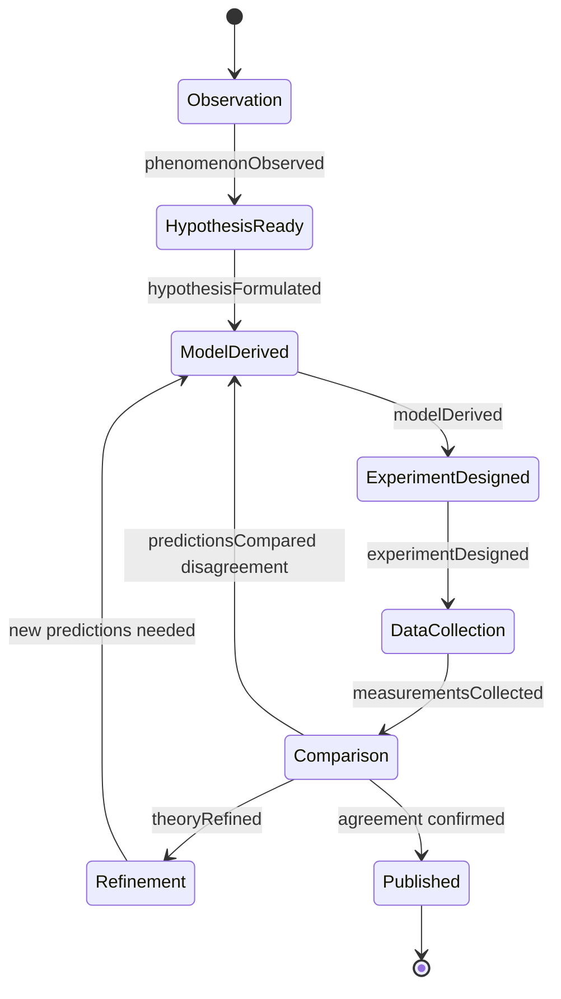
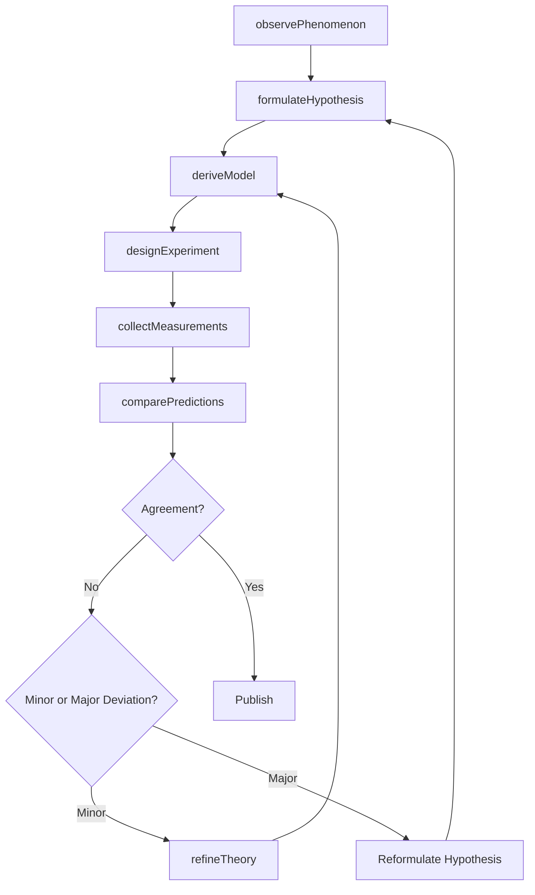
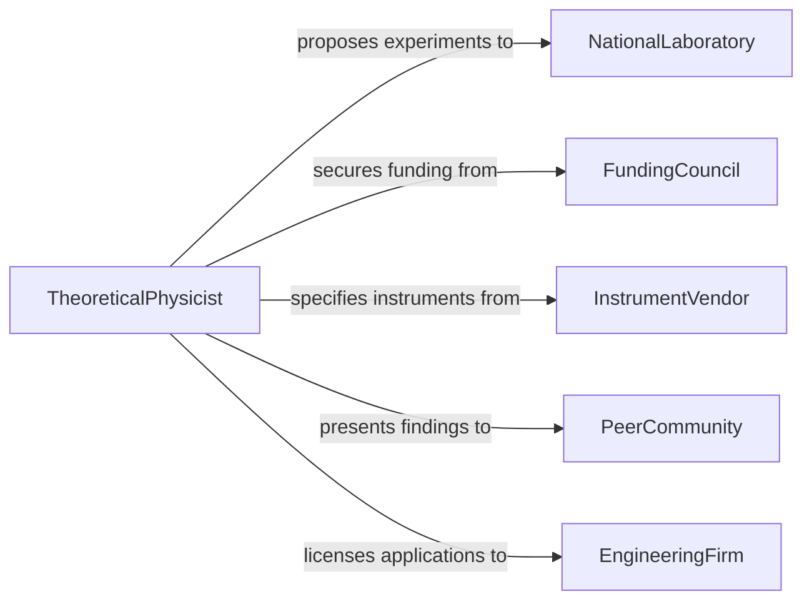

# Develop Theories Models Physical Phenomena

> Business-as-Code definition for developing theories and models of physical phenomena. Models the theoretical physics workflow from observation and hypothesis through mathematical formulation, experimental testing, and theory refinement.

## Overview

Developing theories and models of physical phenomena involves constructing mathematical frameworks that describe the behavior of matter, energy, forces, and fields. This encompasses formulating hypotheses from experimental observations, deriving predictive equations, designing experiments to test theoretical predictions, and iteratively refining models to achieve agreement with empirical data. This definition provides actions for the theoretical and experimental physics pipeline used in research laboratories, national facilities, and engineering R&D centers.

## Actors

| Actor | Description |
|-------|-------------|
| NationalLaboratory | Provides large-scale experimental facilities and measurement infrastructure |
| FundingCouncil | Awards grants and defines research priority areas in physical sciences |
| InstrumentVendor | Supplies specialized measurement and detection equipment |
| PeerCommunity | Evaluates and critiques theoretical proposals through review and conference |
| EngineeringFirm | Applies validated physical theories to product design and materials development |

## Roles

| Role | Description |
|------|-------------|
| TheoreticalPhysicist | Formulates hypotheses and derives mathematical descriptions of physical systems |
| ExperimentalPhysicist | Designs and conducts experiments to test theoretical predictions |
| ComputationalPhysicist | Implements numerical simulations of physical models |
| PostdoctoralResearcher | Contributes to data analysis, simulation, and manuscript preparation |

## Entities

| Entity | Description |
|--------|-------------|
| Theory | A formal framework of principles and equations explaining physical behavior |
| PhysicalModel | A mathematical representation of a specific physical system or process |
| Experiment | A controlled procedure designed to measure physical quantities and test predictions |
| Measurement | A recorded observation of a physical quantity with associated uncertainty |
| Prediction | A quantitative forecast derived from a theoretical model |
| Publication | A peer-reviewed paper presenting the theory, data, and conclusions |

## Actions

| Action | Description |
|--------|-------------|
| observePhenomenon | Record and characterize an unexplained or poorly understood physical observation |
| formulateHypothesis | Propose a testable explanation for the observed phenomenon |
| deriveModel | Construct the mathematical equations governing the hypothesized system |
| designExperiment | Specify apparatus, measurements, and controls to test model predictions |
| collectMeasurements | Acquire experimental data under controlled conditions |
| comparePredictions | Evaluate agreement between model predictions and experimental results |
| refineTheory | Modify the theoretical framework based on experimental discrepancies |

## Events

| Event | Description |
|-------|-------------|
| phenomenonObserved | A physical phenomenon has been recorded and characterized |
| hypothesisFormulated | A testable explanation has been proposed |
| modelDerived | Mathematical equations for the model have been established |
| experimentDesigned | An experimental protocol has been specified |
| measurementsCollected | Experimental data have been acquired |
| predictionsCompared | Model predictions have been evaluated against measurements |
| theoryRefined | The theoretical framework has been updated based on new evidence |

## Searches

| Search | Description |
|--------|-------------|
| findTheories | List theories by physical domain, author, or validation status |
| getExperiments | Retrieve experiments by facility, measurement type, or date range |
| getMeasurements | Find measurement data by physical quantity, experiment, or uncertainty range |
| getPredictions | Retrieve model predictions by theory, parameter set, or comparison outcome |

## Entity Relationships



## State Diagram



## Workflow



## Actor Relationships



## Usage

### Calling Actions

```typescript
import { developTheoriesModelsPhysicalPhenomena } from '@headlessly/develop-theories-models-physical-phenomena'

const physics = developTheoriesModelsPhysicalPhenomena()

// Observe and characterize an anomalous signal
const observation = await physics.observePhenomenon({
  domain: 'condensed-matter',
  description: 'Anomalous resistivity drop in layered perovskite at 180K',
  facility: 'argonne-national-lab',
  measurements: ['resistivity', 'magnetic-susceptibility', 'specific-heat']
})

// Derive a theoretical model
const model = await physics.deriveModel({
  hypothesisId: observation.hypothesisId,
  framework: 'BCS-extended',
  governingEquations: ['gap-equation', 'eliashberg-equations'],
  freeParameters: ['coupling-constant', 'phonon-frequency']
})

// Compare predictions with measurements
await physics.comparePredictions({
  modelId: model.id,
  experimentId: 'perovskite-transport-2025',
  metric: 'chi-squared'
})
```

### Event-Driven Automation

```typescript
// Auto-design follow-up experiments when predictions disagree
physics.predictionsCompared(async ({ modelId, chiSquared, pValue }) => {
  if (pValue < 0.05) {
    await physics.refineTheory({
      modelId,
      reason: `Chi-squared=${chiSquared.toFixed(2)}, p=${pValue.toFixed(4)} - significant deviation`
    })
  }
})

// Notify collaborators when new theory is derived
physics.modelDerived(async ({ modelId, domain, framework }) => {
  await notify({
    to: 'physics-collaboration',
    message: `New ${framework} model ${modelId} derived for ${domain} - ready for experimental design`
  })
})
```
