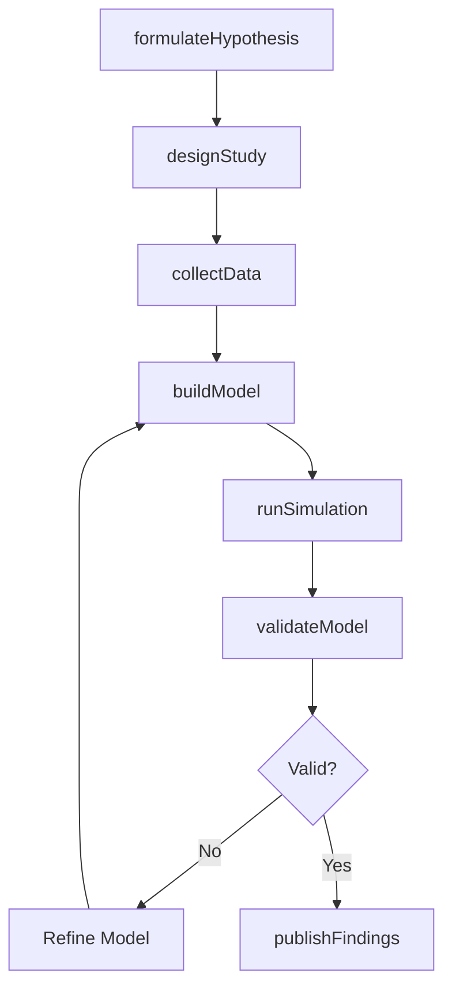
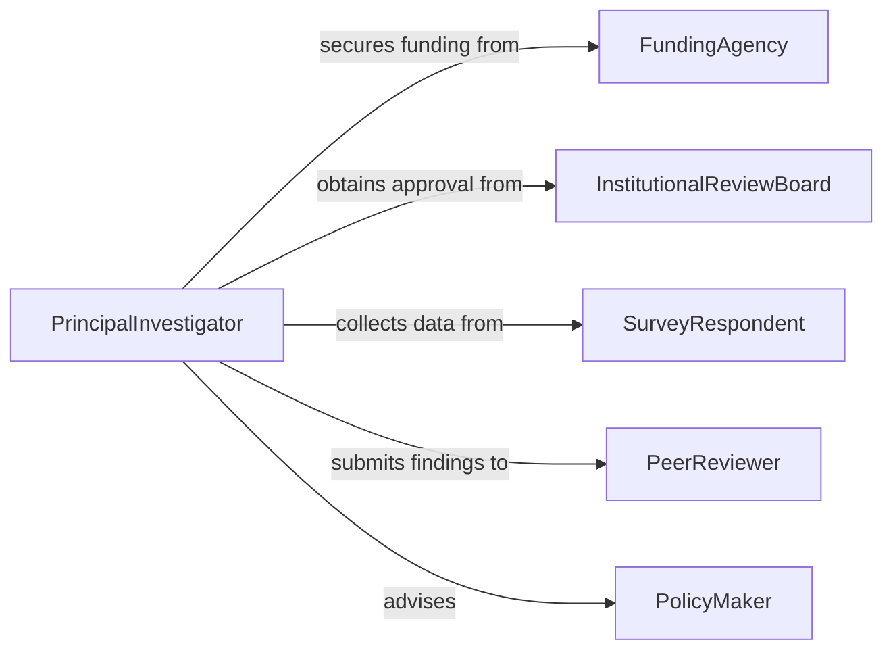

# Develop Theories Models Social Phenomena

> Business-as-Code definition for developing theories and models of social phenomena. Models the research lifecycle from hypothesis formulation through data analysis, model construction, and peer validation.

## Overview

Developing theories and models of social phenomena involves formulating hypotheses about human behavior, social structures, cultural dynamics, and institutional processes, then constructing formal or computational models to explain and predict these patterns. This encompasses literature review, survey and observational data collection, statistical modeling, agent-based simulation, and peer review. This definition provides actions for the social science research pipeline used in academia, policy analysis, and market research.

## Actors

| Actor | Description |
|-------|-------------|
| FundingAgency | Provides grants and defines research priorities for social science studies |
| InstitutionalReviewBoard | Reviews research protocols for ethical compliance with human subjects |
| SurveyRespondent | Participates in data collection through surveys, interviews, or observation |
| PeerReviewer | Evaluates the validity and rigor of proposed theories and models |
| PolicyMaker | Consumes social models to inform public policy decisions |

## Roles

| Role | Description |
|------|-------------|
| PrincipalInvestigator | Leads the research program and formulates theoretical frameworks |
| SocialScientist | Designs studies, analyzes data, and constructs social models |
| Statistician | Applies quantitative methods and validates model fit |
| ResearchAssistant | Collects data, manages datasets, and supports analysis tasks |

## Entities

| Entity | Description |
|--------|-------------|
| Theory | A formal explanatory framework describing causal relationships in social phenomena |
| SocialModel | A computational or mathematical representation of a social system |
| Hypothesis | A testable proposition derived from a theoretical framework |
| Dataset | A structured collection of survey, observational, or administrative data |
| Variable | A measured attribute such as income, education level, or social trust |
| Simulation | An agent-based or system dynamics run that tests model behavior |

## Actions

| Action | Description |
|--------|-------------|
| formulateHypothesis | Define a testable proposition about a social phenomenon |
| designStudy | Specify the research methodology, sampling strategy, and data sources |
| collectData | Gather survey responses, interview transcripts, or observational records |
| buildModel | Construct a mathematical or computational model of the social system |
| runSimulation | Execute agent-based or statistical simulations to test model predictions |
| validateModel | Assess model fit using holdout data, cross-validation, or replication |
| publishFindings | Submit the theory and model results for peer review and publication |

## Events

| Event | Description |
|-------|-------------|
| hypothesisFormulated | A new hypothesis has been formally defined |
| studyDesigned | A research methodology and sampling plan have been established |
| dataCollected | Data collection for the study has been completed |
| modelBuilt | A formal social model has been constructed |
| simulationCompleted | A simulation run has finished with results |
| modelValidated | The model has passed validation against empirical data |
| findingsPublished | The theory and results have been submitted for peer review |

## Searches

| Search | Description |
|--------|-------------|
| findTheories | List theories by domain, author, or publication date |
| getDatasets | Retrieve datasets by social phenomenon, sample size, or collection method |
| getSimulationResults | Find simulation outputs by model, parameter set, or outcome variable |
| getValidationMetrics | Retrieve model fit statistics and validation outcomes |

## Workflow



## Actor Relationships



## Usage

### Calling Actions

```typescript
import { developTheoriesModelsSocialPhenomena } from '@headlessly/develop-theories-models-social-phenomena'

const research = developTheoriesModelsSocialPhenomena()

// Formulate a hypothesis about social trust
const hypothesis = await research.formulateHypothesis({
  domain: 'social-trust',
  statement: 'Community engagement increases generalized social trust in urban populations',
  variables: ['community-engagement-hours', 'generalized-trust-score', 'urban-density']
})

// Build an agent-based model
const model = await research.buildModel({
  hypothesisId: hypothesis.id,
  type: 'agent-based',
  agents: 10000,
  parameters: {
    engagementRate: 0.15,
    networkDensity: 0.08,
    trustDecay: 0.02
  }
})

// Run and validate simulations
const simulation = await research.runSimulation({ modelId: model.id, iterations: 500 })
await research.validateModel({ modelId: model.id, datasetId: 'gss-2024-trust-panel' })
```

### Event-Driven Automation

```typescript
// Notify team when simulation completes
research.simulationCompleted(async ({ modelId, iterations, convergenceMetric }) => {
  await notify({
    to: 'research-team',
    message: `Simulation for model ${modelId} completed ${iterations} iterations with convergence at ${convergenceMetric}`
  })
})

// Auto-trigger validation after model construction
research.modelBuilt(async ({ modelId, datasetId }) => {
  await research.runSimulation({ modelId, iterations: 1000 })
})
```
