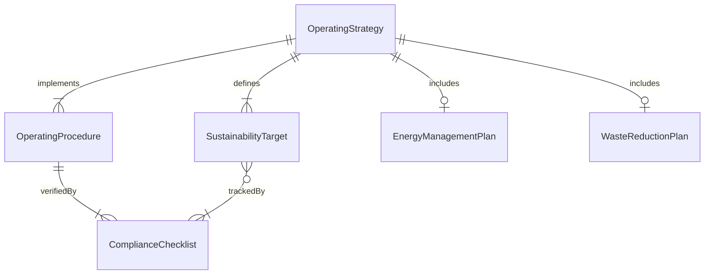
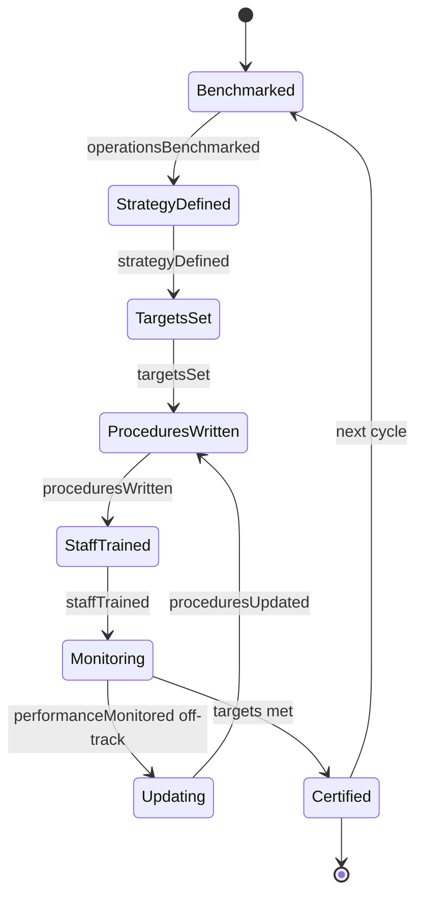
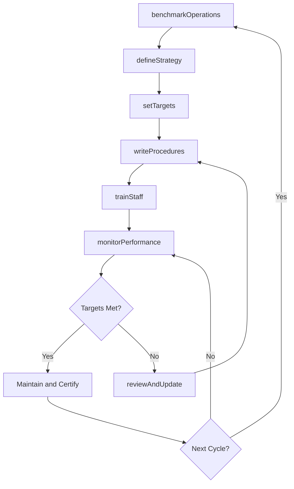
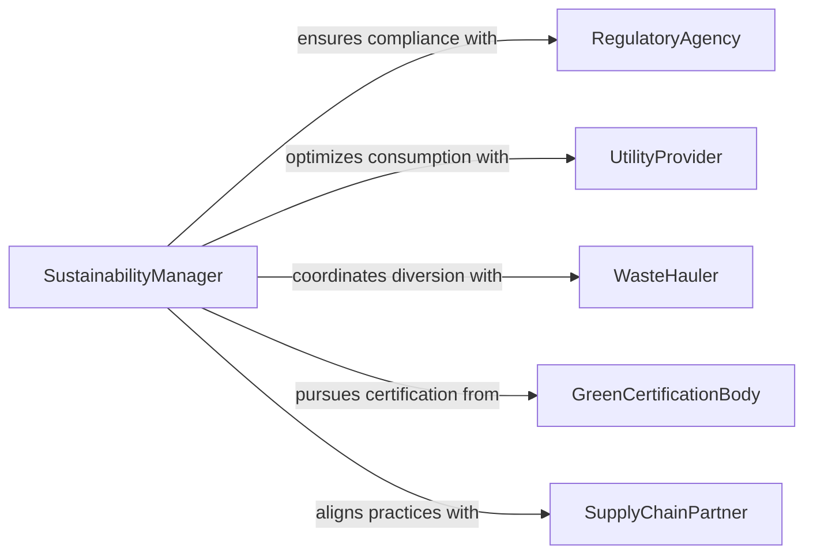

# Develop Operating Strategies Plans Procedures

> Business-as-Code definition for developing operating strategies, plans, and procedures that drive green or sustainable organizational operations.

## Overview

Developing operating strategies, plans, and procedures for green or sustainable operations involves translating high-level sustainability commitments into actionable operational frameworks. This includes creating energy management plans, waste reduction procedures, sustainable procurement workflows, and green building operations protocols. The resulting documents provide step-by-step guidance for operational staff, define performance targets, and establish accountability mechanisms for continuous environmental improvement.

## Actors

| Actor | Description |
|-------|-------------|
| RegulatoryAgency | Establishes environmental compliance standards for operations |
| UtilityProvider | Supplies energy and water with consumption data for optimization |
| WasteHauler | Manages waste streams including recycling and composting services |
| GreenCertificationBody | Awards certifications such as LEED, ENERGY STAR, or ISO 14001 |
| SupplyChainPartner | Implements sustainable procurement and delivery practices |

## Roles

| Role | Description |
|------|-------------|
| SustainabilityManager | Develops and oversees green operating strategies and procedures |
| FacilitiesDirector | Implements sustainable operations across physical locations |
| ProcurementLead | Integrates sustainability criteria into purchasing decisions |
| OperationsAnalyst | Tracks operational sustainability metrics and identifies improvements |

## Entities

| Entity | Description |
|--------|-------------|
| OperatingStrategy | A high-level plan defining the approach to sustainable operations |
| OperatingProcedure | A step-by-step guide for performing an operation sustainably |
| EnergyManagementPlan | A structured approach to reducing energy consumption |
| WasteReductionPlan | A framework for minimizing waste generation and maximizing diversion |
| SustainabilityTarget | A quantified operational goal for environmental performance |
| ComplianceChecklist | A verification tool for ensuring adherence to green procedures |

## Actions

| Action | Description |
|--------|-------------|
| benchmarkOperations | Compare current operational performance against industry green standards |
| defineStrategy | Create the overarching sustainable operations strategy |
| writeProcedures | Document step-by-step green operating procedures |
| setTargets | Establish quantified sustainability performance goals |
| trainStaff | Educate operational teams on green procedures and expectations |
| monitorPerformance | Track operational sustainability metrics against targets |
| reviewAndUpdate | Periodically revise strategies and procedures based on performance data |

## Events

| Event | Description |
|-------|-------------|
| operationsBenchmarked | Current performance has been compared against green standards |
| strategyDefined | The sustainable operations strategy has been created |
| proceduresWritten | Step-by-step green operating procedures have been documented |
| targetsSet | Quantified sustainability goals have been established |
| staffTrained | Operational teams have completed green procedures training |
| performanceMonitored | Sustainability metrics have been tracked and reported |
| proceduresUpdated | Operating procedures have been revised based on new data |

## Searches

| Search | Description |
|--------|-------------|
| findProceduresByFacility | Retrieve green operating procedures for a specific location |
| getTargetProgress | View progress toward sustainability targets over time |
| getBenchmarkComparisons | Compare operational metrics against industry averages |
| findTrainingRecords | List staff training completion status for green procedures |

## Entity Relationships



## State Diagram



## Workflow



## Actor Relationships



## Usage

### Calling Actions

```typescript
import { developOperatingStrategiesPlansProcedures } from '@headlessly/develop-operating-strategies-plans-procedures'

const operations = developOperatingStrategiesPlansProcedures()

// Benchmark current operations
const benchmark = await operations.benchmarkOperations({
  facilityId: 'hq-seattle',
  metrics: ['energyIntensity', 'waterIntensity', 'wasteDiversionRate'],
  compareAgainst: ['industryAverage', 'ENERGYSTAR-topQuartile']
})

// Define strategy and set targets
const strategy = await operations.defineStrategy({
  facilityId: 'hq-seattle',
  pillars: ['energyEfficiency', 'wasteReduction', 'sustainableProcurement'],
  certificationGoal: 'LEED-Gold-Operations'
})

await operations.setTargets({
  strategyId: strategy.id,
  targets: [
    { metric: 'energyIntensity', reduction: 0.25, baselineYear: 2025, targetYear: 2028 },
    { metric: 'wasteDiversionRate', target: 0.90, targetYear: 2028 },
    { metric: 'sustainableProcurementSpend', target: 0.60, targetYear: 2027 }
  ]
})

// Write and deploy procedures
await operations.writeProcedures({
  strategyId: strategy.id,
  procedures: [
    { name: 'HVAC Scheduling Optimization', department: 'facilities', frequency: 'seasonal' },
    { name: 'Zero-Waste Event Protocol', department: 'events', frequency: 'perEvent' }
  ]
})
```

### Event-Driven Automation

```typescript
// Schedule training when new procedures are published
operations.proceduresWritten(async ({ strategyId, procedures }) => {
  for (const proc of procedures) {
    await scheduleTraining({
      department: proc.department,
      procedure: proc.name,
      deadline: addWeeks(new Date(), 4)
    })
  }
})

// Alert when performance falls below target
operations.performanceMonitored(async ({ facilityId, metrics }) => {
  const offTrack = metrics.filter(m => m.actual > m.target * 1.1)
  if (offTrack.length > 0) {
    await escalate({
      to: 'sustainability-manager',
      subject: `${facilityId}: ${offTrack.length} metrics off track`,
      details: offTrack
    })
  }
})
```
