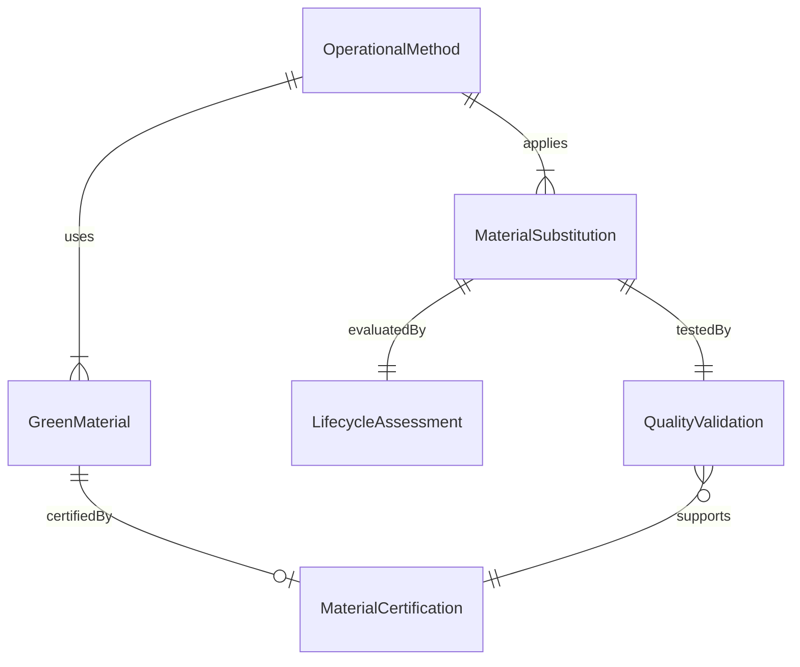
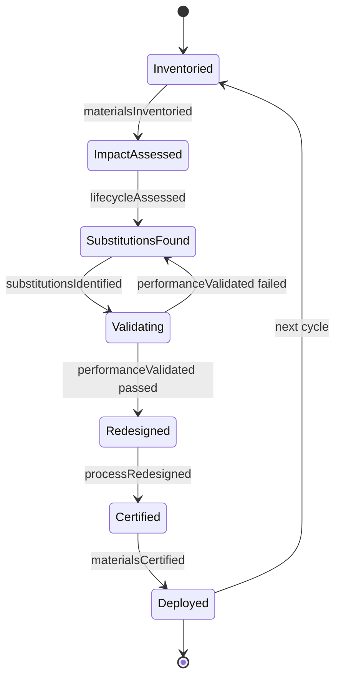
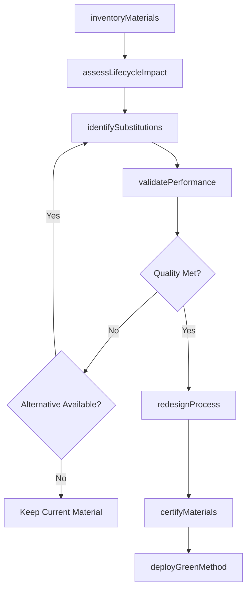
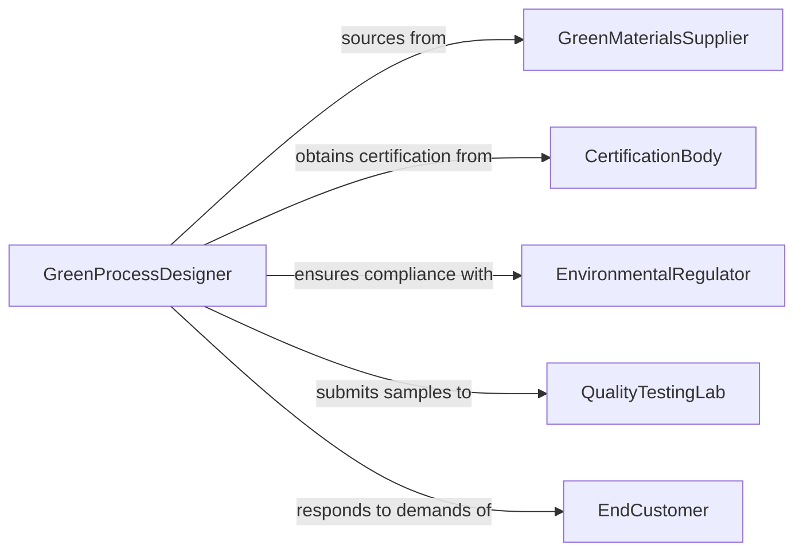

# Develop Operational Methods Processes Use

> Business-as-Code definition for developing operational methods and processes that prioritize green materials, sustainable inputs, and environmentally responsible techniques.

## Overview

Developing operational methods or processes that use green materials or emphasize sustainability involves redesigning workflows to incorporate recycled content, bio-based materials, non-toxic chemicals, and low-impact production techniques. Practitioners evaluate material lifecycles, identify substitutions that reduce environmental harm, and validate that new methods meet quality and performance requirements. This work applies across manufacturing, construction, facilities management, and service delivery operations.

## Actors

| Actor | Description |
|-------|-------------|
| GreenMaterialsSupplier | Provides certified sustainable, recycled, or bio-based materials |
| CertificationBody | Validates material and process environmental claims (e.g., Cradle to Cradle, FSC) |
| EnvironmentalRegulator | Enforces hazardous materials restrictions and waste disposal standards |
| QualityTestingLab | Verifies that green materials meet performance specifications |
| EndCustomer | Demands sustainably produced products and transparent sourcing |

## Roles

| Role | Description |
|------|-------------|
| GreenProcessDesigner | Engineers operational methods using sustainable materials and techniques |
| MaterialsScientist | Evaluates green material properties and identifies suitable substitutions |
| QualityManager | Ensures green methods meet product and service quality standards |
| SupplyChainCoordinator | Sources and manages the procurement of green materials |

## Entities

| Entity | Description |
|--------|-------------|
| OperationalMethod | A defined process or procedure incorporating green materials |
| GreenMaterial | A certified sustainable, recycled, or bio-based input material |
| MaterialSubstitution | A replacement of a conventional material with a green alternative |
| LifecycleAssessment | Cradle-to-grave environmental impact analysis of a material or process |
| QualityValidation | Testing results confirming green methods meet performance standards |
| MaterialCertification | Third-party verification of a material's environmental attributes |

## Actions

| Action | Description |
|--------|-------------|
| inventoryMaterials | Catalog all materials currently used in operations |
| assessLifecycleImpact | Evaluate the environmental footprint of current materials and processes |
| identifySubstitutions | Find green material alternatives for conventional inputs |
| validatePerformance | Test green materials to confirm they meet quality requirements |
| redesignProcess | Modify operational methods to incorporate green materials |
| certifyMaterials | Obtain third-party certification for green material claims |
| deployGreenMethod | Implement the redesigned process using sustainable materials |

## Events

| Event | Description |
|-------|-------------|
| materialsInventoried | Current operational materials have been cataloged |
| lifecycleAssessed | Environmental impact of materials has been evaluated |
| substitutionsIdentified | Green material alternatives have been found |
| performanceValidated | Green materials have passed quality testing |
| processRedesigned | Operational methods have been modified for sustainability |
| materialsCertified | Third-party environmental certifications have been obtained |
| greenMethodDeployed | The sustainable operational method is in production use |

## Searches

| Search | Description |
|--------|-------------|
| findGreenAlternatives | Browse certified green materials for a given material category |
| getLifecycleData | Retrieve environmental impact data for a specific material |
| getCertificationStatus | Check certification validity for green materials in use |
| findMethodsByMaterial | List operational methods using a specific green material |

## Entity Relationships



## State Diagram



## Workflow



## Actor Relationships



## Usage

### Calling Actions

```typescript
import { developOperationalMethodsProcessesUse } from '@headlessly/develop-operational-methods-processes-use'

const methods = developOperationalMethodsProcessesUse()

// Inventory current materials
const inventory = await methods.inventoryMaterials({
  facilityId: 'mfg-portland-02',
  categories: ['solvents', 'coatings', 'packaging', 'adhesives']
})

// Identify green substitutions
const substitutions = await methods.identifySubstitutions({
  materials: inventory.items.filter(m => m.toxicityRating === 'high'),
  criteria: ['cradleToCradleCertified', 'recycledContent50Plus', 'bioBasedOrigin']
})

// Validate and deploy
const validation = await methods.validatePerformance({
  substitutions: substitutions.recommended,
  tests: ['adhesionStrength', 'durability', 'shelfLife'],
  minimumScore: 0.95
})

if (validation.allPassed) {
  await methods.redesignProcess({
    facilityId: 'mfg-portland-02',
    substitutions: validation.approved,
    effectiveDate: '2026-07-01'
  })
}
```

### Event-Driven Automation

```typescript
// Alert procurement when new green materials are certified
methods.materialsCertified(async ({ materials, certifications }) => {
  await notify({
    to: 'supply-chain-coordinator',
    message: `${materials.length} materials certified: ${certifications.join(', ')}. Update procurement catalog.`
  })
})

// Track deployment across facilities
methods.greenMethodDeployed(async ({ facilityId, processId, materials }) => {
  await updateDashboard({
    metric: 'greenMaterialAdoption',
    facilityId,
    materialsCount: materials.length,
    date: new Date()
  })
})
```
