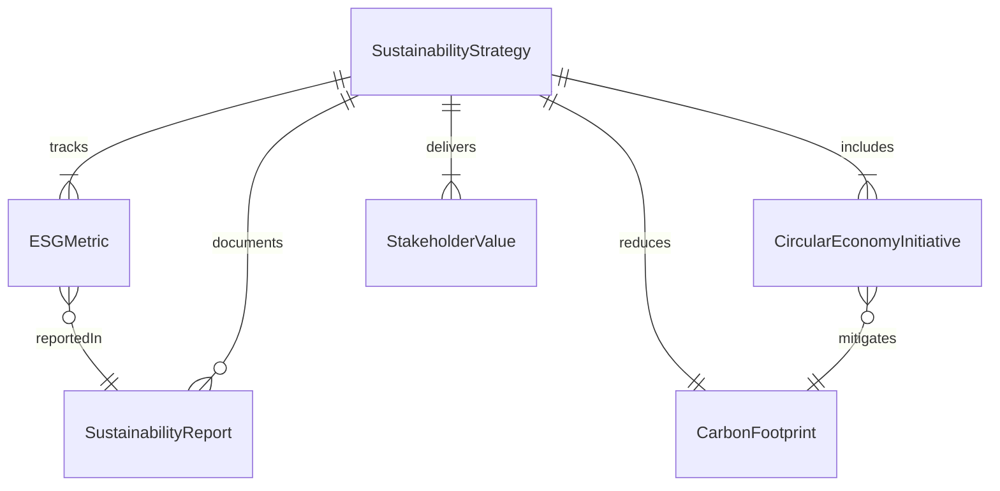
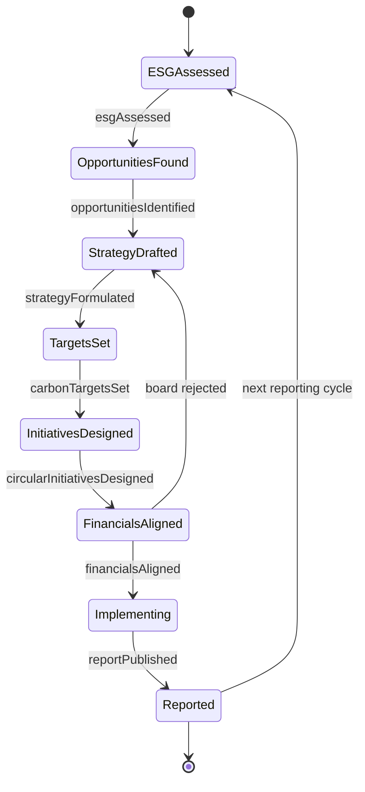
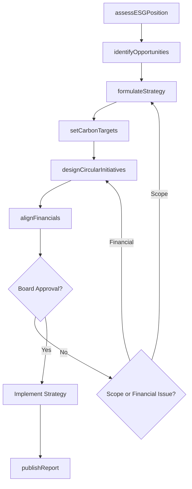
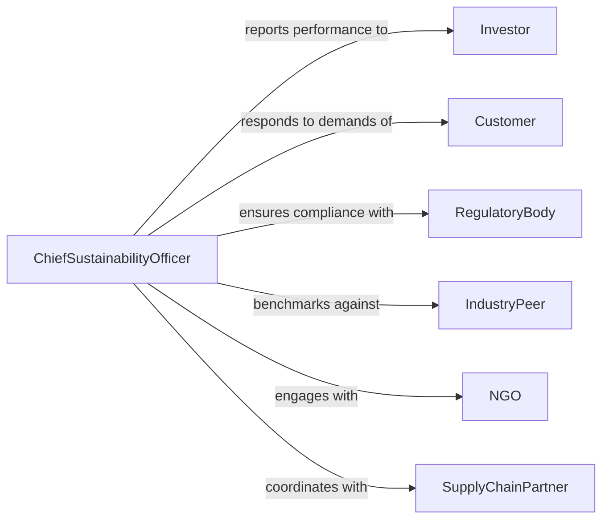

# Develop Sustainable Business Strategies Practices

> Business-as-Code definition for developing business strategies and practices that balance profitability with environmental stewardship and social responsibility.

## Overview

Developing sustainable business strategies involves integrating environmental and social considerations into core business planning, market positioning, and value creation models. This includes identifying opportunities for circular economy practices, carbon reduction initiatives, sustainable product development, and stakeholder value creation that extends beyond shareholder returns. The process aligns long-term business viability with measurable sustainability commitments.

## Actors

| Actor | Description |
|-------|-------------|
| Investor | Evaluates sustainability performance as part of investment criteria |
| Customer | Demands sustainable products and transparent business practices |
| RegulatoryBody | Sets environmental and social compliance requirements |
| IndustryPeer | Provides competitive benchmarking and collaborative opportunities |
| NGO | Advocates for social and environmental standards |
| SupplyChainPartner | Participates in sustainable sourcing and production practices |

## Roles

| Role | Description |
|------|-------------|
| ChiefSustainabilityOfficer | Leads sustainable strategy development and executive alignment |
| StrategyAnalyst | Researches market trends, regulations, and sustainability opportunities |
| ProductManager | Integrates sustainability criteria into product development |
| FinancialPlanner | Models the economic impact of sustainability initiatives |

## Entities

| Entity | Description |
|--------|-------------|
| SustainabilityStrategy | A comprehensive plan aligning business goals with sustainability targets |
| ESGMetric | Environmental, social, or governance performance indicator |
| CircularEconomyInitiative | A project designed to reduce waste through reuse and recycling |
| CarbonFootprint | Measured greenhouse gas emissions from business operations |
| StakeholderValue | Quantified benefit delivered to a specific stakeholder group |
| SustainabilityReport | Periodic public disclosure of sustainability performance |

## Actions

| Action | Description |
|--------|-------------|
| assessESGPosition | Evaluate current environmental, social, and governance performance |
| identifyOpportunities | Discover areas where sustainability drives competitive advantage |
| formulateStrategy | Create the overarching sustainable business strategy |
| setCarbonTargets | Define greenhouse gas emission reduction goals |
| designCircularInitiatives | Develop programs for waste elimination and resource reuse |
| alignFinancials | Model the business case and ROI for sustainability investments |
| publishReport | Issue a public sustainability performance report |

## Events

| Event | Description |
|-------|-------------|
| esgAssessed | ESG performance baseline has been established |
| opportunitiesIdentified | Sustainability-driven competitive advantages have been found |
| strategyFormulated | The sustainable business strategy has been created |
| carbonTargetsSet | Emission reduction goals have been defined |
| circularInitiativesDesigned | Waste reduction and reuse programs have been developed |
| financialsAligned | The business case for sustainability investments has been validated |
| reportPublished | The sustainability report has been issued publicly |

## Searches

| Search | Description |
|--------|-------------|
| findStrategiesByDomain | Retrieve sustainability strategies filtered by focus area |
| getESGScorecard | View current ESG metric scores and trends |
| getCarbonProgress | Track emission reduction progress against targets |
| findInitiativesByROI | List circular economy initiatives ranked by return on investment |

## Entity Relationships



## State Diagram



## Workflow



## Actor Relationships



## Usage

### Calling Actions

```typescript
import { developSustainableBusinessStrategiesPractices } from '@headlessly/develop-sustainable-business-strategies-practices'

const strategies = developSustainableBusinessStrategiesPractices()

// Assess current ESG position
const baseline = await strategies.assessESGPosition({
  frameworks: ['GRI', 'TCFD', 'CDP'],
  reportingYear: 2025,
  scopes: ['scope1', 'scope2', 'scope3']
})

// Formulate strategy with carbon targets
const strategy = await strategies.formulateStrategy({
  timeHorizon: { start: '2026-01-01', end: '2030-12-31' },
  pillars: ['carbonReduction', 'circularEconomy', 'socialEquity'],
  alignedSDGs: [7, 12, 13]
})

await strategies.setCarbonTargets({
  strategyId: strategy.id,
  targets: [
    { scope: 'scope1', reduction: 0.50, baselineYear: 2025, targetYear: 2030 },
    { scope: 'scope2', reduction: 0.75, baselineYear: 2025, targetYear: 2030 }
  ],
  scienceBasedTarget: true
})
```

### Event-Driven Automation

```typescript
// Notify investors when sustainability report is published
strategies.reportPublished(async ({ reportId, reportingYear, highlights }) => {
  await notify({
    to: 'investor-relations',
    message: `${reportingYear} Sustainability Report published with ${highlights.length} key achievements`
  })
})

// Alert leadership when ESG scores decline
strategies.esgAssessed(async ({ scores, priorScores }) => {
  const declining = Object.keys(scores).filter(k => scores[k] < priorScores[k])
  if (declining.length > 0) {
    await escalate({
      to: 'executive-team',
      subject: `ESG score decline in: ${declining.join(', ')}`
    })
  }
})
```
