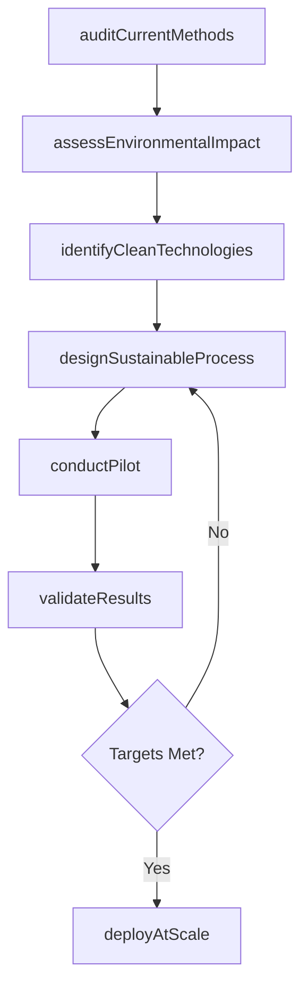
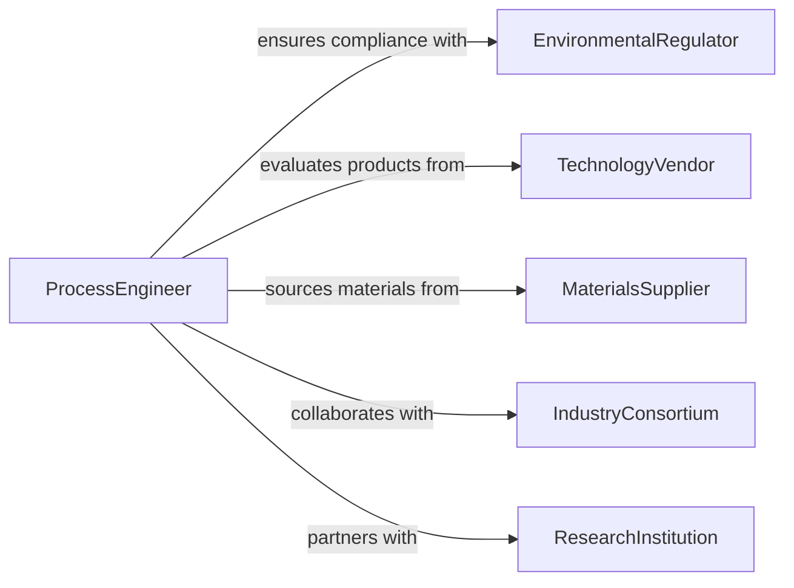

# Develop Sustainable Industrial Development Methods

> Business-as-Code definition for developing industrial production and development methods that minimize environmental impact and promote resource efficiency.

## Overview

Developing sustainable industrial or development methods involves redesigning manufacturing processes, construction techniques, and industrial operations to reduce energy consumption, minimize waste, and lower emissions. Engineers and sustainability professionals evaluate current methods, identify cleaner technologies, and implement process improvements that maintain productivity while advancing environmental performance. This work spans sectors including manufacturing, construction, energy production, and materials processing.

## Actors

| Actor | Description |
|-------|-------------|
| EnvironmentalRegulator | Enforces emissions standards and industrial environmental permits |
| TechnologyVendor | Supplies cleaner production equipment and process technologies |
| MaterialsSupplier | Provides sustainable raw materials and recycled feedstocks |
| IndustryConsortium | Collaborates on sector-wide sustainable development standards |
| CommunityGroup | Represents local populations affected by industrial operations |
| ResearchInstitution | Develops and validates new sustainable industrial technologies |

## Roles

| Role | Description |
|------|-------------|
| ProcessEngineer | Designs and optimizes sustainable industrial methods |
| SustainabilityEngineer | Evaluates environmental performance and identifies improvement areas |
| PlantManager | Oversees implementation of sustainable methods in production facilities |
| EnvironmentalCompliance Specialist | Ensures industrial methods meet regulatory requirements |

## Entities

| Entity | Description |
|--------|-------------|
| IndustrialMethod | A production or development process with defined inputs and outputs |
| EnvironmentalImpactAssessment | Quantified evaluation of a method's ecological footprint |
| ProcessImprovement | A specific change to reduce waste, energy, or emissions |
| CleanTechnology | Equipment or technique that reduces environmental impact |
| ResourceEfficiencyMetric | Measure of material or energy utilization effectiveness |
| PilotProject | A small-scale trial of a sustainable method before full rollout |

## Actions

| Action | Description |
|--------|-------------|
| auditCurrentMethods | Evaluate existing industrial processes for environmental performance |
| assessEnvironmentalImpact | Quantify emissions, waste, and resource use of current operations |
| identifyCleanTechnologies | Research and evaluate cleaner production alternatives |
| designSustainableProcess | Engineer a new or modified industrial method with reduced impact |
| conductPilot | Run a small-scale trial of the proposed sustainable method |
| validateResults | Confirm that pilot outcomes meet environmental and productivity targets |
| deployAtScale | Implement the validated sustainable method across operations |

## Events

| Event | Description |
|-------|-------------|
| methodsAudited | Existing industrial processes have been evaluated |
| impactAssessed | Environmental performance data has been quantified |
| technologiesIdentified | Cleaner production alternatives have been evaluated |
| processDesigned | A sustainable industrial method has been engineered |
| pilotConducted | A small-scale trial has been completed |
| resultsValidated | Pilot outcomes have been confirmed against targets |
| methodDeployed | The sustainable method has been implemented at scale |

## Searches

| Search | Description |
|--------|-------------|
| findMethodsByImpact | Retrieve industrial methods ranked by environmental impact reduction |
| getCleanTechOptions | Browse available clean technologies for a specific process type |
| getPilotResults | View outcomes and performance data from pilot projects |
| getComplianceStatus | Check regulatory compliance for active industrial methods |

## Workflow



## Actor Relationships



## Usage

### Calling Actions

```typescript
import { developSustainableIndustrialDevelopmentMethods } from '@headlessly/develop-sustainable-industrial-development-methods'

const methods = developSustainableIndustrialDevelopmentMethods()

// Audit current manufacturing processes
const audit = await methods.auditCurrentMethods({
  facilityId: 'plant-chicago-01',
  processes: ['thermalCuring', 'solventCleaning', 'wasteDisposal'],
  metrics: ['energyPerUnit', 'waterPerUnit', 'emissionsPerUnit']
})

// Design a sustainable alternative
const process = await methods.designSustainableProcess({
  replacesMethod: 'solventCleaning',
  newMethod: 'aqueousUltrasonicCleaning',
  expectedImprovements: {
    vocEmissions: { reduction: 0.95 },
    energyConsumption: { reduction: 0.30 },
    waterRecycleRate: 0.85
  }
})

// Run pilot and validate
const pilot = await methods.conductPilot({
  processId: process.id,
  facilityId: 'plant-chicago-01',
  duration: { weeks: 8 },
  productionVolume: 5000
})
```

### Event-Driven Automation

```typescript
// Notify plant manager when pilot results are ready
methods.resultsValidated(async ({ processId, pilot, outcomes }) => {
  await notify({
    to: 'plant-manager',
    message: `Pilot for process ${processId} complete: ${outcomes.energyReduction}% energy reduction achieved`
  })
})

// Schedule full deployment after successful validation
methods.methodDeployed(async ({ processId, facilityId }) => {
  await createTask({
    assignee: 'environmental-compliance',
    description: `Update permits and monitoring plans for new process at ${facilityId}`,
    dueDate: addWeeks(new Date(), 4)
  })
})
```
