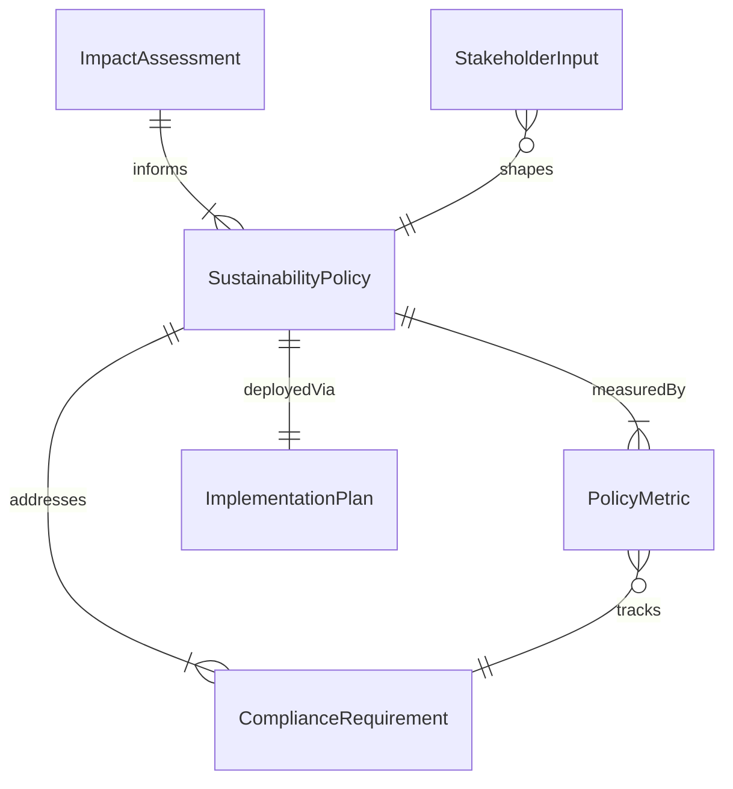
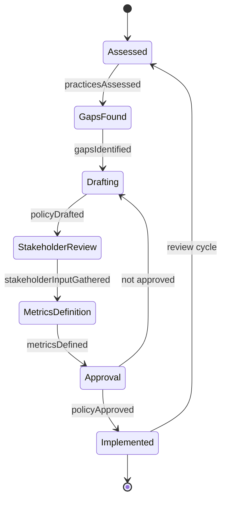
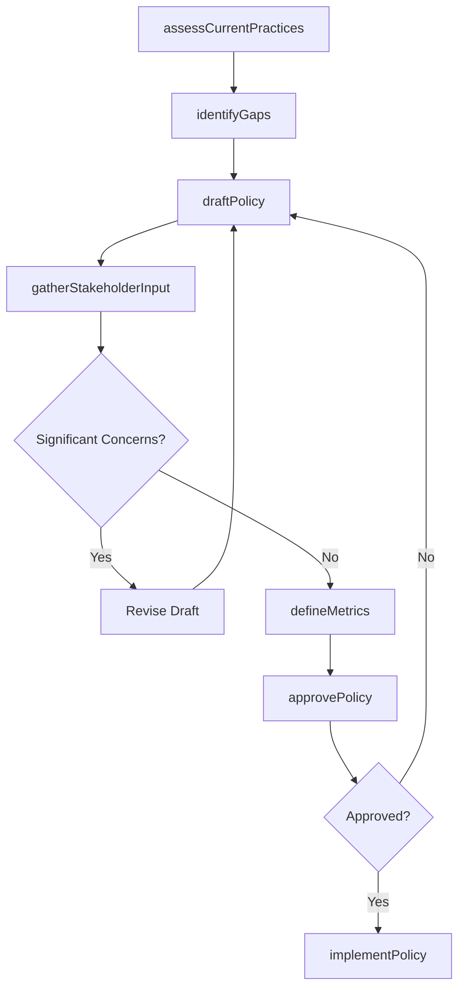
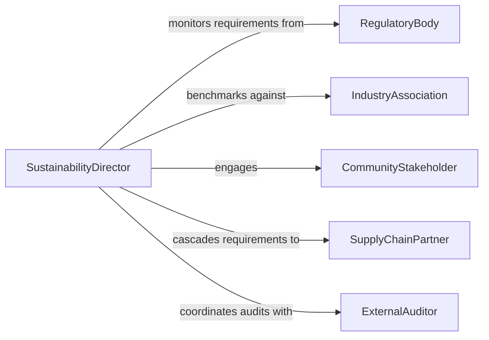

# Develop Sustainable Organizational Policies Practices

> Business-as-Code definition for developing organizational policies and practices that integrate environmental, social, and governance sustainability principles.

## Overview

Developing sustainable organizational policies and practices involves creating internal governance frameworks, operational guidelines, and behavioral standards that embed sustainability into day-to-day organizational functions. This includes establishing waste reduction mandates, energy efficiency standards, ethical sourcing requirements, and social responsibility commitments. The resulting policies guide decision-making at all levels and position the organization for long-term environmental and social stewardship.

## Actors

| Actor | Description |
|-------|-------------|
| RegulatoryBody | Enforces environmental and social compliance requirements |
| IndustryAssociation | Publishes sustainability standards and certification frameworks |
| CommunityStakeholder | Represents local interests affected by organizational operations |
| SupplyChainPartner | Implements sustainability requirements cascaded from the organization |
| ExternalAuditor | Verifies compliance with sustainability policies and standards |

## Roles

| Role | Description |
|------|-------------|
| SustainabilityDirector | Leads policy development and sustainability strategy |
| PolicyAnalyst | Researches regulations, benchmarks, and best practices |
| ComplianceOfficer | Ensures organizational adherence to sustainability policies |
| OperationsManager | Implements sustainability practices within operational workflows |

## Entities

| Entity | Description |
|--------|-------------|
| SustainabilityPolicy | A formal organizational directive on environmental or social practices |
| ComplianceRequirement | A regulatory or voluntary standard the organization must meet |
| ImpactAssessment | Evaluation of environmental or social effects of current practices |
| PolicyMetric | A measurable indicator for tracking policy effectiveness |
| StakeholderInput | Feedback from affected parties incorporated into policy design |
| ImplementationPlan | The schedule and resources for rolling out a new policy |

## Actions

| Action | Description |
|--------|-------------|
| assessCurrentPractices | Evaluate existing organizational operations against sustainability benchmarks |
| identifyGaps | Determine areas where policies fall short of standards or regulations |
| draftPolicy | Create a new sustainability policy document |
| gatherStakeholderInput | Collect feedback from internal and external stakeholders |
| defineMetrics | Establish measurable indicators for policy success |
| approvePolicy | Submit the policy through governance channels for formal adoption |
| implementPolicy | Roll out the approved policy with training and process changes |

## Events

| Event | Description |
|-------|-------------|
| practicesAssessed | Current operations have been evaluated against sustainability benchmarks |
| gapsIdentified | Shortfalls between current practices and standards have been documented |
| policyDrafted | A new sustainability policy document has been created |
| stakeholderInputGathered | Feedback from affected parties has been collected |
| metricsDefined | Measurable success indicators have been established |
| policyApproved | The policy has received formal organizational adoption |
| policyImplemented | The policy has been rolled out across the organization |

## Searches

| Search | Description |
|--------|-------------|
| findPoliciesByDomain | Retrieve sustainability policies filtered by area (energy, waste, social) |
| getComplianceStatus | Check organizational compliance status for active policies |
| getMetricsTrends | View policy metric performance over time |
| findPendingPolicies | List policies in draft or approval stages |

## Entity Relationships



## State Diagram



## Workflow



## Actor Relationships



## Usage

### Calling Actions

```typescript
import { developSustainableOrganizationalPoliciesPractices } from '@headlessly/develop-sustainable-organizational-policies-practices'

const policies = developSustainableOrganizationalPoliciesPractices()

// Assess current practices against benchmarks
const assessment = await policies.assessCurrentPractices({
  domains: ['energyEfficiency', 'wasteManagement', 'ethicalSourcing'],
  frameworks: ['GRI', 'ISO14001', 'SASB']
})

// Draft a new waste reduction policy
const policy = await policies.draftPolicy({
  title: 'Zero Waste to Landfill Policy',
  domain: 'wasteManagement',
  objectives: [
    'Achieve 95% waste diversion from landfill by 2028',
    'Eliminate single-use plastics in all facilities by 2027',
    'Implement composting in all cafeteria operations'
  ],
  applicability: ['allFacilities']
})

// Define success metrics
await policies.defineMetrics({
  policyId: policy.id,
  metrics: [
    { name: 'wasteDiversionRate', target: 0.95, unit: 'percentage', frequency: 'quarterly' },
    { name: 'landfillTonnage', target: 50, unit: 'metricTons', frequency: 'annually' }
  ]
})
```

### Event-Driven Automation

```typescript
// Notify compliance team when policy is approved
policies.policyApproved(async ({ policyId, title, effectiveDate }) => {
  await notify({
    to: 'compliance-team',
    message: `Policy "${title}" approved - effective ${effectiveDate}. Begin implementation planning.`
  })
})

// Alert leadership when compliance gaps are found
policies.gapsIdentified(async ({ domain, gaps }) => {
  if (gaps.some(g => g.severity === 'critical')) {
    await escalate({
      to: 'executive-leadership',
      subject: `Critical sustainability gap in ${domain}`,
      gaps: gaps.filter(g => g.severity === 'critical')
    })
  }
})
```
