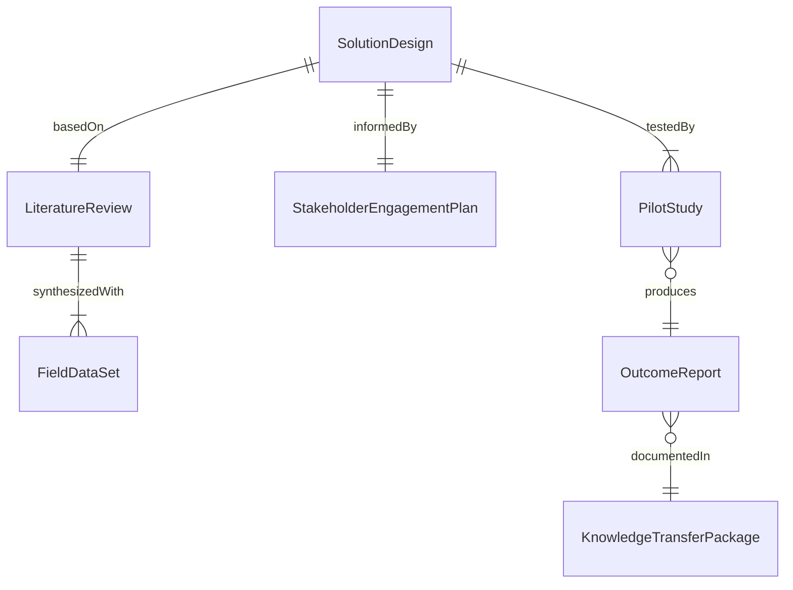
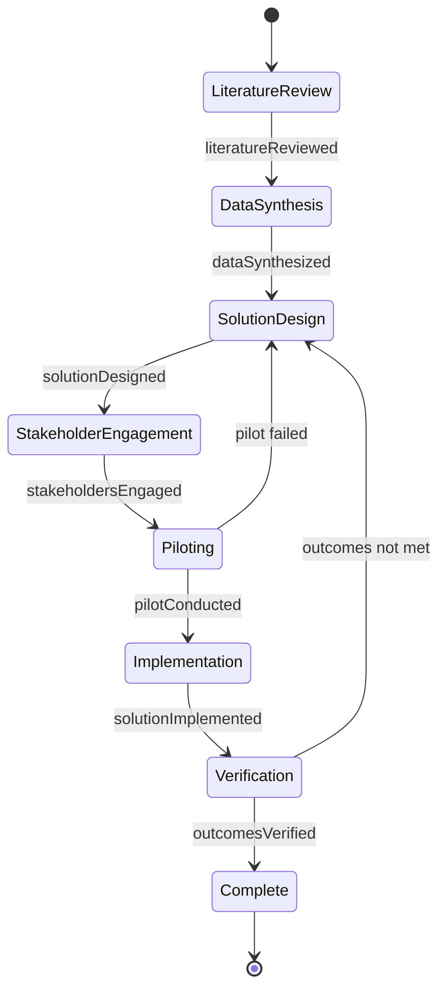
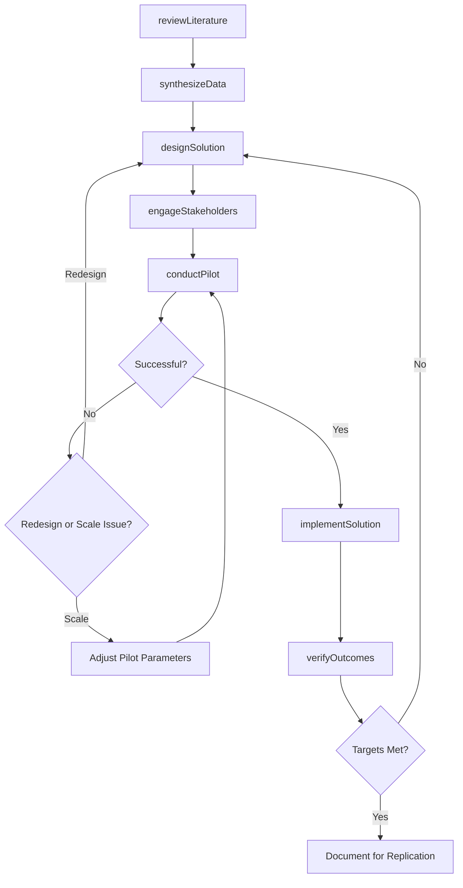
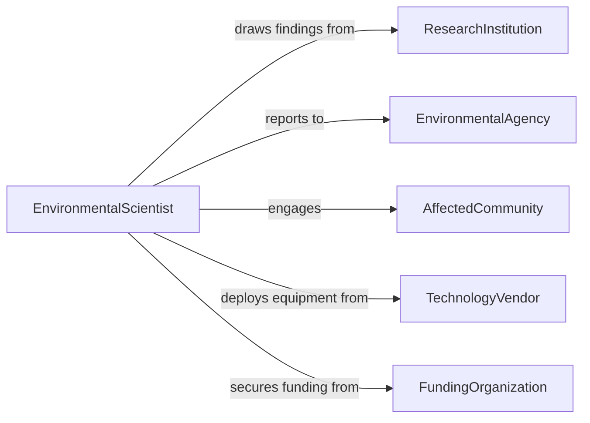

# Apply Knowledge or Research Findings to Address Environmental Problems

> Business-as-Code definition for translating scientific research, field data, and expert knowledge into practical solutions that address environmental contamination, ecosystem degradation, and resource depletion.

## Overview

Applying environmental research involves synthesizing peer-reviewed findings, field monitoring data, and regulatory science into actionable remediation strategies, management plans, and technology deployments. This definition models the process from literature review and data synthesis through solution design, stakeholder engagement, pilot implementation, and outcome verification.

## Actors

| Actor | Description |
|-------|-------------|
| ResearchInstitution | University or lab generating environmental science findings |
| EnvironmentalAgency | Regulatory body overseeing environmental protection |
| AffectedCommunity | Population impacted by the environmental problem |
| TechnologyVendor | Provider of remediation or monitoring equipment |
| FundingOrganization | Grant maker or investor supporting environmental projects |

## Roles

| Role | Description |
|------|-------------|
| EnvironmentalScientist | Translates research into practical solutions |
| DataAnalyst | Synthesizes monitoring and research data |
| ProjectManager | Coordinates solution implementation |
| CommunityLiaison | Engages affected populations in the solution process |

## Entities

| Entity | Description |
|--------|-------------|
| LiteratureReview | Synthesis of peer-reviewed research on the problem |
| FieldDataSet | Environmental monitoring measurements from the site |
| SolutionDesign | Engineered approach to address the environmental issue |
| StakeholderEngagementPlan | Strategy for involving affected communities |
| PilotStudy | Small-scale trial of the proposed solution |
| OutcomeReport | Measured results of the implemented solution |
| KnowledgeTransferPackage | Documentation enabling replication at other sites |

## Actions

| Action | Description |
|--------|-------------|
| reviewLiterature | Survey peer-reviewed research relevant to the problem |
| synthesizeData | Combine field measurements with published findings |
| designSolution | Engineer a practical approach based on evidence |
| engageStakeholders | Involve communities and regulators in solution planning |
| conductPilot | Trial the solution at a limited scale |
| implementSolution | Deploy the approach at full scale |
| verifyOutcomes | Measure environmental improvement against targets |

## Events

| Event | Description |
|-------|-------------|
| literatureReviewed | Research synthesis is complete |
| dataSynthesized | Field and published data have been combined |
| solutionDesigned | Evidence-based approach has been engineered |
| stakeholdersEngaged | Communities and regulators have provided input |
| pilotConducted | Limited-scale trial is complete |
| solutionImplemented | Full-scale deployment is active |
| outcomesVerified | Environmental improvement has been measured |

## Searches

| Search | Description |
|--------|-------------|
| findResearch | Search literature by environmental topic or contaminant |
| getFieldData | Retrieve monitoring measurements for a site |
| listPilotStudies | Enumerate trial results by solution type |
| getOutcomeReports | Look up measured environmental improvements |

## Entity Relationships



## State Diagram



## Workflow



## Actor Relationships



## Usage

### Calling Actions

```typescript
import { applyKnowledgeResearchFindingsAddress } from '@headlessly/apply-knowledge-research-findings-address'

const envResearch = applyKnowledgeResearchFindingsAddress()

// Review literature
const review = await envResearch.reviewLiterature({
  topic: 'PFAS-contamination-groundwater',
  databases: ['PubMed', 'Web-of-Science', 'EPA-IRIS'],
  dateRange: { start: '2020-01-01', end: '2026-01-01' },
  keywords: ['PFAS', 'remediation', 'activated-carbon', 'ion-exchange']
})

// Design solution
const solution = await envResearch.designSolution({
  reviewId: review.id,
  approach: 'granular-activated-carbon-treatment',
  siteConditions: {
    contaminant: 'PFOS-PFOA',
    concentration: { value: 120, unit: 'ppt' },
    flowRate: { value: 500, unit: 'gpm' }
  },
  targetLevel: { value: 4, unit: 'ppt' }
})

// Conduct pilot
await envResearch.conductPilot({
  solutionId: solution.id,
  duration: { weeks: 12 },
  scale: '10%-of-full-flow',
  monitoringFrequency: 'weekly'
})
```

### Event-Driven Automation

```typescript
// Notify community when outcomes are verified
envResearch.outcomesVerified(async ({ siteId, contaminant, reductionPercent }) => {
  await notify({
    to: 'community-liaison',
    message: `${contaminant} reduced by ${reductionPercent}% at site ${siteId} - treatment goals achieved`
  })
})

// Auto-implement after successful pilot
envResearch.pilotConducted(async ({ solutionId, successful }) => {
  if (successful) {
    await envResearch.implementSolution({ solutionId })
  }
})
```
