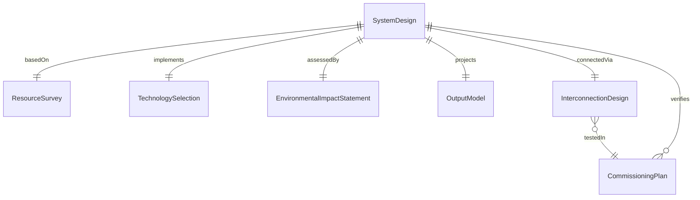
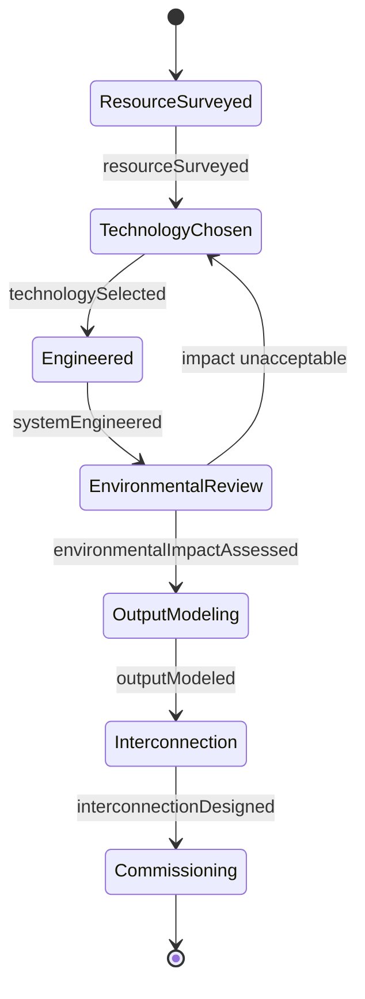
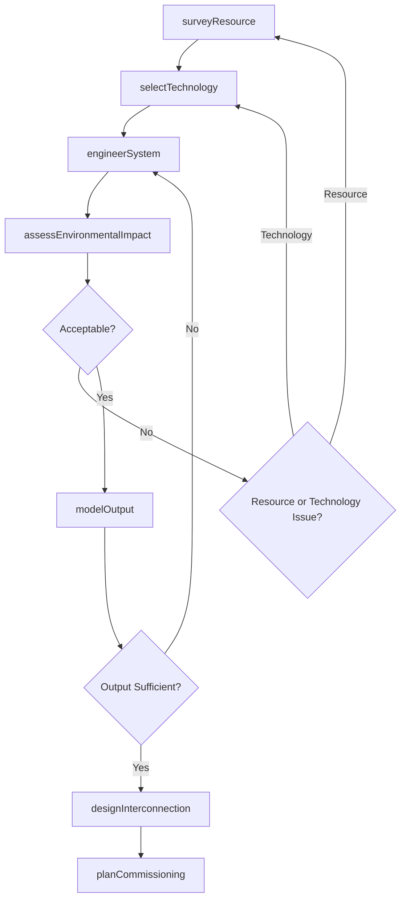
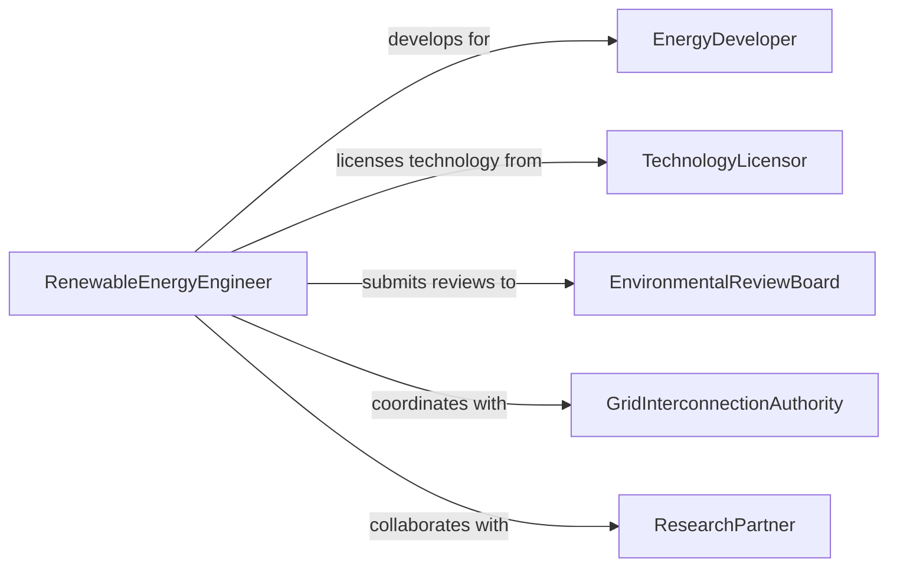

# Design Alternative Energy Systems

> Business-as-Code definition for designing alternative energy systems including geothermal heat pumps, biomass generators, hydrogen fuel cells, tidal power installations, and hybrid renewable microgrids.

## Overview

Alternative energy system design involves evaluating non-conventional energy sources, engineering conversion technologies, modeling system output, and integrating these systems into existing infrastructure. This definition models the process from resource assessment through technology selection, system engineering, environmental impact review, and commissioning planning.

## Actors

| Actor | Description |
|-------|-------------|
| EnergyDeveloper | Company investing in alternative energy projects |
| TechnologyLicensor | Organization providing proprietary energy conversion technology |
| EnvironmentalReviewBoard | Agency assessing the ecological impact of installations |
| GridInterconnectionAuthority | Utility managing connection to the electrical grid |
| ResearchPartner | Academic institution contributing technical expertise |

## Roles

| Role | Description |
|------|-------------|
| RenewableEnergyEngineer | Designs alternative energy generation systems |
| ResourceAnalyst | Evaluates site-specific energy resource potential |
| EnvironmentalAssessor | Reviews ecological and community impacts |
| GridIntegrationEngineer | Designs the interface between the system and the grid |

## Entities

| Entity | Description |
|--------|-------------|
| ResourceSurvey | Site assessment of available alternative energy sources |
| TechnologySelection | Evaluation and choice of energy conversion approach |
| SystemDesign | Engineering specification for the alternative energy system |
| EnvironmentalImpactStatement | Assessment of ecological and community effects |
| OutputModel | Projected annual energy generation |
| InterconnectionDesign | Electrical interface between the system and the grid |
| CommissioningPlan | Startup and performance verification procedure |

## Actions

| Action | Description |
|--------|-------------|
| surveyResource | Assess available alternative energy at the project site |
| selectTechnology | Choose the optimal energy conversion approach |
| engineerSystem | Design the complete alternative energy installation |
| assessEnvironmentalImpact | Evaluate ecological and community effects |
| modelOutput | Project annual energy generation and availability |
| designInterconnection | Engineer the grid interface |
| planCommissioning | Create the startup and verification protocol |

## Events

| Event | Description |
|-------|-------------|
| resourceSurveyed | Site energy assessment is complete |
| technologySelected | Conversion approach has been chosen |
| systemEngineered | Design specifications are finalized |
| environmentalImpactAssessed | Ecological review is complete |
| outputModeled | Energy generation projections are ready |
| interconnectionDesigned | Grid interface engineering is done |
| commissioningPlanned | Startup protocol has been created |

## Searches

| Search | Description |
|--------|-------------|
| findProjects | Search alternative energy projects by technology or region |
| getResourceData | Retrieve site energy assessment data |
| listTechnologies | Enumerate evaluated conversion approaches |
| getOutputProjections | Look up annual generation estimates |

## Entity Relationships



## State Diagram



## Workflow



## Actor Relationships



## Usage

### Calling Actions

```typescript
import { designAlternativeEnergySystems } from '@headlessly/design-alternative-energy-systems'

const altEnergy = designAlternativeEnergySystems()

// Survey the resource
const resource = await altEnergy.surveyResource({
  site: { lat: 46.8, lng: -121.7 },
  resources: ['geothermal', 'biomass', 'small-hydro'],
  dataCollection: { duration: 12, unit: 'months' }
})

// Select technology
const tech = await altEnergy.selectTechnology({
  resourceId: resource.id,
  candidates: [
    { type: 'binary-cycle-geothermal', capacity: 5, unit: 'MW' },
    { type: 'biomass-gasification', capacity: 2, unit: 'MW' },
    { type: 'run-of-river-hydro', capacity: 1.5, unit: 'MW' }
  ],
  criteria: ['LCOE', 'environmental-impact', 'reliability']
})

// Engineer the system
await altEnergy.engineerSystem({
  technologyId: tech.id,
  components: ['wellhead-equipment', 'binary-turbine', 'air-cooled-condenser', 'power-block'],
  designLife: 30
})
```

### Event-Driven Automation

```typescript
// Notify developer when environmental review passes
altEnergy.environmentalImpactAssessed(async ({ projectId, approved }) => {
  if (approved) {
    await notify({
      to: 'energy-developer',
      message: `Environmental impact approved for project ${projectId} - proceeding to output modeling`
    })
  }
})

// Auto-plan commissioning after interconnection design
altEnergy.interconnectionDesigned(async ({ projectId }) => {
  await altEnergy.planCommissioning({ projectId })
})
```
