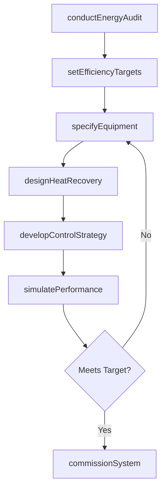
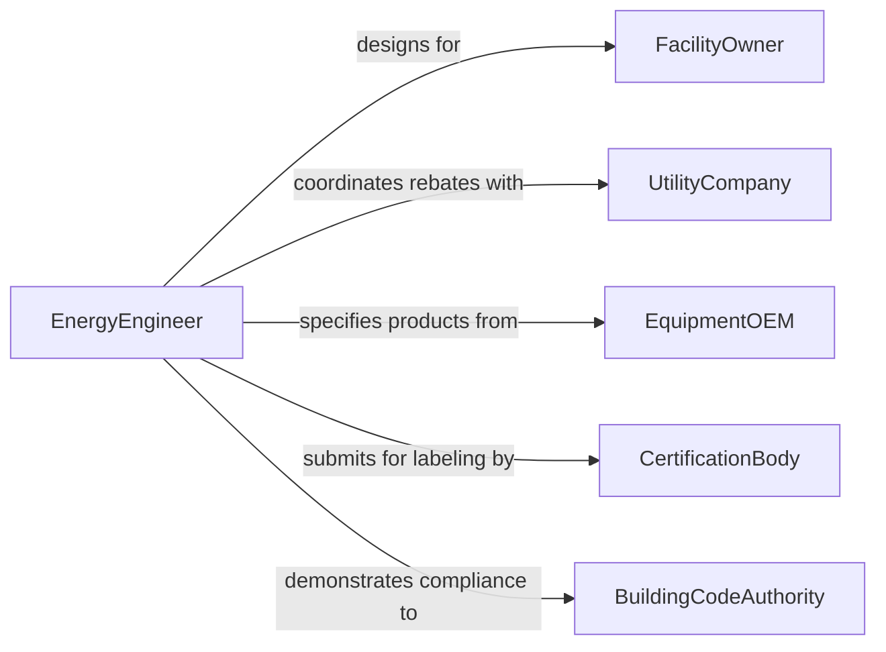

# Design Energy-efficient Equipment or Systems

> Business-as-Code definition for designing energy-efficient equipment and systems including high-efficiency HVAC units, variable-frequency drives, heat recovery systems, LED lighting arrays, and smart building energy management platforms.

## Overview

Energy-efficient equipment design involves benchmarking current energy consumption, identifying efficiency improvement opportunities, engineering optimized components or systems, and validating performance against energy codes and voluntary standards such as ENERGY STAR and ASHRAE 90.1. This definition models the process from energy audit through efficiency target setting, system design, performance simulation, and commissioning verification.

## Actors

| Actor | Description |
|-------|-------------|
| FacilityOwner | Building or plant operator seeking energy cost reductions |
| UtilityCompany | Energy provider offering efficiency incentive programs |
| EquipmentOEM | Manufacturer producing motors, compressors, and controls |
| CertificationBody | Organization awarding ENERGY STAR or similar labels |
| BuildingCodeAuthority | Agency enforcing minimum energy performance standards |

## Roles

| Role | Description |
|------|-------------|
| EnergyEngineer | Designs equipment and systems for optimal energy performance |
| MechanicalDesigner | Engineers HVAC, pumping, and compressed air systems |
| ControlsArchitect | Designs building automation and demand response strategies |
| CommissioningAgent | Verifies installed systems meet design energy targets |

## Entities

| Entity | Description |
|--------|-------------|
| EnergyAudit | Baseline assessment of current equipment energy consumption |
| EfficiencyTarget | Quantified energy reduction goal for the design |
| EquipmentSpecification | Engineering parameters for high-efficiency components |
| PerformanceSimulation | Modeled annual energy use under operating conditions |
| HeatRecoveryDesign | System for capturing and reusing waste thermal energy |
| ControlStrategy | Logic for variable-speed drives, scheduling, and setpoints |
| CommissioningReport | Verification that installed systems meet energy targets |

## Actions

| Action | Description |
|--------|-------------|
| conductEnergyAudit | Measure baseline energy consumption of existing equipment |
| setEfficiencyTargets | Define energy reduction goals and performance benchmarks |
| specifyEquipment | Select and size high-efficiency components |
| designHeatRecovery | Engineer waste heat capture and reuse systems |
| developControlStrategy | Create automation logic for demand-based operation |
| simulatePerformance | Model annual energy savings under typical conditions |
| commissionSystem | Verify installed systems achieve design efficiency |

## Events

| Event | Description |
|-------|-------------|
| energyAuditCompleted | Baseline consumption data have been collected |
| efficiencyTargetsSet | Performance benchmarks have been defined |
| equipmentSpecified | High-efficiency components have been selected |
| heatRecoveryDesigned | Waste thermal capture system is engineered |
| controlStrategyDeveloped | Automation logic has been finalized |
| performanceSimulated | Annual energy model results are available |
| systemCommissioned | Installed equipment meets verified efficiency targets |

## Searches

| Search | Description |
|--------|-------------|
| findDesigns | Search equipment designs by efficiency class or application |
| getAuditData | Retrieve baseline energy consumption measurements |
| listEquipmentOptions | Enumerate high-efficiency component selections |
| getSimulationResults | Look up modeled energy savings projections |

## Workflow



## Actor Relationships



## Usage

### Calling Actions

```typescript
import { designEnergyEfficientEquipmentSystems } from '@headlessly/design-energy-efficient-equipment-systems'

const efficiency = designEnergyEfficientEquipmentSystems()

// Conduct energy audit
const audit = await efficiency.conductEnergyAudit({
  facility: 'distribution-warehouse',
  systems: ['HVAC', 'lighting', 'compressed-air', 'conveyor-drives'],
  period: { months: 12, baselineYear: 2024 }
})

// Specify high-efficiency equipment
const spec = await efficiency.specifyEquipment({
  auditId: audit.id,
  upgrades: [
    { system: 'HVAC', component: 'variable-refrigerant-flow', cop: 4.2 },
    { system: 'lighting', component: 'LED-high-bay', efficacy: 180, unit: 'lumens-per-watt' },
    { system: 'compressed-air', component: 'VSD-rotary-screw', specificPower: 5.5, unit: 'kW-per-100-cfm' }
  ]
})

// Simulate annual performance
await efficiency.simulatePerformance({
  specificationId: spec.id,
  weatherData: 'TMY3-local',
  occupancyProfile: 'warehouse-two-shift',
  utilityRate: 0.12
})
```

### Event-Driven Automation

```typescript
// Notify facility owner when simulation shows savings
efficiency.performanceSimulated(async ({ designId, annualSavingsKwh, paybackYears }) => {
  await notify({
    to: 'facility-owner',
    message: `Design ${designId} projects ${annualSavingsKwh.toLocaleString()} kWh annual savings with ${paybackYears}-year payback`
  })
})

// Auto-apply for utility rebates after commissioning
efficiency.systemCommissioned(async ({ facilityId, verifiedSavings }) => {
  await notify({
    to: 'utility-incentive-coordinator',
    message: `Facility ${facilityId} commissioned with ${verifiedSavings} kWh verified savings - rebate application eligible`
  })
})
```
