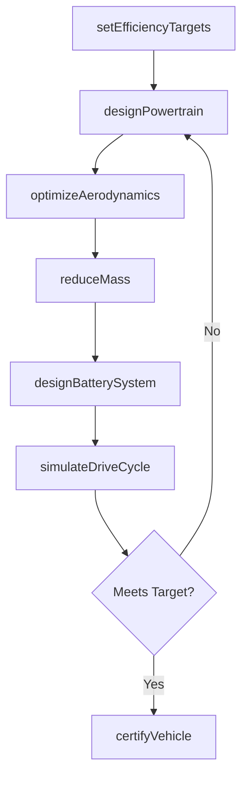
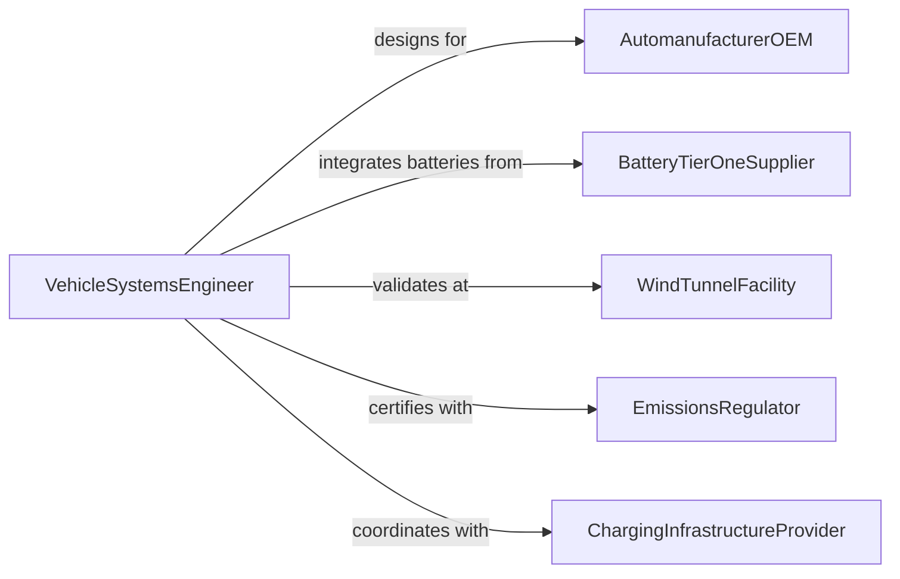

# Design Energy-efficient Vehicles or Vehicle Components

> Business-as-Code definition for designing energy-efficient vehicles and components including electric drivetrains, lightweight structures, aerodynamic bodies, regenerative braking systems, and battery management modules.

## Overview

Energy-efficient vehicle design involves optimizing powertrain efficiency, reducing vehicle mass, improving aerodynamics, and integrating energy recovery systems to minimize fuel or electricity consumption per mile traveled. This definition models the process from efficiency target setting through component design, simulation, prototype testing, and regulatory certification.

## Actors

| Actor | Description |
|-------|-------------|
| AutomanufacturerOEM | Vehicle company commissioning efficient designs |
| BatteryTierOneSupplier | Provider of cells and battery packs |
| WindTunnelFacility | Testing laboratory for aerodynamic validation |
| EmissionsRegulator | Agency certifying vehicle efficiency and emissions |
| ChargingInfrastructureProvider | Company deploying EV charging networks |

## Roles

| Role | Description |
|------|-------------|
| VehicleSystemsEngineer | Integrates powertrain, chassis, and body for efficiency |
| AerodynamicistDesigner | Optimizes body shape and airflow management |
| BatteryEngineer | Designs energy storage and management systems |
| LightweightingSpecialist | Selects materials and structures to reduce mass |

## Entities

| Entity | Description |
|--------|-------------|
| EfficiencyTarget | Quantified fuel economy or energy consumption goal |
| PowertrainDesign | Engineering specification for the drive system |
| AerodynamicModel | CFD simulation and wind tunnel test data |
| LightweightDesign | Material selection and structural optimization data |
| BatteryPackDesign | Cell configuration, thermal management, and BMS spec |
| DriveCycleSimulation | Predicted efficiency over standard drive cycles |
| CertificationPackage | Documentation for regulatory efficiency and emissions testing |

## Actions

| Action | Description |
|--------|-------------|
| setEfficiencyTargets | Define fuel economy or energy consumption goals |
| designPowertrain | Engineer the drive system for maximum efficiency |
| optimizeAerodynamics | Reduce drag through body shape and flow management |
| reduceMass | Select lightweight materials and optimize structure |
| designBatterySystem | Configure cells, thermal management, and BMS |
| simulateDriveCycle | Predict efficiency over standard driving patterns |
| certifyVehicle | Submit for regulatory efficiency and emissions testing |

## Events

| Event | Description |
|-------|-------------|
| efficiencyTargetsSet | Consumption goals have been defined |
| powertrainDesigned | Drive system specification is complete |
| aerodynamicsOptimized | Drag reduction measures have been finalized |
| massReduced | Lightweight design is complete |
| batterySystemDesigned | Energy storage specification is ready |
| driveCycleSimulated | Efficiency predictions are complete |
| vehicleCertified | Regulatory testing and approval are finished |

## Searches

| Search | Description |
|--------|-------------|
| findDesigns | Search vehicle designs by efficiency class or type |
| getSimulationData | Retrieve drive cycle efficiency predictions |
| listComponents | Enumerate powertrain and battery components |
| getCertificationStatus | Check regulatory approval progress |

## Workflow



## Actor Relationships



## Usage

### Calling Actions

```typescript
import { designEnergyEfficientVehiclesVehicleComponents } from '@headlessly/design-energy-efficient-vehicles-vehicle-components'

const vehicle = designEnergyEfficientVehiclesVehicleComponents()

// Set efficiency targets
const targets = await vehicle.setEfficiencyTargets({
  vehicleClass: 'midsize-sedan',
  powertrain: 'battery-electric',
  range: { value: 350, unit: 'miles' },
  efficiency: { value: 3.5, unit: 'miles-per-kWh' },
  standard: 'EPA-combined-cycle'
})

// Design powertrain
const powertrain = await vehicle.designPowertrain({
  targetsId: targets.id,
  motor: { type: 'permanent-magnet-synchronous', peakPower: 200, unit: 'kW' },
  inverter: { efficiency: 0.97 },
  transmission: 'single-speed-reduction'
})

// Optimize aerodynamics
await vehicle.optimizeAerodynamics({
  powertrainId: powertrain.id,
  targetCd: 0.22,
  features: ['active-grille-shutters', 'flush-door-handles', 'boat-tail-rear', 'underbody-paneling']
})
```

### Event-Driven Automation

```typescript
// Notify certification team when simulation meets targets
vehicle.driveCycleSimulated(async ({ designId, meetsTarget, efficiency }) => {
  if (meetsTarget) {
    await notify({
      to: 'certification-team',
      message: `Design ${designId} achieves ${efficiency} mi/kWh - ready for regulatory certification`
    })
  }
})

// Auto-simulate after battery design completion
vehicle.batterySystemDesigned(async ({ designId }) => {
  await vehicle.simulateDriveCycle({ designId })
})
```
