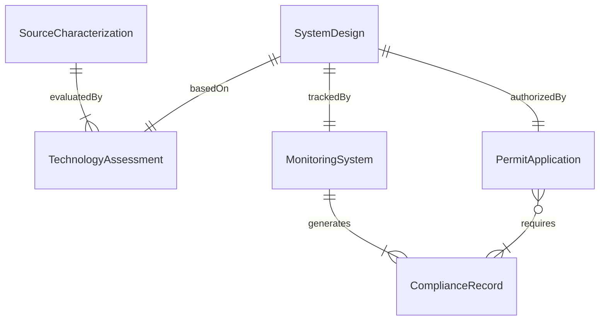
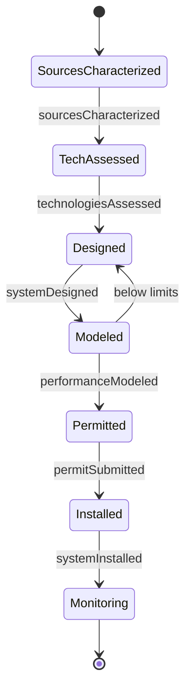
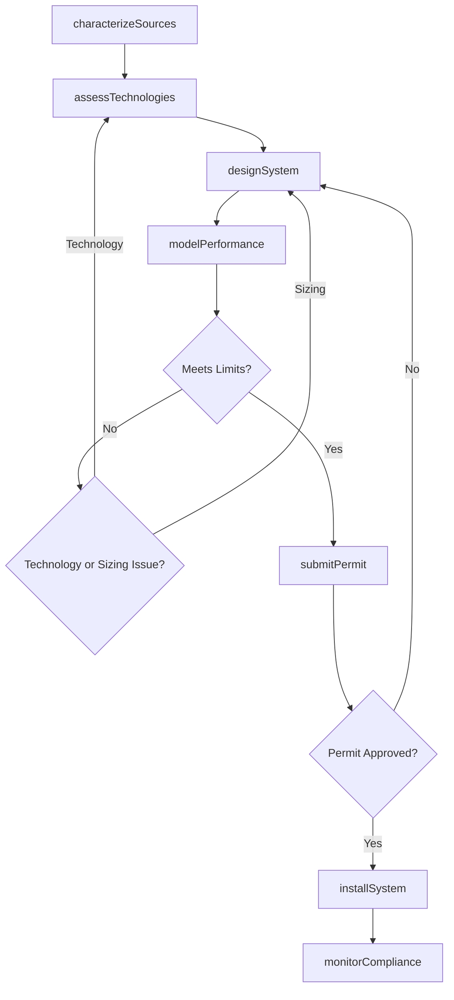
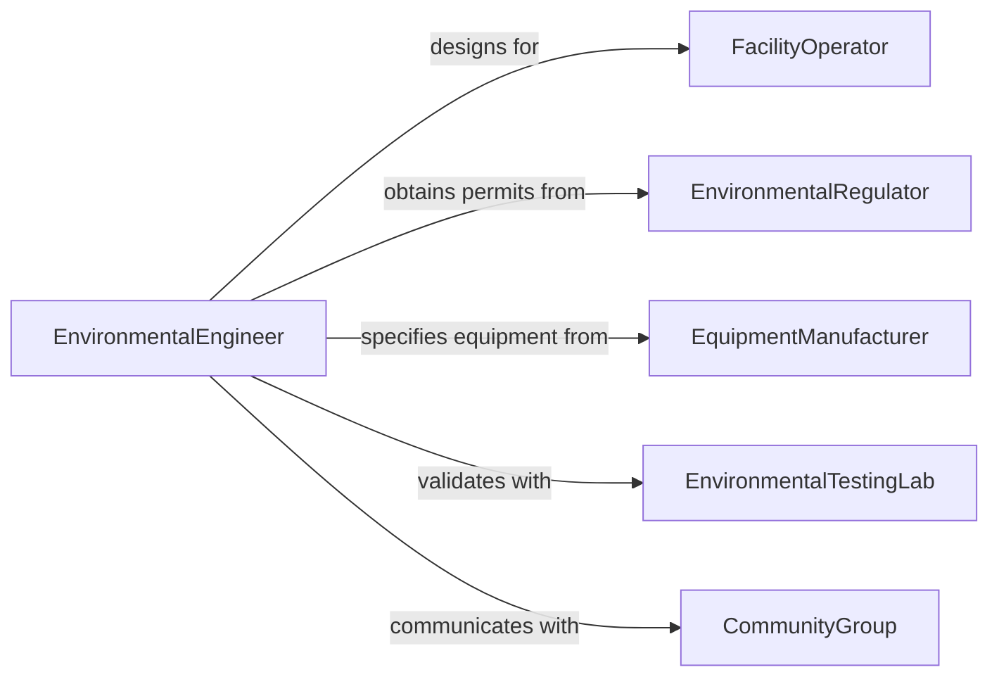

# Design Environmental Control Systems

> Business-as-Code definition for designing environmental control systems including air quality management, wastewater treatment, noise abatement, and pollution containment equipment for industrial and commercial facilities.

## Overview

Environmental control system design involves characterizing pollutant sources, selecting treatment technologies, sizing equipment, and engineering monitoring systems that maintain emissions and discharges within regulatory limits. This definition models the process from source characterization through technology selection, system engineering, permit compliance verification, and operational monitoring.

## Actors

| Actor | Description |
|-------|-------------|
| FacilityOperator | Industrial or commercial entity requiring pollution controls |
| EnvironmentalRegulator | Agency enforcing air, water, and waste discharge limits |
| EquipmentManufacturer | Vendor fabricating pollution control equipment |
| EnvironmentalTestingLab | Accredited facility analyzing emissions and effluent |
| CommunityGroup | Neighboring residents concerned about environmental impact |

## Roles

| Role | Description |
|------|-------------|
| EnvironmentalEngineer | Designs pollution control and treatment systems |
| AirQualitySpecialist | Models and mitigates airborne emissions |
| WastewaterEngineer | Designs liquid waste treatment processes |
| ComplianceManager | Ensures systems meet permit requirements |

## Entities

| Entity | Description |
|--------|-------------|
| SourceCharacterization | Analysis of pollutant types, concentrations, and flow rates |
| TechnologyAssessment | Evaluation of control options and their effectiveness |
| SystemDesign | Engineering drawings and specifications for the control system |
| PermitApplication | Filing for regulatory approval of the control approach |
| MonitoringSystem | Continuous or periodic measurement of system performance |
| ComplianceRecord | Documentation of emissions and discharge data versus limits |

## Actions

| Action | Description |
|--------|-------------|
| characterizeSources | Identify and quantify pollutant emissions or discharges |
| assessTechnologies | Evaluate control options for effectiveness and cost |
| designSystem | Engineer the pollution control equipment and layout |
| modelPerformance | Simulate system effectiveness under operating conditions |
| submitPermit | File for regulatory approval of the control approach |
| installSystem | Oversee construction and commissioning of equipment |
| monitorCompliance | Track ongoing performance against permit limits |

## Events

| Event | Description |
|-------|-------------|
| sourcesCharacterized | Pollutant data have been collected and analyzed |
| technologiesAssessed | Control options have been evaluated |
| systemDesigned | Engineering specifications are complete |
| performanceModeled | System effectiveness simulation is done |
| permitSubmitted | Regulatory filing has been completed |
| systemInstalled | Equipment has been constructed and commissioned |
| complianceMonitored | Ongoing performance tracking is active |

## Searches

| Search | Description |
|--------|-------------|
| findDesigns | Search control systems by pollutant type or facility |
| getSourceData | Retrieve pollutant characterization for a facility |
| listTechnologies | Enumerate evaluated control options |
| getComplianceHistory | Look up permit compliance records |

## Entity Relationships



## State Diagram



## Workflow



## Actor Relationships



## Usage

### Calling Actions

```typescript
import { designEnvironmentalControlSystems } from '@headlessly/design-environmental-control-systems'

const envControl = designEnvironmentalControlSystems()

// Characterize emission sources
const sources = await envControl.characterizeSources({
  facility: 'chemical-manufacturing-plant',
  pollutants: [
    { type: 'VOC', source: 'reactor-vents', flowRate: 5000, unit: 'scfm', concentration: 500, concUnit: 'ppm' },
    { type: 'particulate', source: 'dryer-exhaust', flowRate: 8000, unit: 'scfm', loading: 2.5, loadUnit: 'gr/dscf' }
  ]
})

// Design the system
const design = await envControl.designSystem({
  characterizationId: sources.id,
  controls: [
    { pollutant: 'VOC', technology: 'regenerative-thermal-oxidizer', efficiency: 0.99 },
    { pollutant: 'particulate', technology: 'baghouse-filter', efficiency: 0.995 }
  ]
})

// Submit permit
await envControl.submitPermit({
  designId: design.id,
  permitType: 'Title-V-modification',
  regulator: 'state-DEQ'
})
```

### Event-Driven Automation

```typescript
// Alert compliance team when monitoring shows exceedance
envControl.complianceMonitored(async ({ facilityId, parameter, reading, limit }) => {
  if (reading > limit * 0.9) {
    await notify({
      to: 'compliance-manager',
      message: `${parameter} at ${reading} approaching limit of ${limit} at facility ${facilityId}`
    })
  }
})

// Auto-install after permit approval
envControl.permitSubmitted(async ({ designId, approved }) => {
  if (approved) {
    await envControl.installSystem({ designId })
  }
})
```
