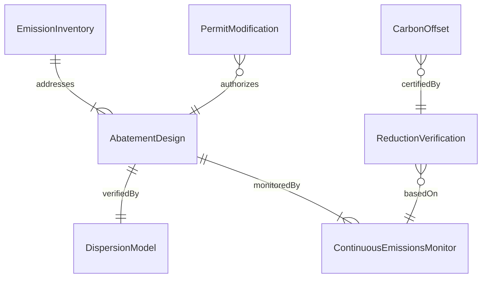

# Design Systems to Reduce Harmful Emissions

> Business-as-Code definition for designing systems that reduce harmful atmospheric emissions including greenhouse gases, criteria pollutants, volatile organic compounds, and hazardous air pollutants from industrial and transportation sources.

## Overview

Emission reduction system design involves quantifying emission inventories, evaluating abatement technologies, engineering control systems, and verifying reductions against regulatory standards and climate commitments. This definition models the process from emission baseline development through technology assessment, system design, regulatory filing, and continuous emissions monitoring.

## Actors

| Actor | Description |
|-------|-------------|
| IndustrialEmitter | Facility generating harmful atmospheric emissions |
| AirQualityDistrict | Regional agency enforcing emission limits |
| EmissionControlVendor | Manufacturer of scrubbers, catalysts, and filters |
| CarbonMarket | Exchange facilitating emissions trading and offsets |
| PublicHealthAgency | Organization monitoring air quality health impacts |

## Roles

| Role | Description |
|------|-------------|
| EmissionsEngineer | Designs abatement systems and quantifies reductions |
| AirQualityModeler | Simulates dispersion and impact of emissions |
| CarbonAccountant | Tracks greenhouse gas inventories and credits |
| RegulatorySpecialist | Manages permit applications and compliance filings |

## Entities

| Entity | Description |
|--------|-------------|
| EmissionInventory | Quantified list of all emission sources and rates |
| AbatementDesign | Engineering specification for the reduction system |
| DispersionModel | Simulation of pollutant transport in the atmosphere |
| ContinuousEmissionsMonitor | Real-time measurement system for stack emissions |
| CarbonOffset | Verified emission reduction credit |
| PermitModification | Updated regulatory filing reflecting new controls |
| ReductionVerification | Third-party confirmation of achieved emission decreases |

## Actions

| Action | Description |
|--------|-------------|
| developInventory | Quantify all emission sources and baseline rates |
| assessAbatementOptions | Evaluate technologies for emission reduction potential |
| designAbatementSystem | Engineer the control equipment and integration |
| modelDispersion | Simulate pollutant transport and ambient concentrations |
| installMonitoring | Deploy continuous emissions measurement systems |
| filePermitModification | Update regulatory approvals for new controls |
| verifyReductions | Confirm achieved reductions through third-party audit |

## Events

| Event | Description |
|-------|-------------|
| inventoryDeveloped | Emission sources and baselines have been quantified |
| abatementOptionsAssessed | Control technologies have been evaluated |
| abatementSystemDesigned | Engineering specifications are complete |
| dispersionModeled | Atmospheric transport simulation is done |
| monitoringInstalled | Continuous measurement systems are operational |
| permitModificationFiled | Regulatory update has been submitted |
| reductionsVerified | Achieved decreases have been confirmed |

## Searches

| Search | Description |
|--------|-------------|
| findAbatementDesigns | Search emission control systems by pollutant or industry |
| getInventoryData | Retrieve emission baselines for a facility |
| listMonitoringData | Enumerate continuous emissions readings |
| getVerificationReports | Look up third-party reduction confirmations |

## Entity Relationships



## State Diagram


## Workflow


## Actor Relationships


## Usage

### Calling Actions

```typescript
import { designSystemsReduceHarmfulEmissions } from '@headlessly/design-systems-reduce-harmful-emissions'

const emissions = designSystemsReduceHarmfulEmissions()

// Develop emission inventory
const inventory = await emissions.developInventory({
  facility: 'coal-fired-power-plant',
  sources: [
    { name: 'boiler-stack', pollutants: ['SO2', 'NOx', 'PM2.5', 'CO2'] },
    { name: 'coal-handling', pollutants: ['PM10', 'fugitive-dust'] }
  ],
  baseline: { year: 2024, unit: 'tons-per-year' }
})

// Design abatement system
const design = await emissions.designAbatementSystem({
  inventoryId: inventory.id,
  controls: [
    { pollutant: 'SO2', technology: 'wet-flue-gas-desulfurization', efficiency: 0.95 },
    { pollutant: 'NOx', technology: 'selective-catalytic-reduction', efficiency: 0.90 },
    { pollutant: 'PM2.5', technology: 'electrostatic-precipitator', efficiency: 0.99 }
  ]
})

// Model atmospheric dispersion
await emissions.modelDispersion({
  designId: design.id,
  model: 'AERMOD',
  receptors: 'regulatory-grid',
  meteorology: 'local-5-year'
})
```

### Event-Driven Automation

```typescript
// Alert operations when monitoring shows exceedance risk
emissions.monitoringInstalled(async ({ facilityId }) => {
  await notify({
    to: 'plant-operations',
    message: `Continuous emissions monitoring active for facility ${facilityId} - real-time alerts configured`
  })
})

// Auto-verify reductions after monitoring period
emissions.reductionsVerified(async ({ facilityId, reductionPercent }) => {
  await notify({
    to: 'carbon-accountant',
    message: `Facility ${facilityId} achieved ${reductionPercent}% emission reduction - credits eligible`
  })
})
```
