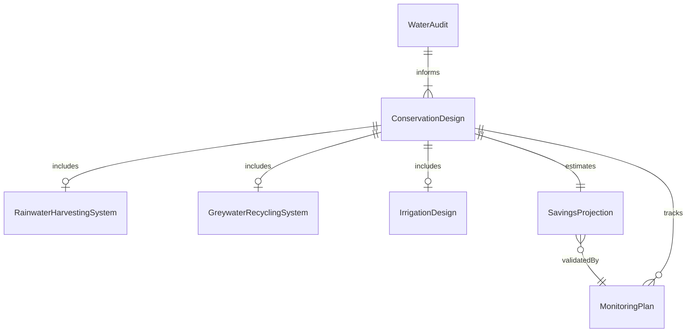
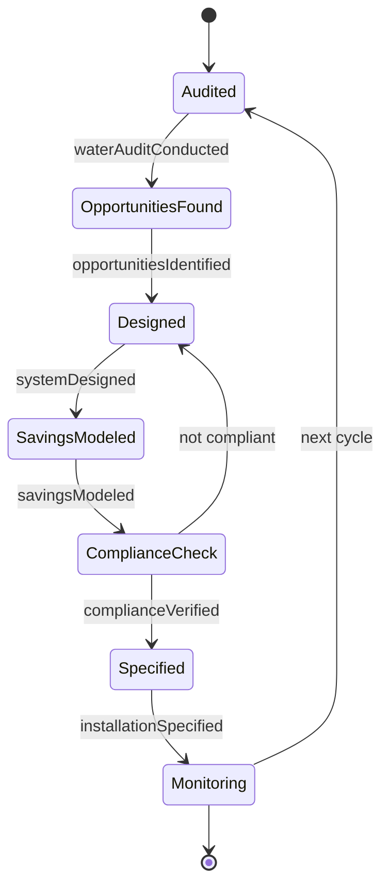
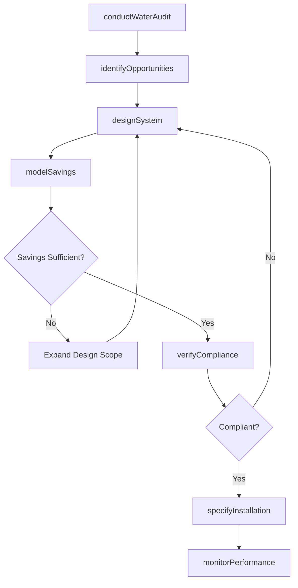
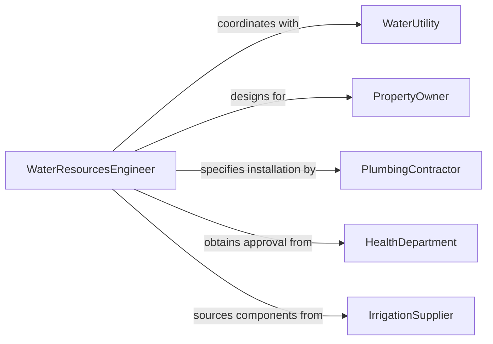

# Design Water Conservation Systems

> Business-as-Code definition for designing water conservation systems including rainwater harvesting, greywater recycling, efficient irrigation networks, and low-flow fixture specifications for commercial and municipal applications.

## Overview

Water conservation system design involves analyzing water usage patterns, identifying reduction opportunities, engineering reclamation and reuse systems, and specifying efficient fixtures and controls that reduce potable water consumption. This definition models the process from water audit through system design, regulatory compliance, installation specification, and post-installation monitoring.

## Actors

| Actor | Description |
|-------|-------------|
| WaterUtility | Municipal provider supplying potable water |
| PropertyOwner | Building or site owner commissioning conservation systems |
| PlumbingContractor | Installer of water conservation equipment |
| HealthDepartment | Authority governing water reuse safety standards |
| IrrigationSupplier | Vendor providing efficient irrigation components |

## Roles

| Role | Description |
|------|-------------|
| WaterResourcesEngineer | Designs conservation and reclamation systems |
| HydrologicAnalyst | Models water flow, demand, and savings potential |
| RegulatoryCompliance | Ensures designs meet health and safety codes |
| SustainabilityConsultant | Advises on conservation strategy and certification |

## Entities

| Entity | Description |
|--------|-------------|
| WaterAudit | Baseline assessment of current water usage |
| ConservationDesign | Engineering drawings for the conservation system |
| RainwaterHarvestingSystem | Collection, storage, and treatment of roof runoff |
| GreywaterRecyclingSystem | Treatment and reuse of sink and shower water |
| IrrigationDesign | Efficient landscape watering system specification |
| SavingsProjection | Estimated reduction in water consumption and cost |
| MonitoringPlan | Post-installation water usage tracking protocol |

## Actions

| Action | Description |
|--------|-------------|
| conductWaterAudit | Measure and analyze current water consumption patterns |
| identifyOpportunities | Determine where conservation measures yield highest savings |
| designSystem | Engineer rainwater, greywater, or irrigation solutions |
| modelSavings | Project water and cost reductions from the design |
| verifyCompliance | Confirm the design meets health and building codes |
| specifyInstallation | Produce construction documents for the system |
| monitorPerformance | Track post-installation water usage against projections |

## Events

| Event | Description |
|-------|-------------|
| waterAuditConducted | Baseline usage data have been collected |
| opportunitiesIdentified | Conservation priorities have been determined |
| systemDesigned | Engineering drawings are complete |
| savingsModeled | Projected reductions have been calculated |
| complianceVerified | Design meets regulatory requirements |
| installationSpecified | Construction documents have been produced |
| performanceMonitored | Post-installation tracking is active |

## Searches

| Search | Description |
|--------|-------------|
| findDesigns | Search conservation systems by type or property |
| getAuditData | Retrieve baseline water usage assessments |
| listSavingsProjections | Enumerate estimated reductions by system |
| getComplianceStatus | Check regulatory review progress |

## Entity Relationships



## State Diagram



## Workflow



## Actor Relationships



## Usage

### Calling Actions

```typescript
import { designWaterConservationSystems } from '@headlessly/design-water-conservation-systems'

const water = designWaterConservationSystems()

// Conduct water audit
const audit = await water.conductWaterAudit({
  property: 'corporate-campus-building-A',
  meters: ['potable-main', 'irrigation', 'cooling-tower'],
  period: { months: 12 },
  currentUsage: { value: 15000, unit: 'gallons-per-day' }
})

// Design the system
const design = await water.designSystem({
  auditId: audit.id,
  systems: [
    { type: 'rainwater-harvesting', roofArea: 50000, unit: 'sqft', tankCapacity: 25000 },
    { type: 'greywater-recycling', sources: ['lavatories', 'showers'], reuse: 'toilet-flushing' },
    { type: 'smart-irrigation', zones: 8, controller: 'weather-based-ET' }
  ]
})

// Model savings
await water.modelSavings({
  designId: design.id,
  waterCost: 0.008,
  sewerCost: 0.012,
  unit: 'dollars-per-gallon'
})
```

### Event-Driven Automation

```typescript
// Alert property owner when savings exceed projections
water.performanceMonitored(async ({ designId, actualSavings, projectedSavings }) => {
  if (actualSavings > projectedSavings * 1.1) {
    await notify({
      to: 'property-owner',
      message: `Water conservation system ${designId} exceeding projections by ${((actualSavings / projectedSavings - 1) * 100).toFixed(0)}%`
    })
  }
})

// Auto-specify installation after compliance verification
water.complianceVerified(async ({ designId }) => {
  await water.specifyInstallation({ designId })
})
```
