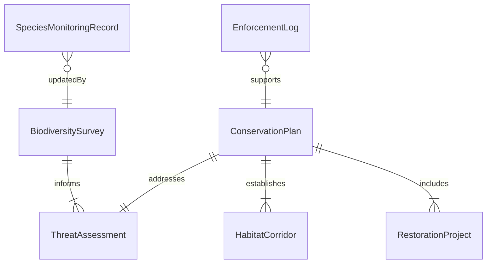
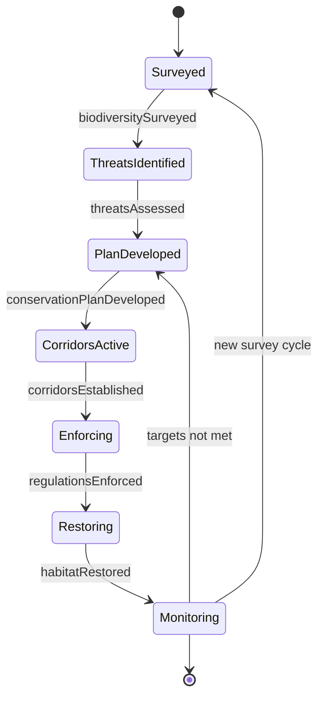
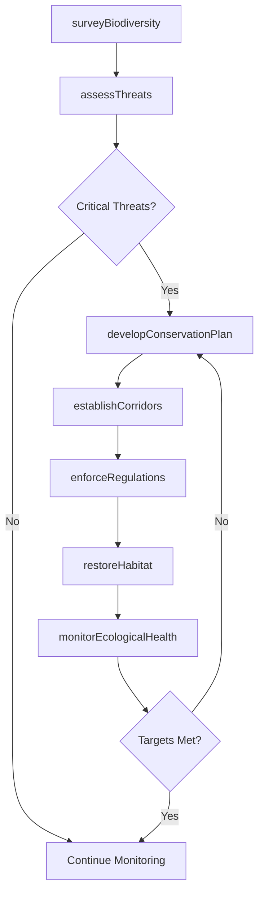
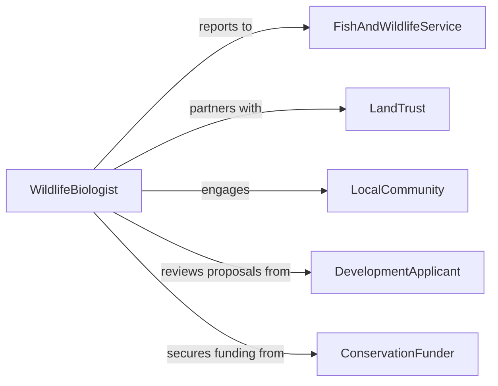

# Protect Wildlife or Natural Areas

> Business-as-Code definition for protecting wildlife populations and natural areas through habitat conservation, species management, anti-poaching enforcement, and ecological restoration programs.

## Overview

Wildlife and natural area protection involves surveying biodiversity, identifying threats, implementing conservation measures, enforcing regulations, and monitoring ecological health over time. This definition models the process from ecological assessment through threat analysis, conservation planning, enforcement coordination, and long-term monitoring.

## Actors

| Actor | Description |
|-------|-------------|
| FishAndWildlifeService | Federal agency managing protected species |
| LandTrust | Nonprofit acquiring and preserving natural lands |
| LocalCommunity | Residents living adjacent to protected areas |
| DevelopmentApplicant | Entity proposing land use changes near wildlife areas |
| ConservationFunder | Foundation or government providing protection grants |

## Roles

| Role | Description |
|------|-------------|
| WildlifeBiologist | Surveys species populations and habitat conditions |
| ConservationPlanner | Designs protection strategies and management plans |
| ParkRanger | Enforces regulations and monitors protected areas |
| RestorationEcologist | Implements habitat rehabilitation projects |

## Entities

| Entity | Description |
|--------|-------------|
| BiodiversitySurvey | Inventory of species present in the area |
| ThreatAssessment | Analysis of risks to wildlife and habitat |
| ConservationPlan | Strategy document for protecting the area |
| HabitatCorridor | Connected natural pathway enabling wildlife movement |
| SpeciesMonitoringRecord | Ongoing population and health data for key species |
| EnforcementLog | Record of patrols, violations, and citations |
| RestorationProject | Planned or active habitat rehabilitation effort |

## Actions

| Action | Description |
|--------|-------------|
| surveyBiodiversity | Inventory species populations and habitat conditions |
| assessThreats | Identify risks from development, poaching, and climate |
| developConservationPlan | Create a strategy for protecting the area |
| establishCorridors | Design connected pathways for wildlife movement |
| enforceRegulations | Patrol protected areas and address violations |
| restoreHabitat | Rehabilitate degraded ecosystems |
| monitorEcologicalHealth | Track species populations and habitat quality |

## Events

| Event | Description |
|-------|-------------|
| biodiversitySurveyed | Species inventory and habitat assessment are complete |
| threatsAssessed | Risks to wildlife and habitat have been identified |
| conservationPlanDeveloped | Protection strategy has been created |
| corridorsEstablished | Wildlife movement pathways have been designed |
| regulationsEnforced | Patrol and enforcement activities are ongoing |
| habitatRestored | Ecosystem rehabilitation has been completed |
| ecologicalHealthMonitored | Population and habitat data have been collected |

## Searches

| Search | Description |
|--------|-------------|
| findProtectedAreas | Search conservation sites by region or species |
| getSpeciesData | Retrieve population counts for monitored species |
| listThreats | Enumerate identified risks by severity |
| getRestorationStatus | Check progress of habitat rehabilitation projects |

## Entity Relationships



## State Diagram



## Workflow



## Actor Relationships



## Usage

### Calling Actions

```typescript
import { protectWildlifeNaturalAreas } from '@headlessly/protect-wildlife-natural-areas'

const wildlife = protectWildlifeNaturalAreas()

// Survey biodiversity
const survey = await wildlife.surveyBiodiversity({
  area: 'Blue Ridge Corridor',
  methods: ['camera-traps', 'point-counts', 'vegetation-transects'],
  targetSpecies: ['black-bear', 'cerulean-warbler', 'brook-trout'],
  acreage: 15000
})

// Assess threats
const threats = await wildlife.assessThreats({
  surveyId: survey.id,
  categories: ['habitat-fragmentation', 'invasive-species', 'climate-change', 'poaching'],
  severity: 'ranked'
})

// Develop conservation plan
await wildlife.developConservationPlan({
  threatAssessmentId: threats.id,
  strategies: [
    { action: 'acquire-buffer-parcels', priority: 'high', cost: 2500000 },
    { action: 'invasive-removal-program', priority: 'high', cost: 150000 },
    { action: 'wildlife-crossing-structures', priority: 'medium', cost: 800000 }
  ],
  timeline: '5-year'
})
```

### Event-Driven Automation

```typescript
// Alert rangers when threats escalate
wildlife.threatsAssessed(async ({ areaId, criticalThreats }) => {
  if (criticalThreats.length > 0) {
    await notify({
      to: 'park-rangers',
      message: `${criticalThreats.length} critical threats identified in ${areaId} - increased patrols recommended`
    })
  }
})

// Report ecological health to funders
wildlife.ecologicalHealthMonitored(async ({ areaId, speciesTrends }) => {
  await notify({
    to: 'conservation-funder',
    message: `Annual ecological health report ready for ${areaId} - ${speciesTrends.improving} species improving`
  })
})
```
