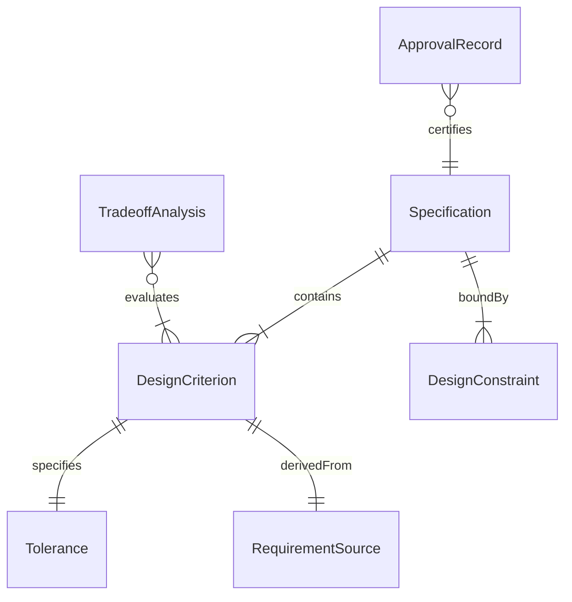
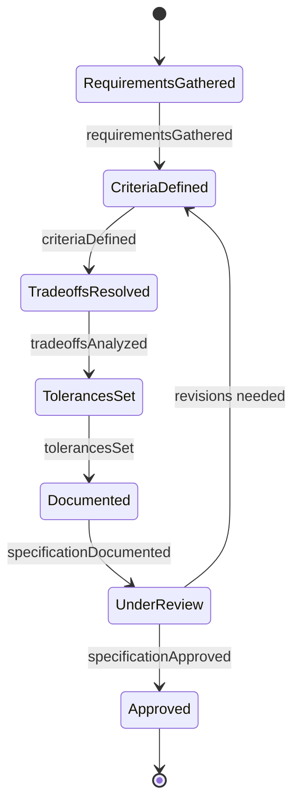
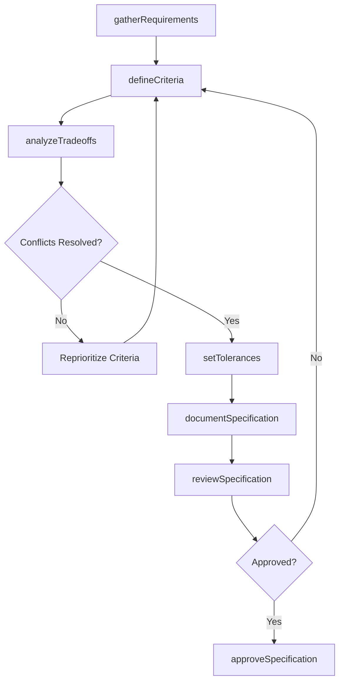
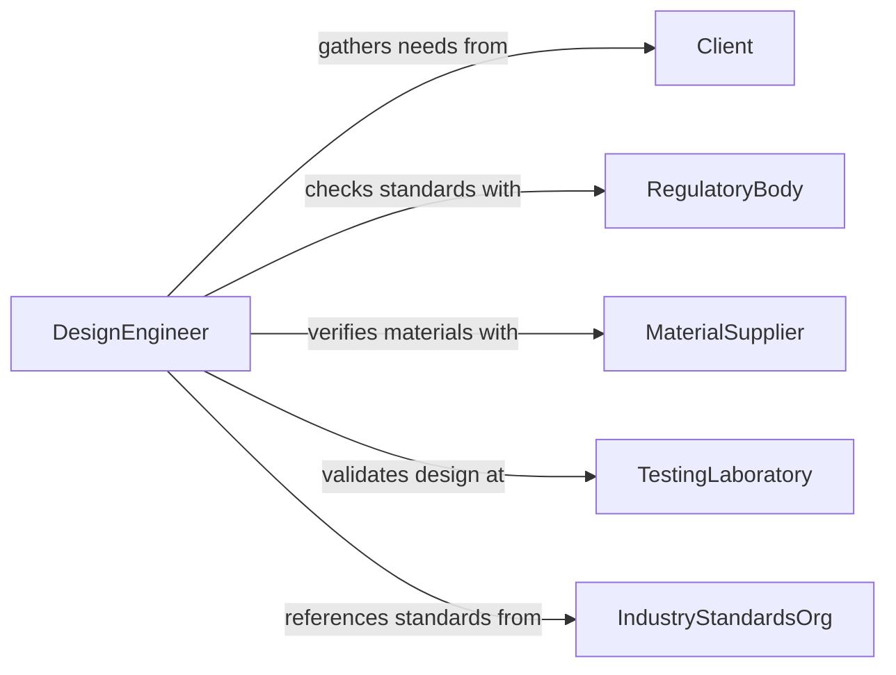

# Determine Design Criteria and Specifications

> Business-as-Code definition for establishing the functional, performance, and quality criteria that govern product and system design decisions.

## Overview

Determining design criteria and specifications involves analyzing stakeholder requirements, regulatory constraints, and technical feasibility to define the parameters within which a product or system must be designed. This definition models the process of gathering input from multiple sources, translating requirements into measurable criteria, and documenting specifications that guide engineering and manufacturing teams.

## Actors

| Actor | Description |
|-------|-------------|
| Client | Organization or individual commissioning the design |
| RegulatoryBody | Authority imposing safety or compliance standards |
| MaterialSupplier | Vendor providing raw materials with known properties |
| TestingLaboratory | Independent facility validating design performance |
| IndustryStandardsOrg | Body publishing design and engineering standards |
| EndUser | Person or system that will use the final product |

## Roles

| Role | Description |
|------|-------------|
| DesignEngineer | Translates requirements into technical specifications |
| SystemsArchitect | Defines system-level criteria and interfaces |
| QualityEngineer | Establishes acceptance criteria and tolerances |
| ProjectManager | Coordinates specification development timeline |

## Entities

| Entity | Description |
|--------|-------------|
| DesignCriterion | A specific measurable requirement for the design |
| Specification | Formal document detailing all design parameters |
| RequirementSource | Origin of a design requirement such as regulation or client |
| Tolerance | Acceptable range of variation for a design parameter |
| DesignConstraint | Limitation imposed by materials, cost, or regulations |
| TradeoffAnalysis | Evaluation of competing criteria and priorities |
| ApprovalRecord | Sign-off documenting stakeholder acceptance |

## Actions

| Action | Description |
|--------|-------------|
| gatherRequirements | Collect design needs from stakeholders and standards |
| defineCriteria | Establish measurable design parameters and thresholds |
| analyzeTradeoffs | Evaluate competing criteria to resolve conflicts |
| setTolerances | Define acceptable variation ranges for each criterion |
| documentSpecification | Author the formal specification document |
| reviewSpecification | Submit specification for stakeholder review |
| approveSpecification | Obtain formal sign-off on the specification |

## Events

| Event | Description |
|-------|-------------|
| requirementsGathered | All design requirements have been collected |
| criteriaDefined | Measurable design criteria have been established |
| tradeoffsAnalyzed | Competing criteria have been evaluated |
| tolerancesSet | Acceptable variation ranges have been defined |
| specificationDocumented | The formal specification has been authored |
| specificationReviewed | Stakeholder review has been completed |
| specificationApproved | The specification has received formal sign-off |

## Searches

| Search | Description |
|--------|-------------|
| findCriteria | Search design criteria by category, source, or priority |
| getSpecifications | Retrieve specifications by project or version |
| listConstraints | Enumerate design constraints by type or source |
| findTradeoffs | Locate tradeoff analyses for a given specification |
| getApprovalStatus | Check the approval state of a specification |

## Entity Relationships



## State Diagram



## Workflow



## Actor Relationships



## Usage

### Calling Actions

```typescript
import { determineDesignCriteriaSpecifications } from '@headlessly/determine-design-criteria-specifications'

const designSpec = determineDesignCriteriaSpecifications()

// Gather requirements from multiple sources
const requirements = await designSpec.gatherRequirements({
  sources: [
    { type: 'client', ref: 'project-alpha-brief' },
    { type: 'regulation', ref: 'ISO-9001' },
    { type: 'standard', ref: 'ASTM-E119' }
  ]
})

// Define measurable criteria
const criteria = await designSpec.defineCriteria({
  projectId: 'project-alpha',
  criteria: [
    { name: 'loadCapacity', value: 5000, unit: 'kg', priority: 'critical' },
    { name: 'operatingTemp', min: -20, max: 60, unit: 'celsius' },
    { name: 'serviceLife', value: 25, unit: 'years' }
  ]
})

// Set tolerances
await designSpec.setTolerances({
  criteriaId: criteria.id,
  tolerances: [
    { criterion: 'loadCapacity', tolerance: '+-5%' },
    { criterion: 'operatingTemp', tolerance: '+-2C' }
  ]
})
```

### Event-Driven Automation

```typescript
// Notify stakeholders when specification is ready for review
designSpec.specificationDocumented(async ({ specId, projectId }) => {
  await notify({
    to: 'design-review-board',
    message: `Specification ${specId} for project ${projectId} is ready for review`
  })
})

// Archive approved specifications
designSpec.specificationApproved(async ({ specId }) => {
  await archive({ documentId: specId, category: 'approved-specs' })
})
```
