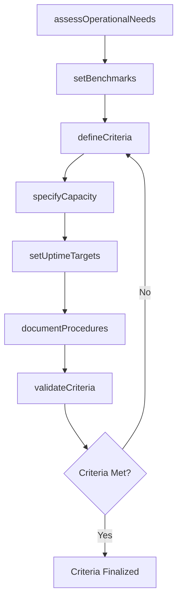
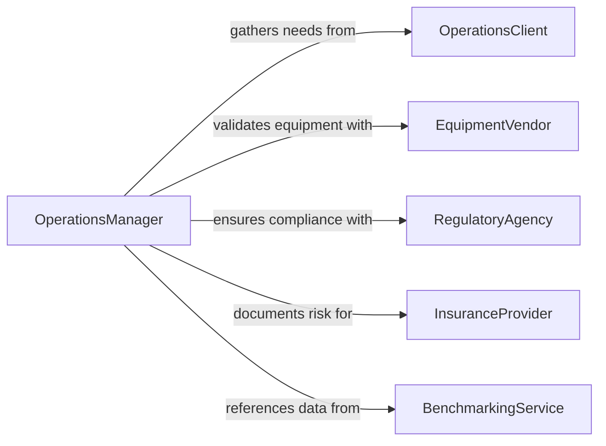

# Determine Operational Criteria or Specifications

> Business-as-Code definition for establishing the operational parameters, performance benchmarks, and procedural standards that govern how systems and processes must function.

## Overview

Determining operational criteria and specifications involves defining the measurable standards that systems, equipment, and processes must meet during normal operation. This includes throughput targets, uptime requirements, environmental conditions, staffing levels, and quality thresholds. This definition models the analysis of operational needs, criteria formulation, stakeholder alignment, and formal documentation of operational standards.

## Actors

| Actor | Description |
|-------|-------------|
| OperationsClient | Organization or department whose operations are being specified |
| EquipmentVendor | Supplier of machinery or systems being operationally defined |
| RegulatoryAgency | Authority enforcing operational compliance standards |
| InsuranceProvider | Entity requiring operational risk documentation |
| BenchmarkingService | Organization providing industry operational benchmarks |

## Roles

| Role | Description |
|------|-------------|
| OperationsManager | Defines day-to-day operational requirements |
| IndustrialEngineer | Analyzes processes and establishes efficiency criteria |
| ComplianceOfficer | Ensures criteria meet regulatory requirements |
| PerformanceAnalyst | Measures and validates operational metrics |

## Entities

| Entity | Description |
|--------|-------------|
| OperationalCriterion | A specific measurable standard for operations |
| PerformanceBenchmark | Industry or historical reference point for comparison |
| OperatingProcedure | Step-by-step process for executing an operation |
| CapacityRequirement | Minimum and maximum throughput specifications |
| UptimeTarget | Required availability percentage for a system |
| StaffingLevel | Personnel requirements for an operational shift |
| QualityThreshold | Acceptable defect rate or quality metric |

## Actions

| Action | Description |
|--------|-------------|
| assessOperationalNeeds | Analyze current operations to identify requirements |
| defineCriteria | Establish measurable operational standards |
| setBenchmarks | Set performance reference points from industry data |
| specifyCapacity | Define throughput minimums and maximums |
| setUptimeTargets | Establish availability requirements |
| documentProcedures | Write standard operating procedures |
| validateCriteria | Test criteria against actual operational data |

## Events

| Event | Description |
|-------|-------------|
| operationalNeedsAssessed | Current operations have been analyzed |
| criteriaDefined | Measurable operational standards have been set |
| benchmarksEstablished | Performance reference points have been documented |
| capacitySpecified | Throughput requirements have been defined |
| uptimeTargetsSet | Availability requirements have been established |
| proceduresDocumented | Standard operating procedures have been written |
| criteriaValidated | Criteria have been verified against operational data |

## Searches

| Search | Description |
|--------|-------------|
| findCriteria | Search operational criteria by system or department |
| getBenchmarks | Retrieve performance benchmarks by industry or category |
| listProcedures | Enumerate standard operating procedures |
| getCapacityRequirements | Look up throughput specifications |
| findUptimeTargets | Query availability requirements by system |

## Workflow



## Actor Relationships



## Usage

### Calling Actions

```typescript
import { determineOperationalCriteriaSpecifications } from '@headlessly/determine-operational-criteria-specifications'

const opsCriteria = determineOperationalCriteriaSpecifications()

// Assess operational needs
const assessment = await opsCriteria.assessOperationalNeeds({
  department: 'fulfillment-center',
  scope: ['throughput', 'quality', 'staffing'],
  period: 'Q1-2026'
})

// Define criteria
await opsCriteria.defineCriteria({
  assessmentId: assessment.id,
  criteria: [
    { name: 'ordersPerHour', minimum: 500, target: 750 },
    { name: 'pickAccuracy', minimum: 99.5, unit: 'percent' },
    { name: 'shiftStaffing', minimum: 45, unit: 'headcount' }
  ]
})

// Set uptime targets
await opsCriteria.setUptimeTargets({
  assessmentId: assessment.id,
  systems: [
    { name: 'conveyor-system', uptime: 99.9 },
    { name: 'wms-application', uptime: 99.95 }
  ]
})
```

### Event-Driven Automation

```typescript
// Alert when criteria validation fails
opsCriteria.criteriaValidated(async ({ assessmentId, passed, failures }) => {
  if (!passed) {
    await notify({
      to: 'operations-leadership',
      message: `Operational criteria validation failed: ${failures.length} criteria below threshold`
    })
  }
})

// Auto-document procedures after criteria are finalized
opsCriteria.criteriaDefined(async ({ assessmentId }) => {
  await opsCriteria.documentProcedures({
    assessmentId,
    format: 'sop-template'
  })
})
```
