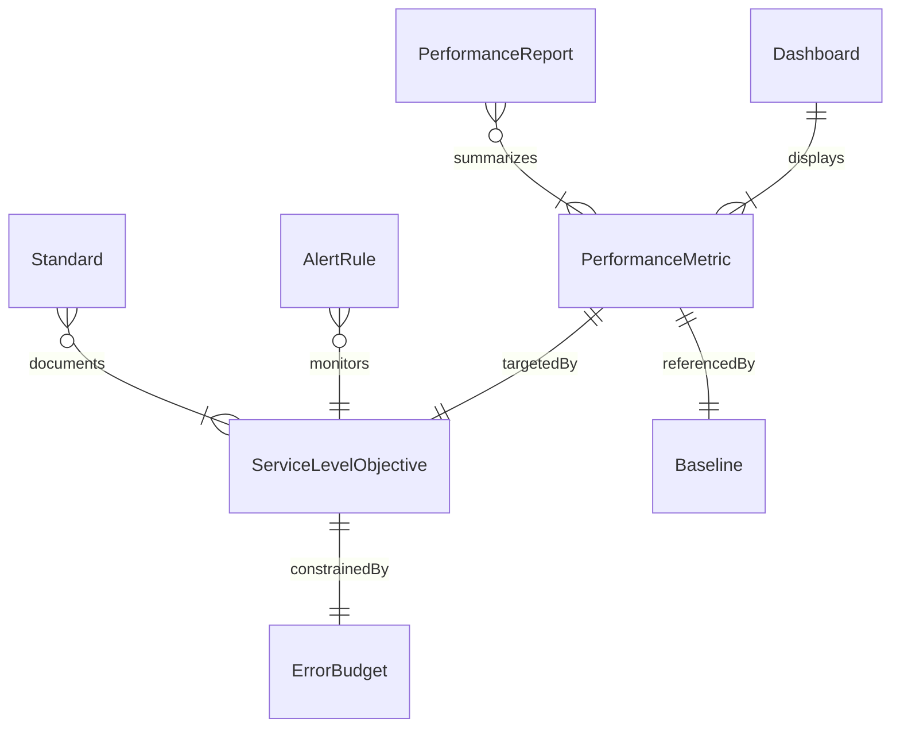
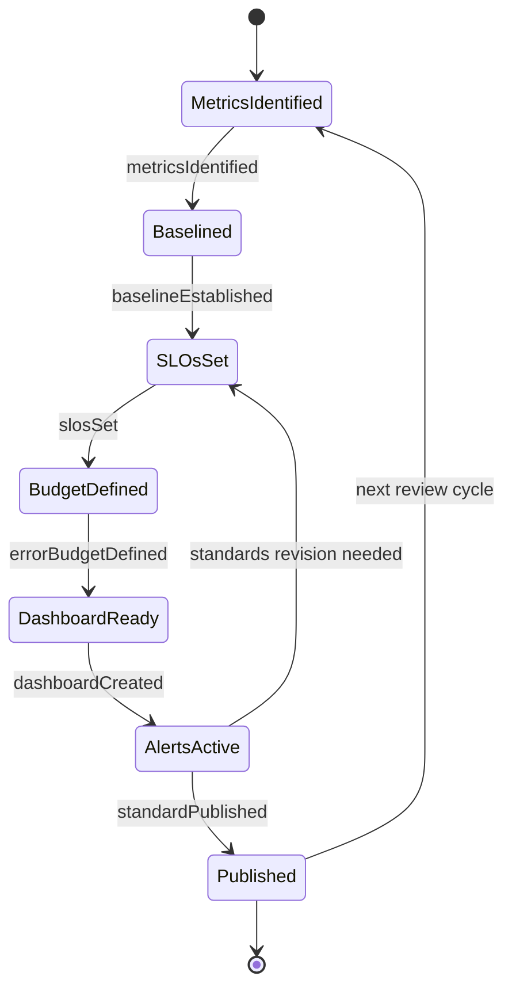
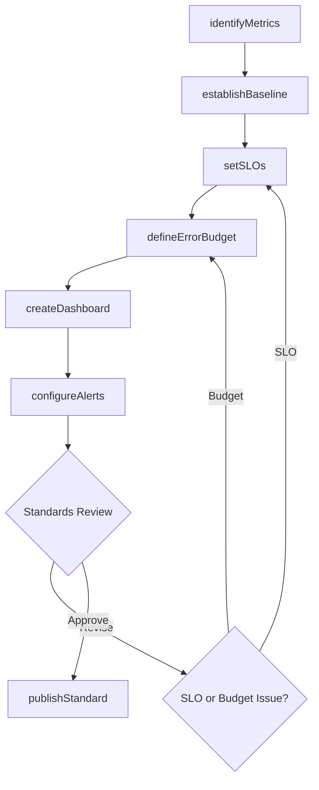
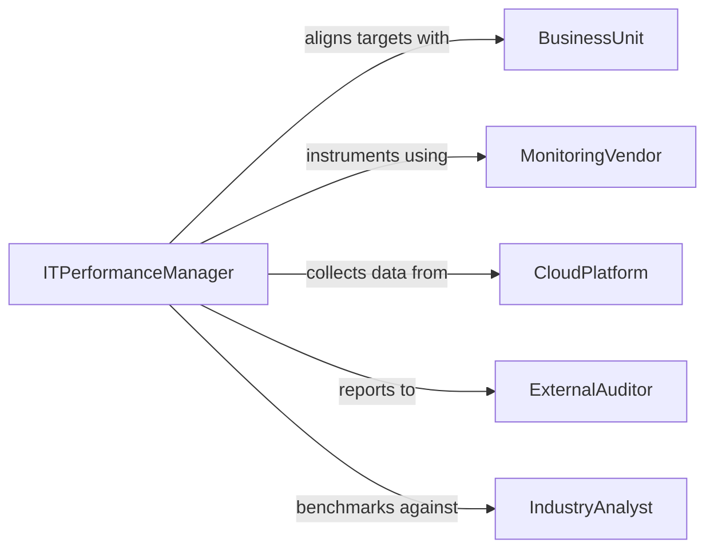

# Develop Performance Metrics or Standards for Information Technology

> Business-as-Code definition for developing key performance indicators, service level objectives, and quality standards that measure and govern IT system performance.

## Overview

IT performance metric and standard development involves defining service level indicators, establishing measurement baselines, setting target thresholds, and creating dashboards and reporting frameworks. This definition models the process of identifying critical metrics, aligning them with business objectives, instrumenting systems for data collection, and publishing performance standards that IT teams use to maintain service quality.

## Actors

| Actor | Description |
|-------|-------------|
| BusinessUnit | Internal department with SLA expectations for IT services |
| MonitoringVendor | Provider of observability and APM tooling |
| CloudPlatform | Infrastructure provider offering performance metrics |
| ExternalAuditor | Party reviewing IT governance and compliance |
| IndustryAnalyst | Organization publishing IT benchmark data |

## Roles

| Role | Description |
|------|-------------|
| ITPerformanceManager | Defines and maintains IT performance standards |
| SRELead | Establishes reliability targets and error budgets |
| DataAnalyst | Analyzes performance data and identifies trends |
| CTO | Approves performance standards and SLA commitments |

## Entities

| Entity | Description |
|--------|-------------|
| PerformanceMetric | A named, measurable indicator of IT system behavior |
| ServiceLevelObjective | Target value for a metric over a defined period |
| ErrorBudget | Allowed failure threshold before action is required |
| Baseline | Historical performance data used as a reference point |
| Dashboard | Visual display of real-time and historical metrics |
| AlertRule | Condition that triggers a notification when breached |
| PerformanceReport | Periodic summary of metrics against targets |
| Standard | Published document defining acceptable metric ranges |

## Actions

| Action | Description |
|--------|-------------|
| identifyMetrics | Select the key performance indicators to track |
| establishBaseline | Collect historical data to set reference points |
| setSLOs | Define service level objectives for each metric |
| defineErrorBudget | Specify the acceptable failure threshold |
| createDashboard | Build visual displays for metric monitoring |
| configureAlerts | Set up notification rules for threshold breaches |
| publishStandard | Release the formalized performance standard |

## Events

| Event | Description |
|-------|-------------|
| metricsIdentified | Key performance indicators have been selected |
| baselineEstablished | Historical reference points have been set |
| slosSet | Service level objectives have been defined |
| errorBudgetDefined | Acceptable failure thresholds have been specified |
| dashboardCreated | Monitoring visualizations have been built |
| alertsConfigured | Notification rules have been activated |
| standardPublished | The performance standard has been released |
| sloBreached | A service level objective has been violated |

## Searches

| Search | Description |
|--------|-------------|
| findMetrics | Search performance metrics by service or category |
| getSLOs | Retrieve service level objectives for a system |
| getErrorBudgetStatus | Check remaining error budget for a service |
| listDashboards | Enumerate available monitoring dashboards |
| getPerformanceReports | Retrieve periodic metric summaries |

## Entity Relationships



## State Diagram



## Workflow



## Actor Relationships



## Usage

### Calling Actions

```typescript
import { developPerformanceMetricsStandardsRelated } from '@headlessly/develop-performance-metrics-standards-related'

const perfMetrics = developPerformanceMetricsStandardsRelated()

// Identify key metrics
const metrics = await perfMetrics.identifyMetrics({
  service: 'payment-gateway',
  indicators: [
    { name: 'p99Latency', unit: 'ms', category: 'latency' },
    { name: 'errorRate', unit: 'percent', category: 'availability' },
    { name: 'throughput', unit: 'requests-per-second', category: 'capacity' }
  ]
})

// Set SLOs
await perfMetrics.setSLOs({
  serviceId: metrics.serviceId,
  objectives: [
    { metric: 'p99Latency', target: 200, window: '30d' },
    { metric: 'errorRate', target: 0.1, window: '30d' },
    { metric: 'throughput', target: 10000, window: '1h' }
  ]
})

// Define error budget
await perfMetrics.defineErrorBudget({
  serviceId: metrics.serviceId,
  budget: { errorRate: 0.1, window: '30d', burnRateAlert: 2.0 }
})
```

### Event-Driven Automation

```typescript
// Alert on SLO breach
perfMetrics.sloBreached(async ({ serviceId, metric, actual, target }) => {
  await notify({
    to: 'sre-oncall',
    message: `SLO breach: ${metric} at ${actual} (target: ${target}) for service ${serviceId}`
  })
})

// Auto-generate performance report when standards are published
perfMetrics.standardPublished(async ({ standardId, serviceId }) => {
  await generateReport({
    serviceId,
    standardId,
    period: 'monthly'
  })
})
```
